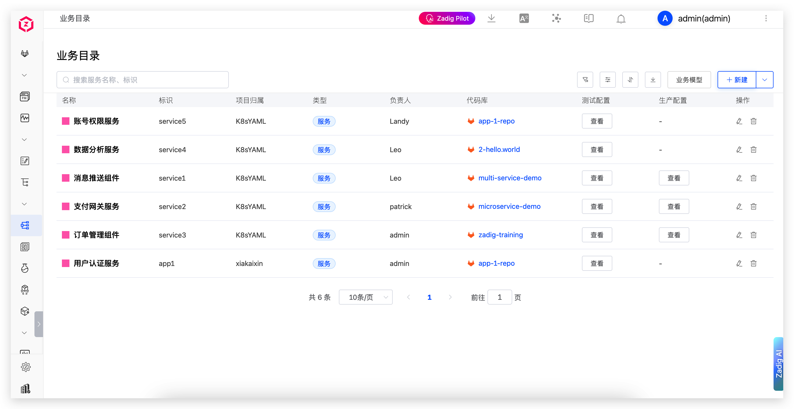
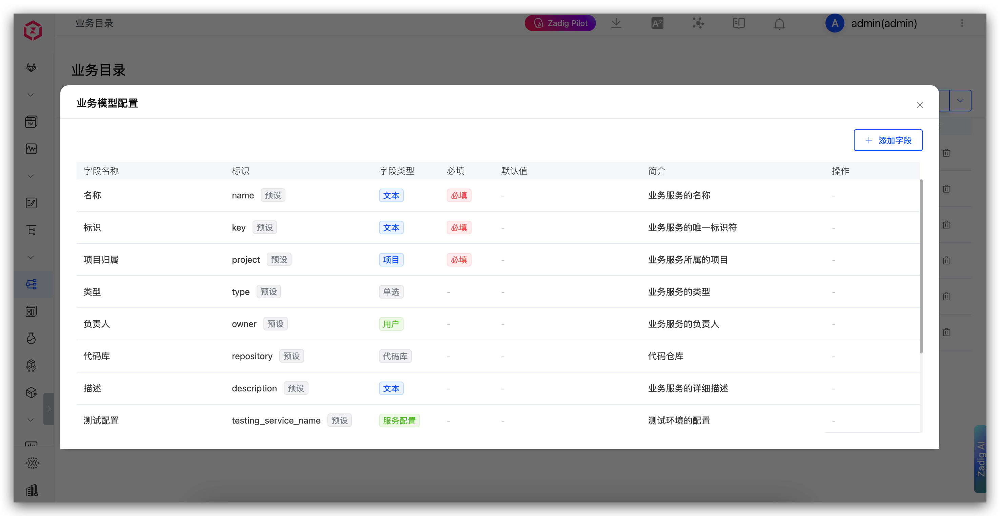
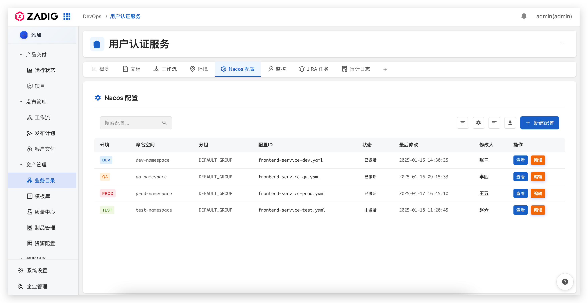

The Service Catalog is a core service management module in the Zadig system, providing unified service perspective management capabilities. Through the Service Catalog, you can quickly search and view project and service metadata, including but not limited to business ownership, responsible persons, code repositories, language frameworks, environments, configurations, and other information. The Service Catalog also supports custom business model configuration and tag page customization, helping you build a service management system that meets your business needs.

## Core Value

- **Quick Problem Location**: When problems occur, relevant services and responsible persons can be quickly found, improving fault troubleshooting efficiency.
- **One-stop Service Management**: Metadata aggregation allows service iteration work to be completed without switching systems, simplifying operations processes.
- **Reduce Newcomer Onboarding Cost**: New employees can quickly familiarize themselves with the company's technology stack and development environment through navigation.

## Custom Business Model

The Service Catalog supports custom business model configuration, allowing you to flexibly configure field information according to actual business needs.

### Preset Fields

The system provides the following preset fields to meet basic business management needs:

- **Name**: Name of the service
- **Identifier**: Unique identifier of the service
- **Project Affiliation**: Project to which the service belongs
- **Type**: Type of the service
- **Owner**: Owner of the service
- **Code Repository**: Code repository information
- **Description**: Detailed description of the service
- **Test Configuration**: Test environment configuration
- **Production Configuration**: Production environment configuration

### Custom Fields

In addition to preset fields, you can also add custom fields with the following field types:

- **Text**: Single-line text
- **Number**: Numeric type
- **Boolean**: Yes/No selection
- **Date Time**: Date and time selection
- **Single Select**: Single-select dropdown
- **Multi Select**: Multi-select dropdown
- **Link**: URL link
- **User**: Users within the Zadig system
- **User Group**: User groups within the Zadig system
- **Project**: Zadig projects

## Tag Page Customization

The tag pages in the Service Catalog detail page support custom development. You can flexibly configure tag display content according to business needs, such as workflow, environment, configuration, monitoring, and other pages.

For custom plugin development, please refer to the [Plugin Development Documentation](/en/Zadig%20v4.2/settings/plugin/#plugin-development)

<!-- - [Official Plugin Repository](https://github.com/koderover/zadig-plugins) - View Zadig official plugin templates -->