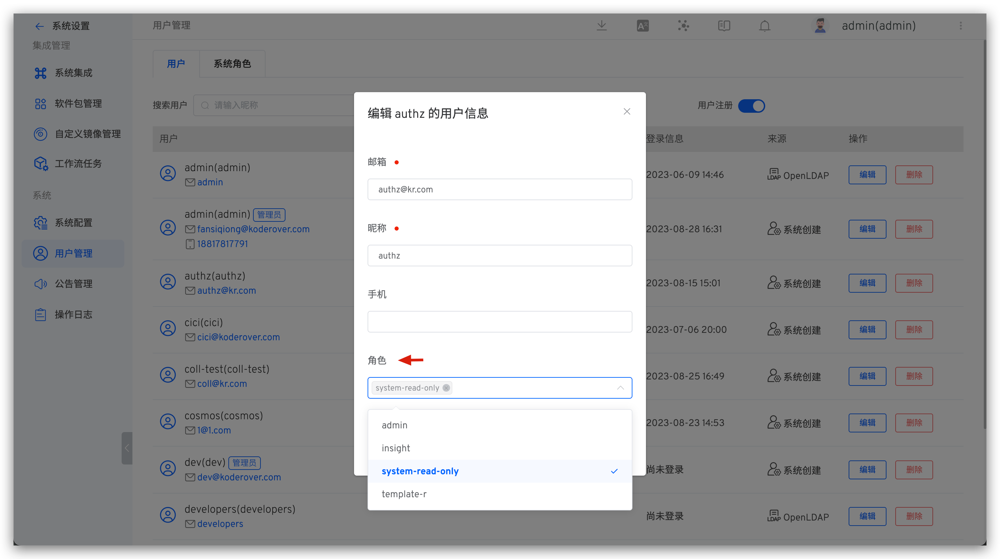
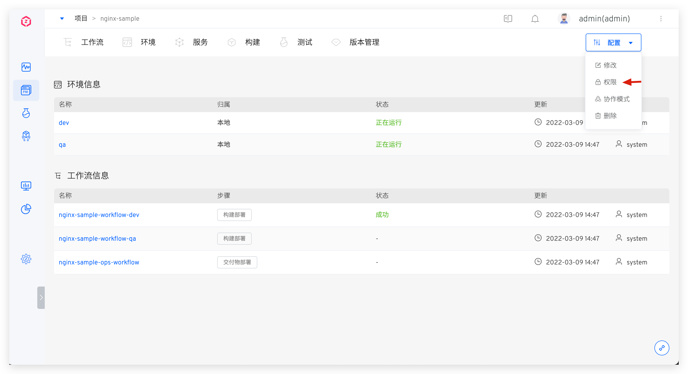
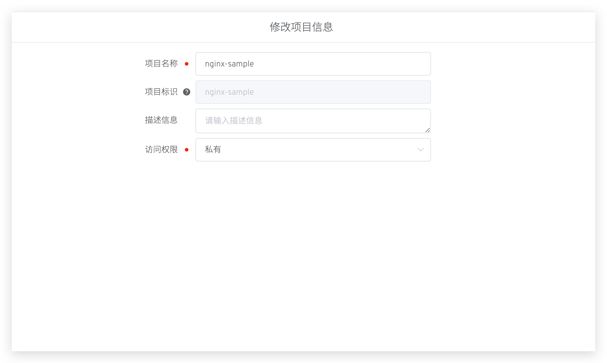
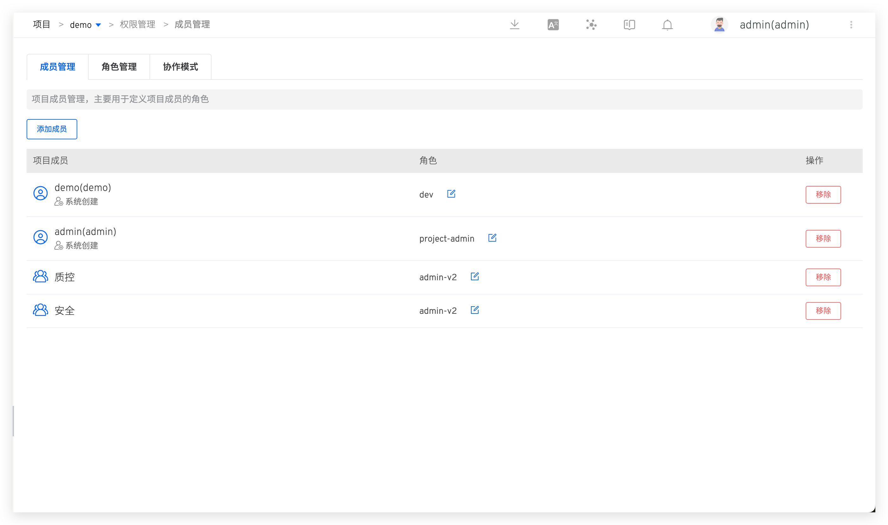
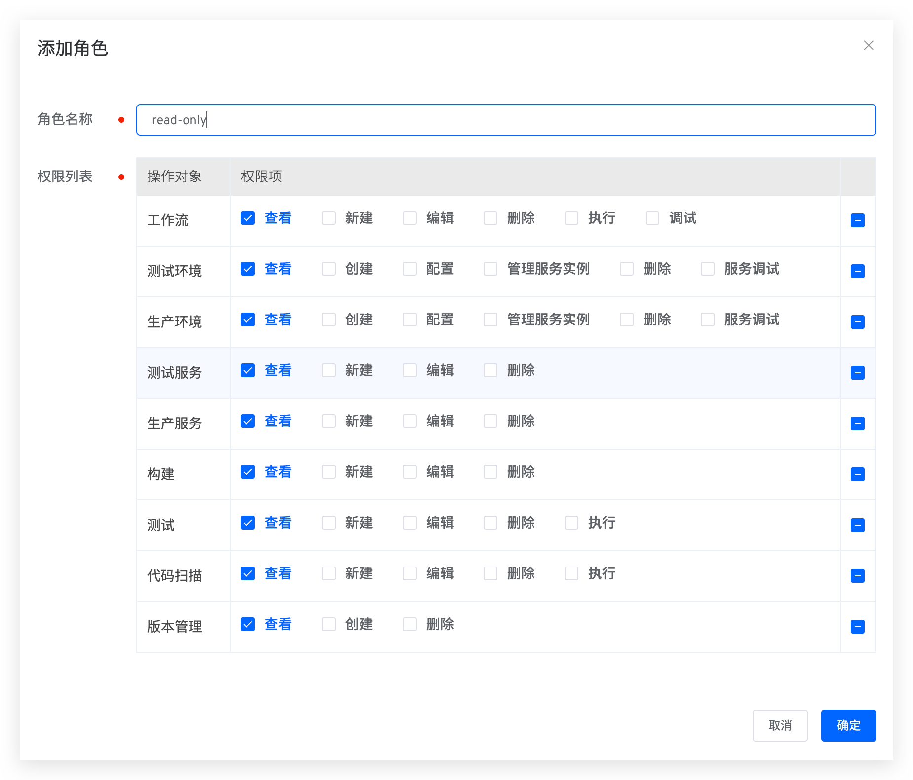
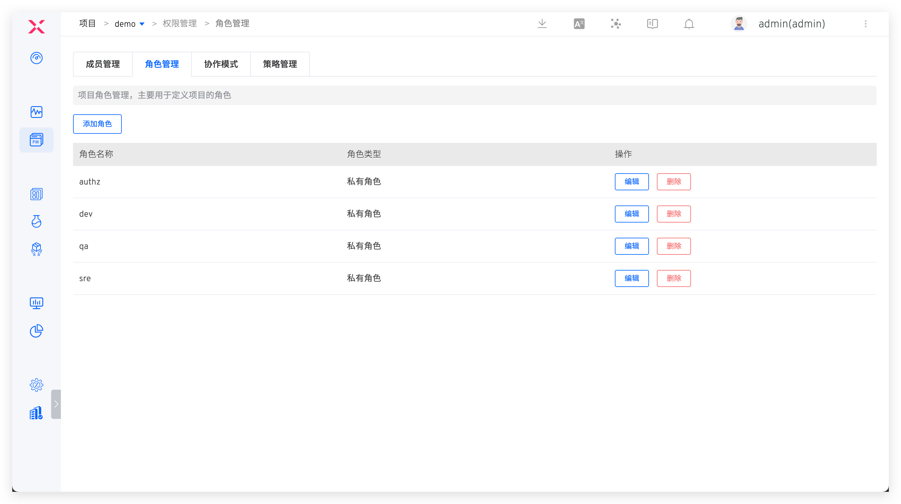
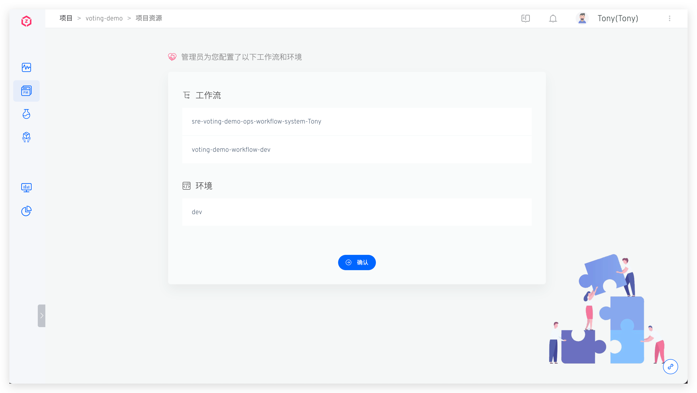
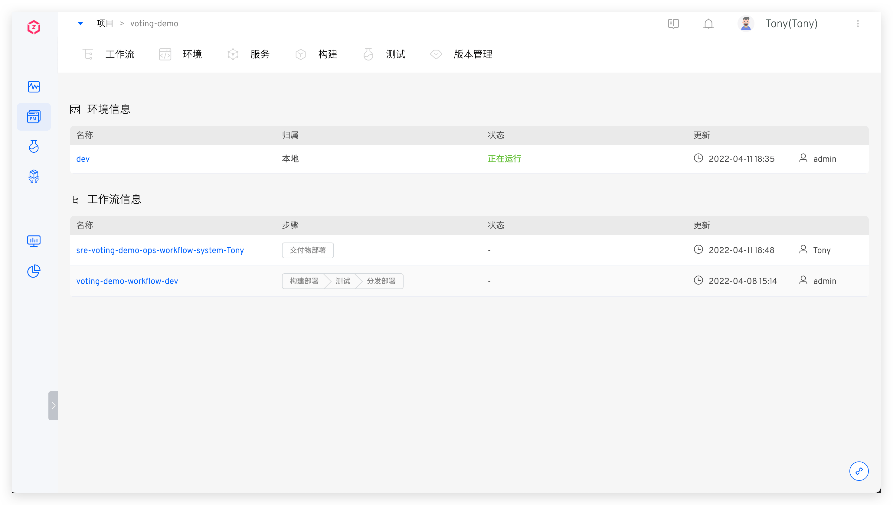

Zadig supports flexible permission configuration to enable team members to collaborate securely and efficiently, including:

- System Role: System-level permission configuration, refer to [System Role](#system-roles)
- Permission configuration: Project-level permission configuration, refer to [Permission configuration](#permission-configuration)
- Project access permissions: define the public / Private properties of the project, refer to [Project access permissions](#project-access-permissions)
- Collaboration mode: The permission configuration for specified workflow and environmental resource granularity within the project, refer to [Collaboration mode](#collaboration-mode)

## System Roles

::: tip
Only system administrators can configure system roles.
:::

Click on the avatar in the upper right corner > User Management > System Role to configure.

System roles can be specified in user information.

## Project Access Permissions
::: tip
Only system administrators and project administrators can configure project access permissions.
:::
Click Configure > Modify > Edit Access Permissions to set the public/private attributes of the project. The differences between public and private projects are as follows:
- For private projects, all users have no permissions by default.
- For public projects, all users have read-only permissions by default, allowing them to view the environment, workflow, services, build, test, version, and code scanning in the project.

## Permission Configuration
::: tip
Only project administrators can configure this.
:::

> Define project members and their permissions for all environments, workflows, services, testing, version management, code scanning, and other resources in the project.

In the project details page, click `Configuration` → `Permission` to configure project members and their permissions.

### Member Management

In `Member Management`, view the user member list and corresponding roles of the project, and configure user roles as needed.

- Roles are a collection of permissions, in [role management](/en/Zadig%20v4.2/project/permission/#role-management) , you can view permission details in roles
- Support adding user groups to project members to implement permission configuration for batch users

### Role Management
Includes system-built-in roles and project administrator-defined roles.

#### Built-in Roles
- `project-admin`: Project administrator, can operate all resources in the project under their jurisdiction and can modify the project configuration.
- `read-project-only`: Members with this role can see the corresponding project in the project list but have no permission to operate the resources in the project.
- `read-only`: Read-only role. In public projects, all users have this role by default. The corresponding permission items are as follows:

#### Custom Roles

In `Role Management`, you can customize roles and assign permissions.

### Permission List

Describes the correspondence between each permission item and function. For the complete functional documents in each functional module, refer to [Workflow](/en/Zadig%20v4.2/project/common-workflow/) / [Environment](/en/Zadig%20v4.2/project/env/k8s) / [Service](/en/Zadig%20v4.2/project/service/k8s/) / [Build](/en/Zadig%20v4.2/project/build/) / [Test](/en/Zadig%20v4.2/project/test/) / [Version Management](/en/Zadig%20v4.2/project/version/) / [Code Scan](/en/Zadig%20v4.2/project/scan/).

::: tip
The version in the K8s YAML project is created by executing the delivery deployment workflow. If permissions for creating a new version are required, configure the workflow execution permissions.
:::

<table>
	<tr>
		<th colspan="3"><b>Permissions and Feature List</b></th>
	</tr>
	<tr>
		<td><b>Feature Module</b></td>
		<td><b>Permission Item</b></td>
		<td><b>Feature List</b></td>
	</tr>
	<tr>
		<td rowspan="5">Workflow</td>
		<td>View</td>
		<td>- View workflow list, basic information, task list, task details - View workflow task execution logs (build logs, test logs, etc.)</td>
	</tr>
	<tr>
		<td>Edit</td>
		<td>- Modify workflow - Quickly enable/disable workflow timer - Associate test tasks with workflow - Edit fields in workflow task list</td>
	</tr>
	<tr>
		<td>Create</td>
		<td>- Create new workflow - Copy workflow</td>
	</tr>
	<tr>
		<td>Delete</td>
		<td>- Delete workflow</td>
	</tr>
	<tr>
		<td>Execute</td>
		<td>- Start workflow - Retry/cancel/clone workflow tasks</td>
	</tr>
	<tr>
		<td rowspan="7">Environment</td>
		<td>View</td>
		<td>- View environment list, environment basic information - View service list and service details in environment - View environment configuration content (Ingress/ConfigMap/Secret/PVC), compare differences between versions - View service instance real-time logs, events, configuration management, YAML export (K8s YAML projects)</td>
	</tr>
	<tr>
		<td>Create</td>
		<td>- Create new environment - Create sub-environment</td>
	</tr>
	<tr>
		<td>Configure</td>
		<td>- Update environment variables (K8s YAML projects), update global variables (K8s Helm Chart projects) - Configure hosting (K8s hosted projects) - Enable/disable self-test mode - Environment sleep and wake - Add/update/rollback/delete services - Edit environment configuration (Ingress/ConfigMap/Secret/PVC), delete environment configuration, rollback versions - View environment change records</td>
	</tr>
	<tr>
		<td>Delete</td>
		<td>- Delete environment - Cancel environment hosting (K8s hosted projects)</td>
	</tr>
	<tr>
		<td>Manage Service Instances</td>
		<td>- Replace service instance images, restart service instances, adjust service instance replica count, start container debugging - Update service instances - Host service start/stop</td>
	</tr>
	<tr>
		<td>Service Debug</td>
		<td>- Enter service instance container for debugging (K8s YAML/K8s Helm Chart/K8s hosted projects)</td>
	</tr>
	<tr>
		<td>Host Login</td>
		<td>- Login to hosts deployed in the environment (free projects)</td>
	</tr>
	<tr>
		<td rowspan="4">Service</td>
		<td>View</td>
		<td>- View service configuration</td>
	</tr>
	<tr>
		<td>Edit</td>
		<td>- Update service configuration</td>
	</tr>
	<tr>
		<td>Create</td>
		<td>- Create new service configuration</td>
	</tr>
	<tr>
		<td>Delete</td>
		<td>- Delete service configuration</td>
	</tr>
	<tr>
		<td rowspan="4">Build</td>
		<td>View</td>
		<td>- View build configuration</td>
	</tr>
	<tr>
		<td>Edit</td>
		<td>- Update build configuration</td>
	</tr>
	<tr>
		<td>Create</td>
		<td>- Create new build configuration</td>
	</tr>
	<tr>
		<td>Delete</td>
		<td>- Delete build configuration</td>
	</tr>
	<tr>
		<td rowspan="4">Test</td>
		<td>View</td>
		<td>- View test configuration</td>
	</tr>
	<tr>
		<td>Edit</td>
		<td>- Update test configuration</td>
	</tr>
	<tr>
		<td>Create</td>
		<td>- Create new test configuration</td>
	</tr>
	<tr>
		<td>Delete</td>
		<td>- Delete test configuration</td>
	</tr>
	<tr>
		<td rowspan="3">Version Management</td>
		<td>View</td>
		<td>- View versions</td>
	</tr>
	<tr>
		<td>Edit</td>
		<td>- Update versions</td>
	</tr>
	<tr>
		<td>Create</td>
		<td>- Create new versions</td>
	</tr>
	<tr>
		<td rowspan="5">Code Scan</td>
		<td>View</td>
		<td>- View code scan configuration</td>
	</tr>
	<tr>
		<td>Edit</td>
		<td>- Update code scan configuration</td>
	</tr>
	<tr>
		<td>Create</td>
		<td>- Create new code scan configuration</td>
	</tr>
	<tr>
		<td>Delete</td>
		<td>- Delete code scan configuration</td>
	</tr>
	<tr>
		<td>Execute</td>
		<td>- Execute/cancel code scan tasks</td>
	</tr>
</table>

## Collaboration Mode
::: tip
Only project administrators can configure this.
:::

Applicable to projects with access permissions set to `Private`. It allows for permission control over specified workflows and environment resources within the project.

### Configure Collaboration Mode
Switch to `Collaboration Mode` in project permission management to configure the functional modules and permissions used by each member during the collaboration process.

Configuration instructions:

- Fill in the name of the collaboration mode, such as `developer`.
- Select participating members, only project members can be selected. If the users who need to be added are not in the member list, they can be added in [member management](/en/Zadig%20v4.2/project/permission/#member-management) .
- Configure collaboration rules. Based on the needs, configure workflows and environmental resources for collaboration members and set operation permissions and recycling rules, including:
    - Exclusive: Based on the benchmark workflow/benchmark environment, create a new workflow/environment for each collaborative member for their exclusive use. The naming rule for the new resource is `Collaboration Mode Name-Benchmark Resource Name-User Source-User Name`, applicable to K8s YAML/K8s Helm Chart projects
    - Shared: Collaboration members share the use of the benchmark workflow/benchmark environment resources without creating new resources for them.
    - Resource Recycling Policy: If a member does not access the project within the configured time, the member's resources will be recycled. When the member revisits the project, they will regain the resources.

### How to Use It in Collaboration
When a member in the collaboration mode logs into the Zadig system and enters the specified project, they should confirm the workflows and environmental resources allocated in the collaboration mode.

Wait a moment for the system to prepare the resources, and the member can then obtain the operation permissions for the corresponding resources and use them in their daily work.

