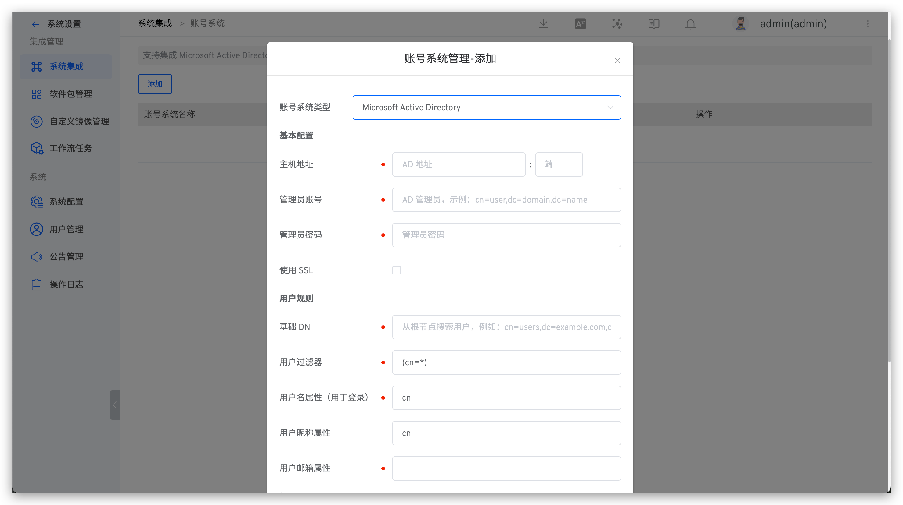

LDAP (Lightweight Directory Access Protocol) is a network protocol for accessing and finding user and user group information.
After integrating an LDAP directory server with Zadig, user and user group synchronization can be achieved. Currently, mainstream LDAP directory servers are supported:

- Microsoft Active Directory
- OpenLDAP

## How to Integrate

**Configuration Instructions:**

1. The administrator should go to `System Settings` → `Integration` → `Account System` to enter the account system integration page.
2. Click the Add button to select an account system type:
    - Microsoft Active Directory
    - OpenLDAP
3. According to the parameter configuration, enter the required parameters
4. Save the settings

**Parameter Description:**
| Parameter Name             | Description |
|-------------------|----------|
| Account Type           | Select the type of LDAP directory server you will be connecting to.  |
| Host Address            | The hostname of the directory server. For example:  ad.example.com  ldap.example.com  opends.example.com  |
| Port               | The port on which your directory server is listening. For example:  389  10389  636 (for SSL) |
| Administrator Account            | Note the distinction between this username and the Zadig username. This username is used to connect to the directory server. For example:  cn=administrator,cn=users,dc=ad,dc=example,dc=com  cn=user,dc=domain,dc=name  user@domain.name |
| Administrator Password               | The password for the user specified to connect to the directory server. |
| Use SSL           | If the directory server uses SSL (Secure Sockets Layer), check this option.  Note: If you want to use this option, you need to configure the SSL certificate.  |
|**User Rules**||
| Base DN | The root distinguished name (DN) used when running queries on the directory server. For example:  o=example,c=com  cn=users,dc=ad,dc=example,dc=com  For Microsoft Active Directory, use the following format to specify the base DN:  dc=domain1,dc=local  You can modify domain1 and local according to your actual needs.  Meanwhile, Microsoft Server provides a tool called ldp.exe, which administrators can use to search and configure on the LDAP server. |
| User Filter         | User filter. For more information on LDAP filters, reference [https://ldap.com/ldap-filters/](https://ldap.com/ldap-filters/)|
| Username Attribute (for Login)|The username attribute used for login|
| User Nickname Attribute|The user nickname attribute, optional|
| User Email Attribute|The user email attribute|
|**Group Rules**||
| Group Base DN | The root distinguished name (DN) used when running queries on the directory server. |
| Group Filter   | Group filter. For more information on LDAP filters, reference [https://ldap.com/ldap-filters/](https://ldap.com/ldap-filters/)|
| Group Name Attribute | The group name attribute |

::: tip More Info
- After the LDAP configuration is correct, logging into Zadig will synchronize the corresponding LDAP account to the Zadig system
- Deleting an LDAP account in Zadig will remove its permissions from the Zadig system, but it will not delete the data in the LDAP system
:::

## [Optional] Set as the Default Account System
After the account system is successfully integrated, you can set it as the default account system.

After setting, the login page corresponding to the default account system will be used as the system's default login page.

::: tip
- If the default account system is modified, and the corresponding account system is unavailable or the login account information is forgotten, resulting in an inability to log in to Zadig, you can quickly access `{Zadig Installation Address}/login/password` and log in using the administrator account and password created in the Zadig system.
- If the system was not modified during installation, the default administrator account/password is `admin`/`Zadig123`.
:::