This article introduces IM application integration in the Zadig system, using IM capabilities for notifications and approvals. Currently supports Feishu, DingTalk, and WeChat Work integration.

## Feishu

> Used for "Manual Approval" and "Notification" tasks in workflows.

Follow these steps to configure Feishu notifications and approvals:
1. Create and publish an application on the Feishu Developer Platform
2. Configure application credentials in Zadig to obtain the `Request Address` for event message push
3. Configure the `Request Address` on the Feishu Developer Platform

### Step 1: Create a Feishu App
1. Visit [the Feishu Developer Platform](https://open.feishu.cn/) and create an "enterprise self-built application" as shown below.

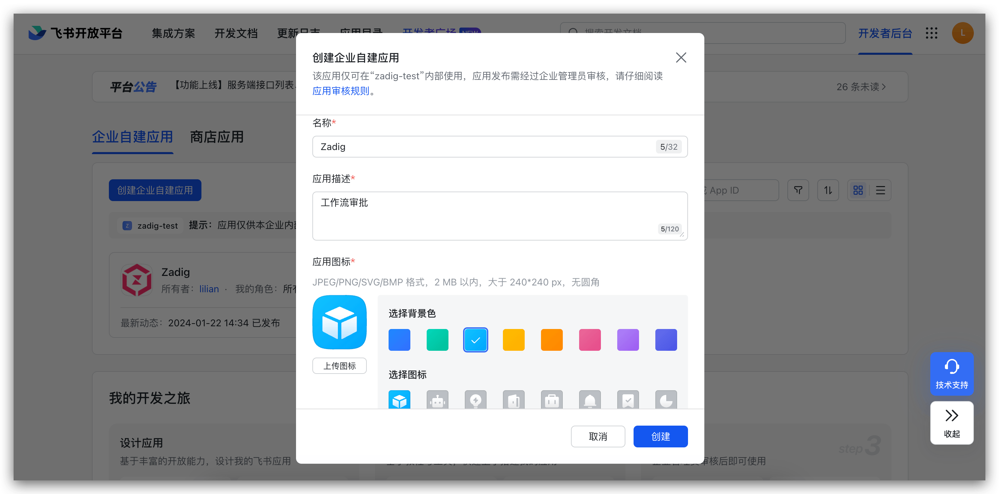

2. In `Permission Management` - `Data Permission`, set the address book permission scope, and in `API Permission`, enable the permissions required for the approval application as shown below.

> Zadig workflows support Feishu approvals, and available approvers are related to the address book scope specified here.

**Approval** requires these permissions:
- `approval:approval`
- `approval:approval.list:readonly`
- `approval:approval:readonly`
- `contact:user.id:readonly`
- `contact:contact.base:readonly`
- `contact:user.employee_id:readonly`
- `contact:user.base:readonly`
- `contact:department.base:readonly`
- `contact:group:readonly`

**Notification** requires these permissions:
- `im:chat`
- `im:chat:read`
- `im:chat:readonly`
- `im:message`
- `im:message:send_as_bot`
- `im:message:send_multi_depts`
- `contact:user.id:readonly`
- `contact:contact.base:readonly`
- `contact:user.employee_id:readonly`
- `contact:user.base:readonly`

3. Add a robot. If "Feishu Group Notification" is configured in the "Notification Task," the robot needs to be added to the corresponding group.

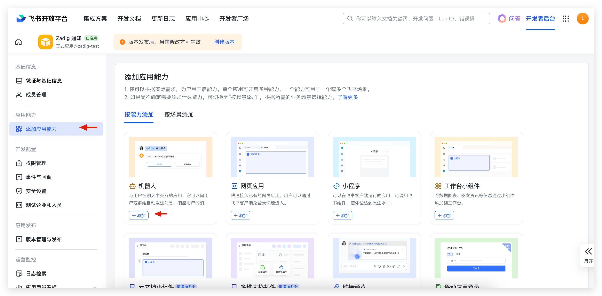

4. Create an application version and request publication.
> Please configure other required information for the application release process yourself.

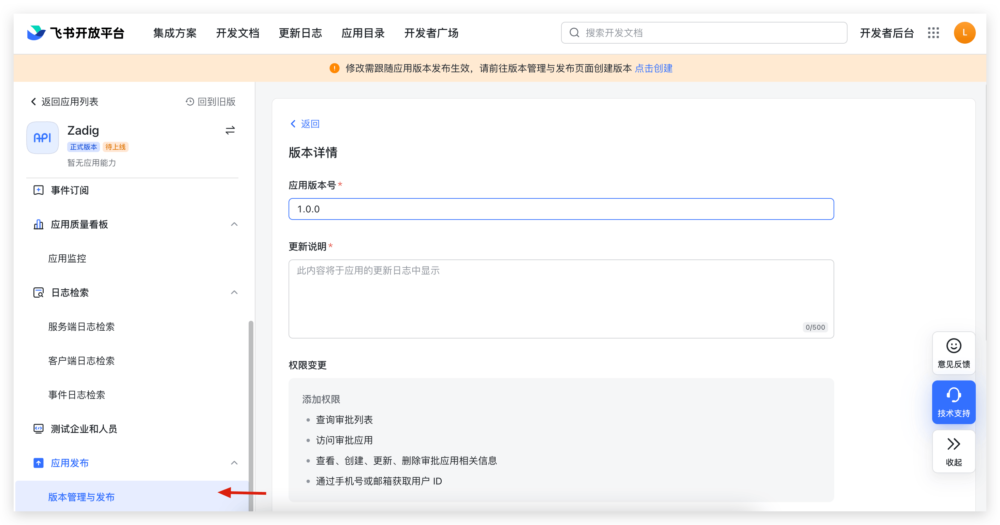

5. Obtain the `App ID`, `App Secret`, and `Encrypt Key` (optional).

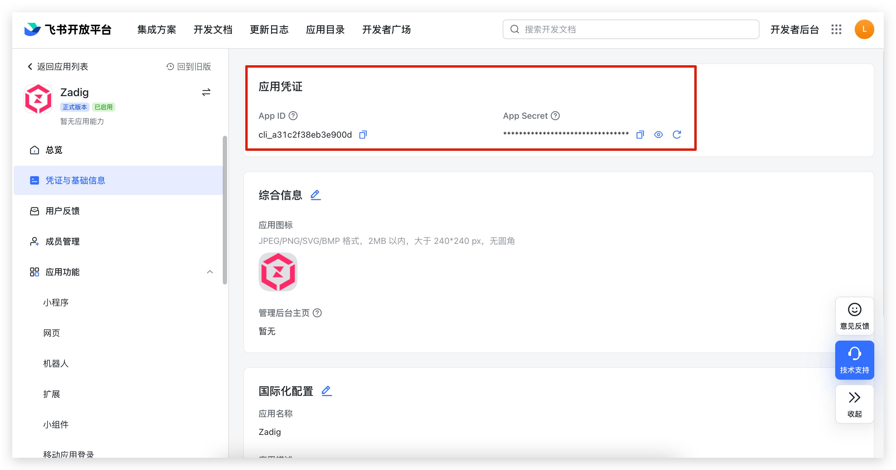
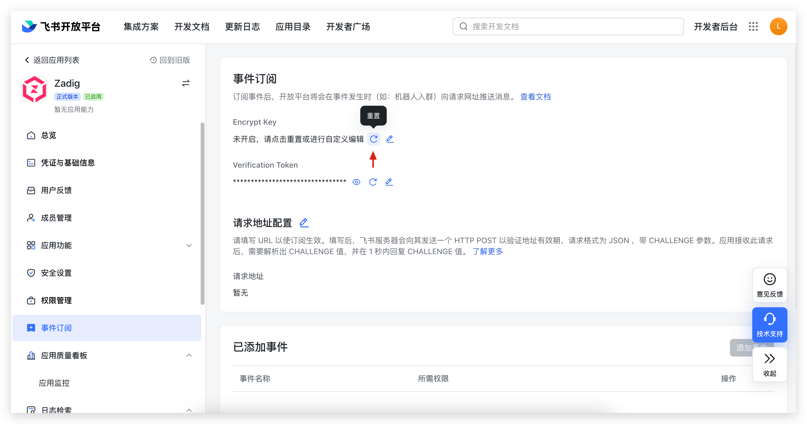

After the application release is approved, proceed to the next configuration step.

### Step 2: Integrate IM Application

Visit Zadig, click `System Settings` -> `Integrations` -> `IM`, and add the Feishu approval application as shown below.

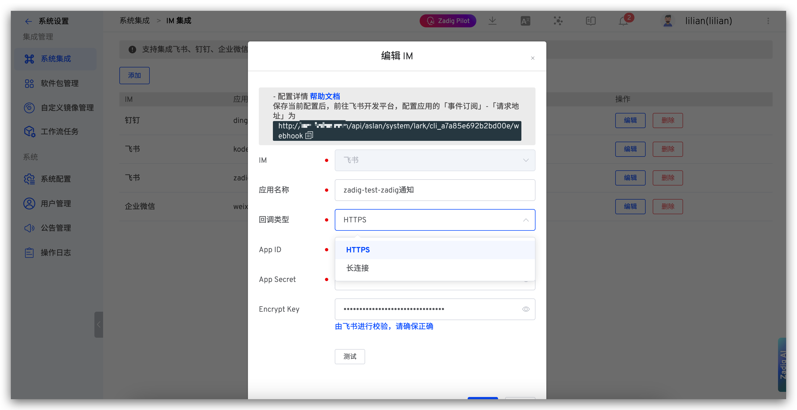

Parameter descriptions:
- `App Name`: Customize for easy identification in the Zadig system
- `Callback Type`: Must match the Feishu app configuration. **If Zadig is deployed in an airgapped environment, select `persistent Connection`.**
- `App ID`: Obtained in Step 1
- `App Secret`: Obtained in Step 1
- `Encrypt Key`: Obtained in Step 1

After filling in the details, obtain the "request address" and save the configuration.

### Step 3: Configure "Request Address" and "Events"

1. Configure the request address. Visit [the Feishu Developer Platform](https://open.feishu.cn/) and fill in the request address as shown below.

::: tip
If Zadig is deployed in an airgapped environment, select "Use long connection to receive events".
:::

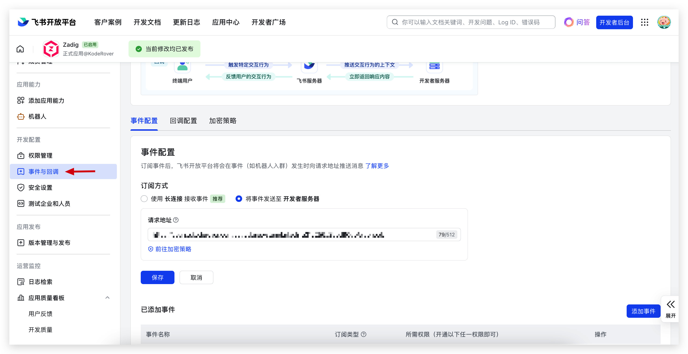

2. Add an event. Click "Event Subscription" -> "Add Event" and select `Approval Task Status Change`.

::: tip
After completing the configuration, you need to create the application version again and release the latest version.
:::

## Lark

> Used for "Manual Approval" and "Notification" tasks in workflows.

Follow these steps to configure Lark notifications and approvals:
1. Create and publish an application on the Lark Developer Platform
2. Configure application credentials in Zadig to obtain the `Request Address` for event message push
3. Configure the `Request Address` on the Lark Developer Platform

### Step 1: Create a Lark App
1. Visit [the Lark Developer Platform](https://open.larksuite.com/) and create an "enterprise self-built application" as shown below.

2. In `Permission Management` - `Data Permission`, set the address book permission scope, and in `API Permission`, enable the permissions required for the approval application as shown below.

> Zadig workflows support Lark approvals, and available approvers are related to the address book scope specified here.

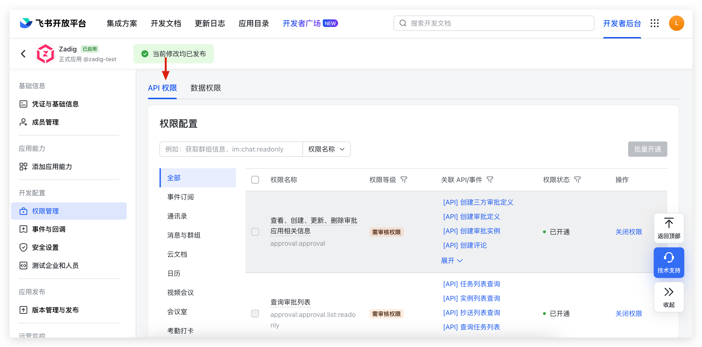

**Approval** requires these permissions:
- `approval:approval`
- `approval:approval.list:readonly`
- `approval:approval:readonly`
- `contact:user.id:readonly`
- `contact:contact.base:readonly`
- `contact:user.employee_id:readonly`
- `contact:user.base:readonly`
- `contact:department.base:readonly`
- `contact:group:readonly`

**Notification** requires these permissions:
- `im:chat`
- `im:chat:read`
- `im:chat:readonly`
- `im:message`
- `im:message:send_as_bot`
- `im:message:send_multi_depts`
- `contact:user.id:readonly`
- `contact:contact.base:readonly`
- `contact:user.employee_id:readonly`
- `contact:user.base:readonly`

3. Add a robot. If "Lark Group Notification" is configured in the "Notification Task," the robot needs to be added to the corresponding group.

4. Create an application version and request publication.
> Please configure other required information for the application release process yourself.

5. Obtain the `App ID`, `App Secret`, and `Encrypt Key` (optional).

After the application release is approved, proceed to the next configuration step.

### Step 2: Integrate IM Application

Visit Zadig, click `System Settings` -> `Integrations` -> `IM`, and add the Lark approval application as shown below.

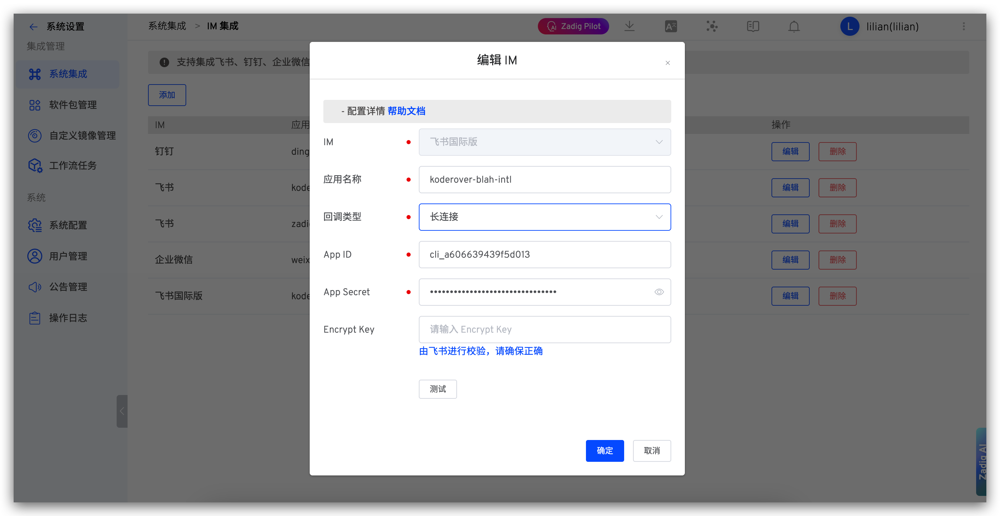

Parameter descriptions:
- `App Name`: Customize for easy identification in the Zadig system
- `Callback Type`: HTTPS
- `App ID`: Obtained in Step 1
- `App Secret`: Obtained in Step 1
- `Encrypt Key`: Obtained in Step 1

After filling in the details, obtain the "request address" and save the configuration.

### Step 3: Configure "Request Address" and "Events"

1. Configure the request address. Visit [the Lark Developer Platform](https://open.larksuite.com/) and fill in the request address as shown below.

::: tip
Lark does not support persistent connection mode, please select "Send events to developer server".
:::

2. Add an event. Click "Event Subscription" -> "Add Event" and select `Approval Task Status Change`.

::: tip
After completing the configuration, you need to create the application version again and release the latest version.
:::

## DingTalk

::: tip
After users complete approval on DingTalk, the DingTalk platform needs to callback the approval status to Zadig. To ensure normal DingTalk approval functionality, please ensure the DingTalk platform can access the Zadig domain name.
:::

Follow these steps to configure DingTalk approvals:
1. Create and publish an application on the DingTalk Developer Platform
2. Configure application credentials in Zadig to obtain the `Request URL` for event message push
3. Configure the `Request URL` on the DingTalk Developer Platform

### Step 1: Create a DingTalk Application
1. Visit [the DingTalk Open Platform](https://open-dev.dingtalk.com/fe/app#/corp/app) and create an application as shown below.
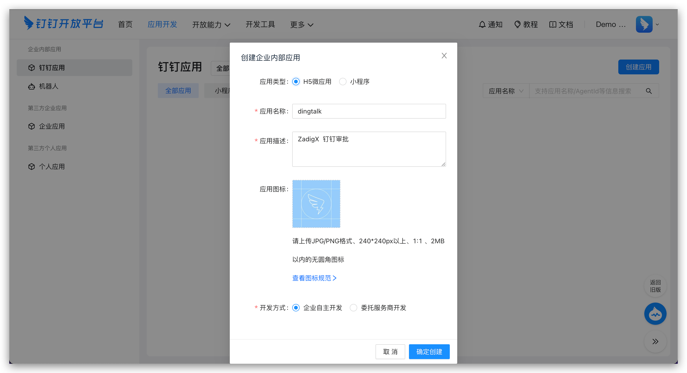

2. In permission management, configure the permission scope and enable the permissions required for the approval application as shown below.

> Zadig workflows support DingTalk approvals, and available approvers are related to the permission scope specified here.

Required permissions:

- `snsapi_base`
- `qyapi_base`
- `Contact.User.Read`
- `qyapi_get_department_list`
- `qyapi_get_member`
- `qyapi_get_member_by_mobile`
- `Workflow.Form.Write`
- `Workflow.Form.Read`
- `Workflow.Instance.Read`
- `Workflow.Instance.Write`

3. Obtain the `AppKey`, `AppSecret`, `aes_key`, and `token` information.

`AppKey` and `AppSecret` are obtained in `App Information`:

`aes_key` and `token` are obtained in `Events and Callbacks`:

> Tip: After saving the aes_key and other information, please do not close the current page. You will need to fill in the request URL here after completing the configuration in Zadig.

### Step 2: Integrate IM Application

Visit Zadig, click `System Settings` -> `Integrations` -> `IM`, and add the DingTalk approval application as shown below.

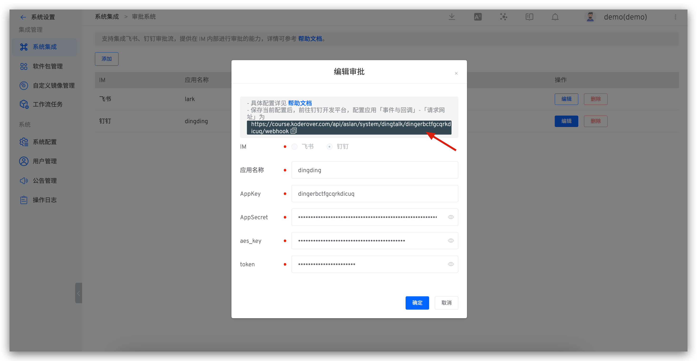

Parameter descriptions:
- `App Name`: Customize for easy identification in the Zadig system
- `App Key`: Obtained in Step 1
- `App Secret`: Obtained in Step 1
- `Aes Key`: Obtained in Step 1
- `Token`: Obtained in Step 1

After filling in the details, copy the "request URL" and save the configuration.

### Step 3: Configure "Request URL" and "Events"

1. Visit the DingTalk Open Platform - Application Functions - Events and Callbacks, fill in the request URL and save.

2. Enable the following events in the approval event:

- `Approval Task Start, End, Transfer`
- `Approval Instance Start, End`

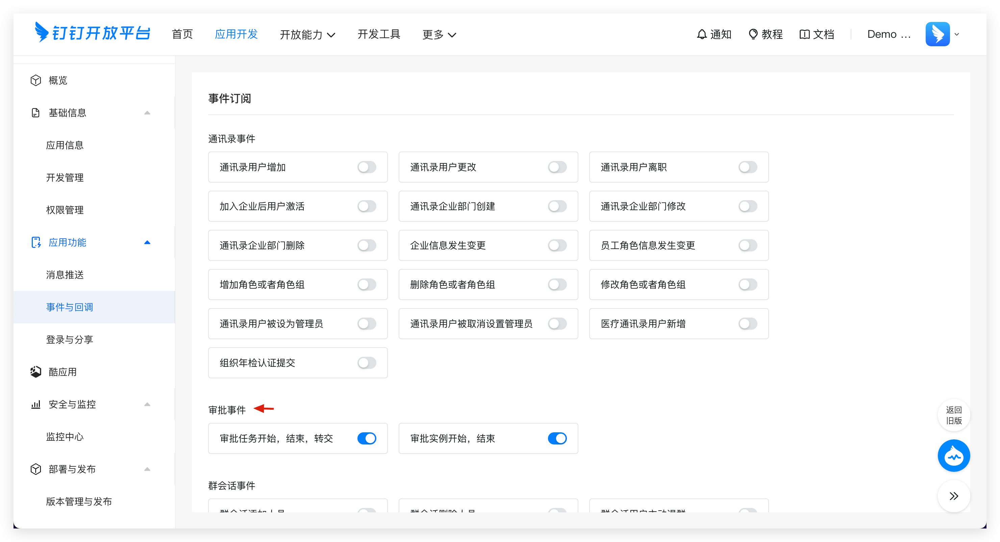

## WeChat Work

::: tip
After users complete approval on WeChat Work, the WeChat Work platform needs to callback the approval status to Zadig. To ensure normal WeChat Work approval functionality, please ensure the WeChat Work platform can access the Zadig domain name.
:::

### Step 1: Create an Application
1. Visit [the WeChat Work backend](https://work.weixin.qq.com/wework_admin/frame#apps) and create an application as shown below.
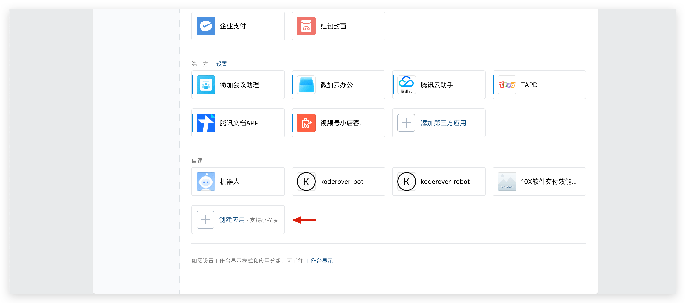

2. Obtain the `AgentID` and `Secret`.

3. Go to "My Enterprise" -> "Enterprise Information" and obtain the `Enterprise ID`.

4. Configure trusted domain names

5. Configure enterprise trusted IPs

6. Go to the "Approval" application and configure the "Application with Callable Interface," checking the created application.

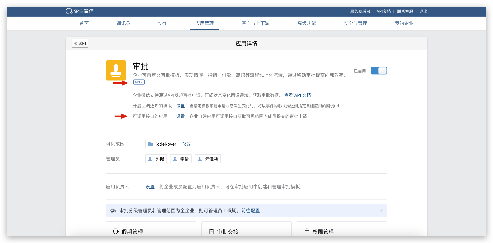
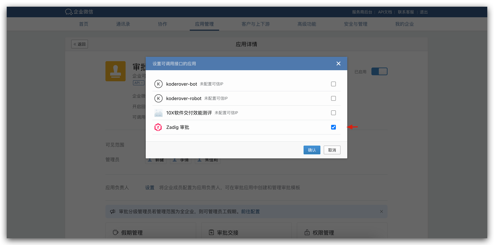

### Step 2: Integrate IM Application

1. Visit Zadig, click `System Settings` -> `Integrations` -> `IM`, and add the WeChat Work approval application, filling in the `Corp ID`, `AgentID`, and `Secret`, and obtain the callback address as shown below.

2. Go to the WeChat Work backend, configure the "Receive Information" URL callback address in the created application, and obtain the `Token` and `EncodingAESKey`.

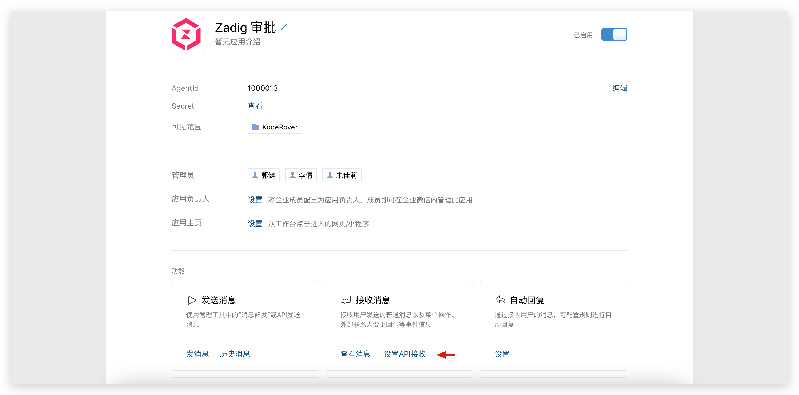
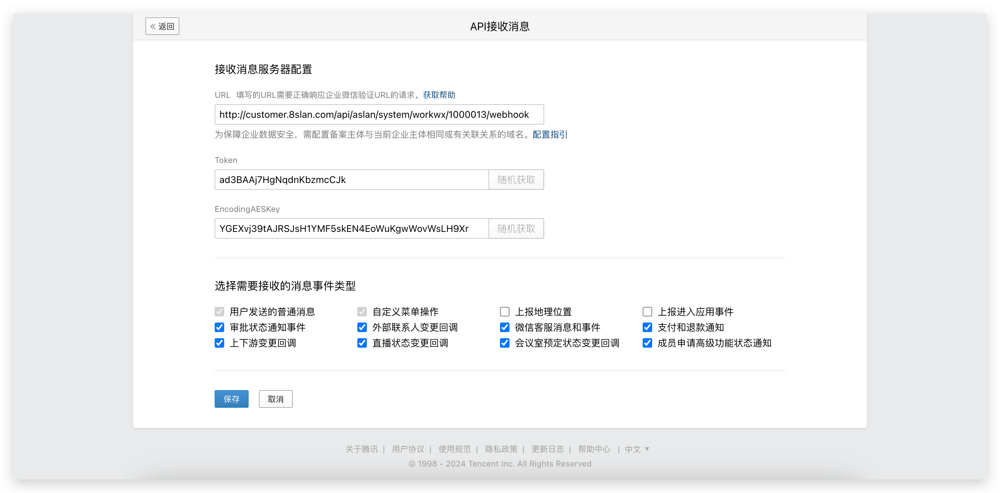

3. In the Zadig approval integration, fill in the `Token` and `EncodingAESKey` and save.

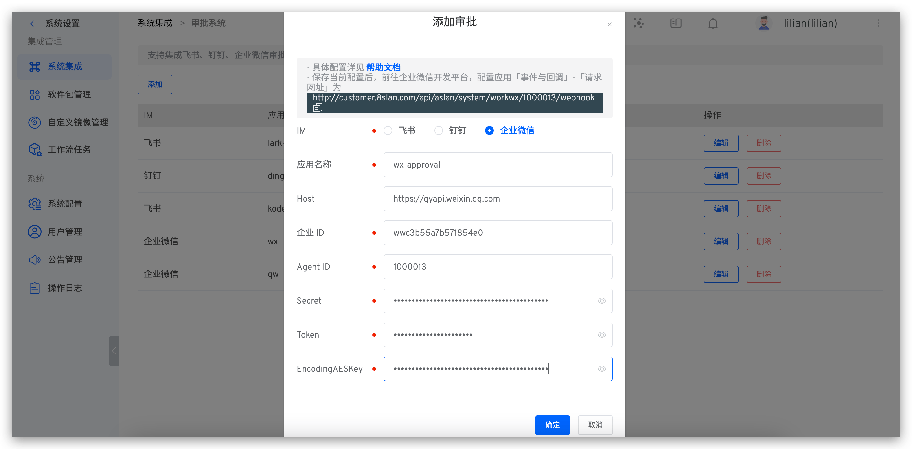

4. In the WeChat Work backend, save the "Receive Information."

### Step 3: Enable the Callback Notification Template

Go to the WeChat Work backend, "Approval" application, and enable the callback address template.

## Extended Reading

### Using Feishu Approval in Zadig

Refer to [Feishu approval](/en/Zadig%20v4.2/workflow/approval/#feishu-approval)

### Using Lark Approval in Zadig

Refer to [Lark approval](/en/Zadig%20v4.2/workflow/approval/#lark-approval)

### Using DingTalk Approval in Zadig

Refer to [DingTalk Approval](/en/Zadig%20v4.2/workflow/approval/#dingtalk-approval)

### Using WeChat Work Approval in Zadig

Refer to [WeChat Work Approval](/en/Zadig%20v4.2/workflow/approval/#enterprise-wechat-approval)