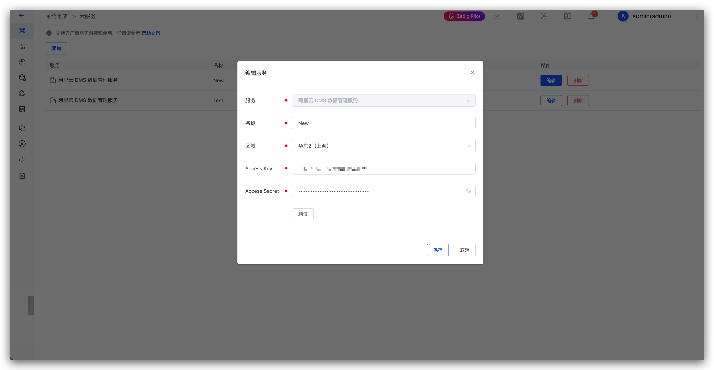

This article introduces integrating cloud services in Zadig. Currently supports integrating Alibaba Cloud DMS data management service.

## Alibaba Cloud DMS Data Management Service

Click `System Settings` -> `System Integration` -> `Cloud Service` -> `Add`:



Parameter Description:

- `System Identifier`: System identifier used to identify the system
- `Region`: Alibaba Cloud DMS data management service region
- `Access Key`: Alibaba Cloud DMS data management service Access Key
- `Secret Key`: Alibaba Cloud DMS data management service Secret Key

Note: Access Key and Secret Key need to have read and write permissions for DMS data management service. The specific permission configuration is as follows:
```
{
  "Version": "1",
  "Statement": [
    {
      "Effect": "Allow",
      "Action": [
        "dms:ListOrders",
        "dms:ExecuteDataCorrect",
        "dms:GetDataCorrectTaskDetail"
      ],
      "Resource": "*"
    }
  ]
}
```
And you need to add `Administrator` permissions on DMS, as shown in the figure:


