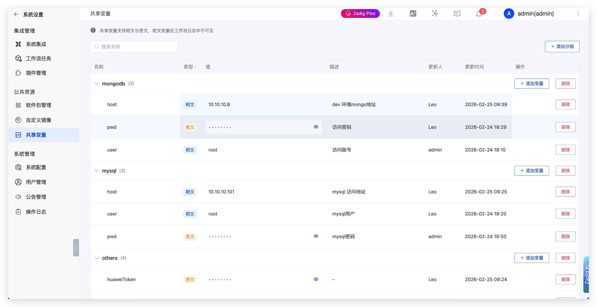

This article introduces configuring and using shared variables in Zadig.

## Shared Variable Configuration

Zadig supports two types of shared variable configuration: project-level and system-level.

### Configuration Entry

- **System-level Shared Variables**: Click `System Settings` -> `System Integration` -> `Shared Variables` -> `Add`
- **Project-level Shared Variables**: Click Project -> `Configuration` -> `Shared Variables` -> `Add`

### Configuration Description

- Shared variables support group management, and variable names cannot be duplicated within the same group
- Shared variable types are divided into plaintext and ciphertext. Ciphertext type variables are not visible in workflow logs
- When duplicate variable names exist, project-level variables have higher priority than system-level variables

## Shared Variable Usage

Shared variables can be used in the following scenarios:
- Build
- Test
- Code Scanning
- Workflow

### Usage Method

Reference shared variables in configuration using `{{.parameter.<variable group name>.<variable name>}}`.
