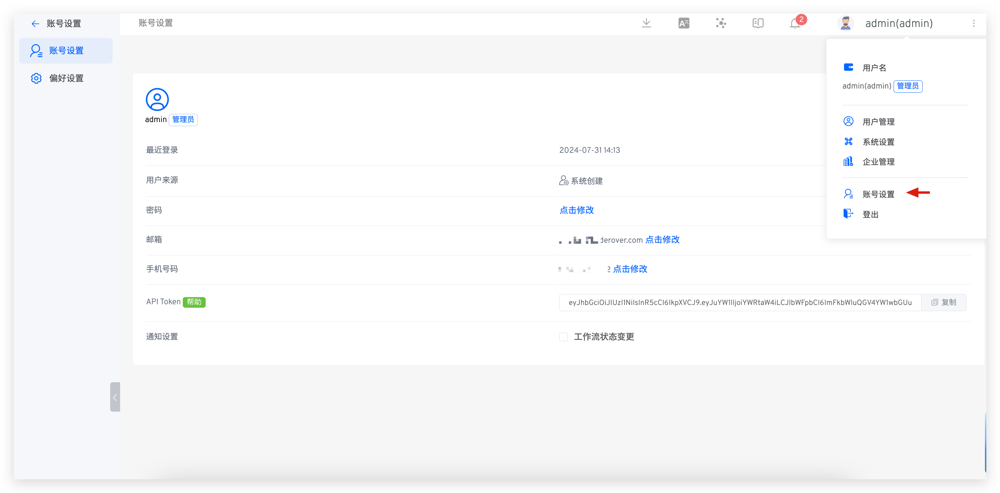
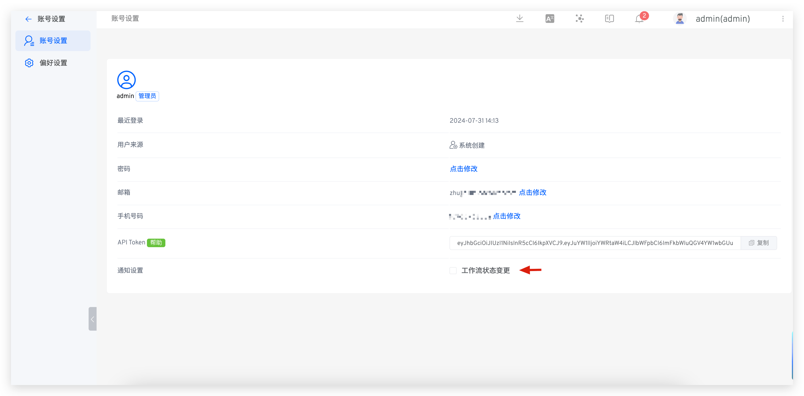
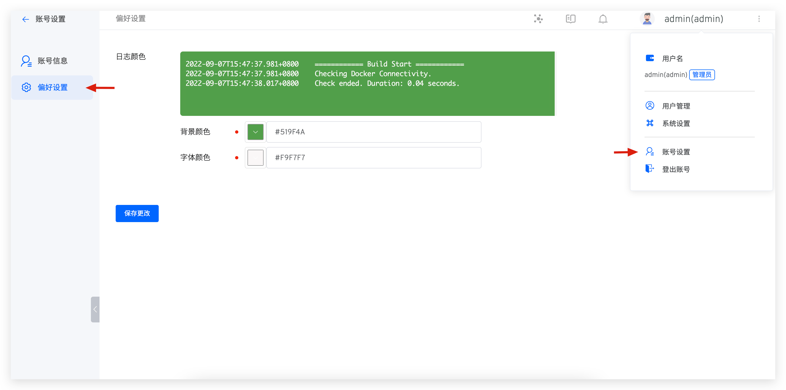
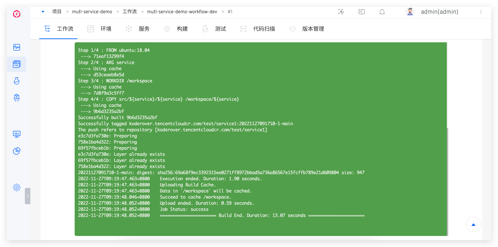

This article primarily introduces the account settings function in Zadig, including:

- Basic account information
- Personal notification settings
- System preferences (workflow logs, environment logs, background color, and font color for environment debugging)

## Profile

Click on your avatar -> `Profile` to modify the basic information of your account.

## Notification Settings

The following events currently trigger notifications:

- Environment: Notifications for adding, deleting, or updating environments in a project
- System Quota: Notifications for the timely cleanup of workflow products
- Workflow: Notifications for creating or deleting workflows

If you enable `Workflow Status Changed`,
- you will be notified when a workflow task is successful, fails, or is canceled
- When a workflow task is pending approval, the approver will be notified

## Preference

Click on your avatar -> `Profile` -> `Preference` to set the background color and font color, as shown in the figure below.

After saving your changes, the background color and font color for workflow logs, environment logs, and environment debugging will take effect.

