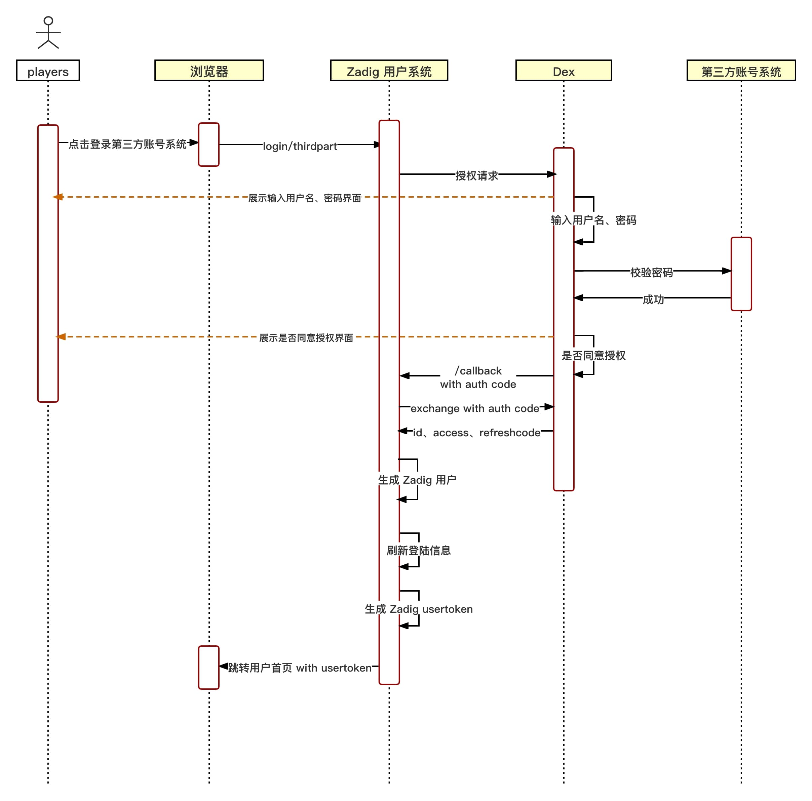
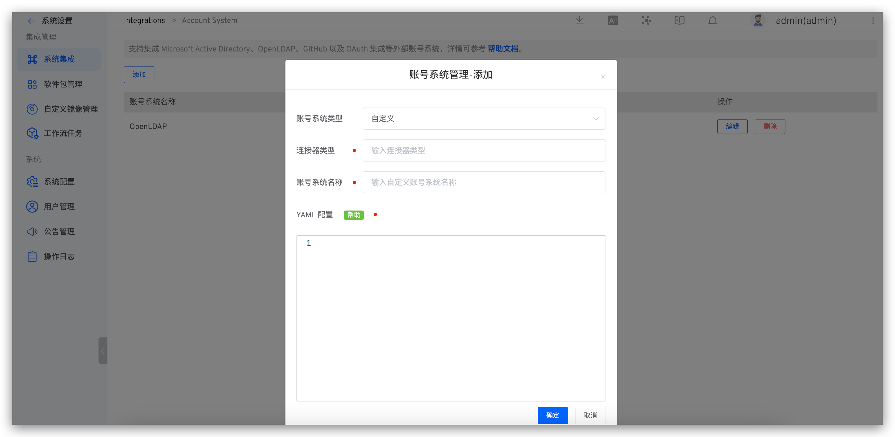
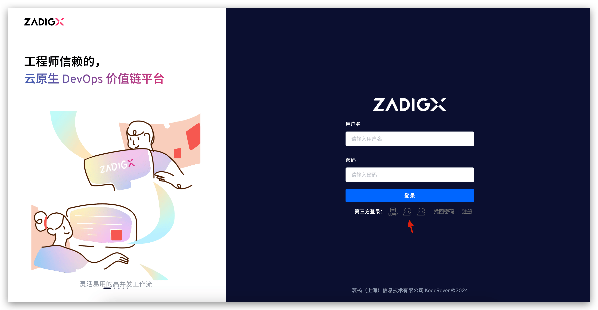

Currently, Zadig user system uses the open-source project [Dex](https://github.com/dexidp/dex) as an identity connector. However, Dex supports a limited list of protocols ([Dex supported protocols](https://dexidp.io/docs/connectors/)), and Zadig has implemented some standard extensions based on the Dex official library, such as OAuth protocol. If your account system is not officially supported by Zadig, you can integrate your custom account system by forking [koderover/dex](https://github.com/koderover/dex) and writing a Connector.

## Custom Account System Login Flow Chart


## Custom Account System Integration Process

### Step 1: Write a Custom Dex Connector

1. fork [koderover/dex](https://github.com/koderover/dex)
2. Write Dex custom Connector (based on the latest Branch release-1.10.0)
- Currently Dex Connector interface is defined in [dex/connector/connector.go](https://github.com/koderover/dex/blob/release-1.10.0/connector/connector.go) , and the official abstracts four interfaces: `PasswordConnector` , `CallbackConnector` , `RefreshConnector` , and `SAMLConnector` Users can implement their own Connector according to their own account system, and use dex/connector various Connector combinations to implement these four interfaces.

The following is a brief description of each interface, and the corresponding interface needs to be implemented according to the specific interaction method of the account system login:
|Interface name|Instructions for use|Currently available for reference|
|-----|-----|-----|
|PasswordConnector|1. Simple use of username and password to log in to obtain user information.<br> Dex The interaction with the account system is synchronous|keystone , atlassiancrowed , ldap , mock/passwordConnector , passwordDB (located at [dex/server/server.go](https://github.com/koderover/dex/blob/release-1.10.0/server/server.go)|
|CallbackConnector|1. Redirecting to obtain user information<br> Dex The interaction with the account system is asynchronous|mock/Callback, bitbucketcloud, authproxy, gitea, github, gitlab, google, linkedin, microsoft, oauth, oidc, openshift|
|SAMLConnector|A SAML connector that implements HTTP POST binding. RelayState is handled by the server |saml|
|RefreshConnector|After implementation, you can update the client claims|mock/Callback, bitbucketcloud, atlassiancrowed, gitea, github, gitlab, google, ldap, linkedin, microsoft, mock/passwordConnector, oidc, passwordDB (located in dex/server/server.go)|

- Add the added custom connector type and name to the ConnectorsConfig in dex/server/server.go.

#### Reference Example
Take the OAuth connector in the dex/connector directory as an example to explain.
1. Implement connector interface

This connector implements the CallbackConnector interface.

<h5 id="!">The following is the code OAuth connector</h5>

::: details
``` Go
package oauth

import (
   "context"
   "crypto/tls"
   "crypto/x509"
   "encoding/base64"
   "encoding/json"
   "errors"
   "fmt"
   "io/ioutil"
   "net"
   "net/http"
   "strings"
   "time"

   "golang.org/x/oauth2"

   "github.com/dexidp/dex/connector"
   "github.com/dexidp/dex/pkg/log"
)

type oauthConnector struct {
   clientID             string
   clientSecret         string
   redirectURI          string
   tokenURL             string
   authorizationURL     string
   userInfoURL          string
   scopes               []string
   userIDKey            string
   userNameKey          string
   preferredUsernameKey string
   emailKey             string
   emailVerifiedKey     string
   groupsKey            string
   httpClient           *http.Client
   logger               log.Logger
}

type connectorData struct {
   AccessToken string
}

type Config struct {
   ClientID           string   `json:"clientID"`
   ClientSecret       string   `json:"clientSecret"`
   RedirectURI        string   `json:"redirectURI"`
   TokenURL           string   `json:"tokenURL"`
   AuthorizationURL   string   `json:"authorizationURL"`
   UserInfoURL        string   `json:"userInfoURL"`
   Scopes             []string `json:"scopes"`
   RootCAs            []string `json:"rootCAs"`
   InsecureSkipVerify bool     `json:"insecureSkipVerify"`
   UserIDKey          string   `json:"userIDKey"` // defaults to "id"
   ClaimMapping       struct {
      UserNameKey          string `json:"userNameKey"`          // defaults to "user_name"
      PreferredUsernameKey string `json:"preferredUsernameKey"` // defaults to "preferred_username"
      GroupsKey            string `json:"groupsKey"`            // defaults to "groups"
      EmailKey             string `json:"emailKey"`             // defaults to "email"
      EmailVerifiedKey     string `json:"emailVerifiedKey"`     // defaults to "email_verified"
   } `json:"claimMapping"`
}

func (c *Config) Open(id string, logger log.Logger) (connector.Connector, error) {
   var err error

   if c.UserIDKey == "" {
      c.UserIDKey = "id"
   }

   if c.ClaimMapping.UserNameKey == "" {
      c.ClaimMapping.UserNameKey = "user_name"
   }

   if c.ClaimMapping.PreferredUsernameKey == "" {
      c.ClaimMapping.PreferredUsernameKey = "preferred_username"
   }

   if c.ClaimMapping.GroupsKey == "" {
      c.ClaimMapping.GroupsKey = "groups"
   }

   if c.ClaimMapping.EmailKey == "" {
      c.ClaimMapping.EmailKey = "email"
   }

   if c.ClaimMapping.EmailVerifiedKey == "" {
      c.ClaimMapping.EmailVerifiedKey = "email_verified"
   }
   oauthConn := &oauthConnector{
      clientID:             c.ClientID,
      clientSecret:         c.ClientSecret,
      tokenURL:             c.TokenURL,
      authorizationURL:     c.AuthorizationURL,
      userInfoURL:          c.UserInfoURL,
      scopes:               c.Scopes,
      redirectURI:          c.RedirectURI,
      logger:               logger,
      userIDKey:            c.UserIDKey,
      userNameKey:          c.ClaimMapping.UserNameKey,
      preferredUsernameKey: c.ClaimMapping.PreferredUsernameKey,
      groupsKey:            c.ClaimMapping.GroupsKey,
      emailKey:             c.ClaimMapping.EmailKey,
      emailVerifiedKey:     c.ClaimMapping.EmailVerifiedKey,
   }

   oauthConn.httpClient, err = newHTTPClient(c.RootCAs, c.InsecureSkipVerify)
   if err != nil {
      return nil, err
   }

   return oauthConn, err
}

func newHTTPClient(rootCAs []string, insecureSkipVerify bool) (*http.Client, error) {
   pool, err := x509.SystemCertPool()
   if err != nil {
      return nil, err
   }

   tlsConfig := tls.Config{RootCAs: pool, InsecureSkipVerify: insecureSkipVerify}
   for _, rootCA := range rootCAs {
      rootCABytes, err := ioutil.ReadFile(rootCA)
      if err != nil {
         return nil, fmt.Errorf("failed to read root-ca: %v", err)
      }
      if !tlsConfig.RootCAs.AppendCertsFromPEM(rootCABytes) {
         return nil, fmt.Errorf("no certs found in root CA file %q", rootCA)
      }
   }

   return &http.Client{
      Transport: &http.Transport{
         TLSClientConfig: &tlsConfig,
         Proxy:           http.ProxyFromEnvironment,
         DialContext: (&net.Dialer{
            Timeout:   30 * time.Second,
            KeepAlive: 30 * time.Second,
            DualStack: true,
         }).DialContext,
         MaxIdleConns:          100,
         IdleConnTimeout:       90 * time.Second,
         TLSHandshakeTimeout:   10 * time.Second,
         ExpectContinueTimeout: 1 * time.Second,
      },
   }, nil
}

func (c *oauthConnector) LoginURL(scopes connector.Scopes, callbackURL, state string) (string, error) {
   if c.redirectURI != callbackURL {
      c.logger.Errorf("expected callback URL %q did not match the URL in the config %q", callbackURL, c.redirectURI)
      return "", fmt.Errorf("expected callback URL %q did not match the URL in the config %q", callbackURL, c.redirectURI)
   }

   oauth2Config := &oauth2.Config{
      ClientID:     c.clientID,
      ClientSecret: c.clientSecret,
      Endpoint:     oauth2.Endpoint{TokenURL: c.tokenURL, AuthURL: c.authorizationURL},
      RedirectURL:  c.redirectURI,
      Scopes:       c.scopes,
   }

   return oauth2Config.AuthCodeURL(state), nil
}

func (c *oauthConnector) HandleCallback(s connector.Scopes, r *http.Request) (identity connector.Identity, err error) {
   q := r.URL.Query()
   if errType := q.Get("error"); errType != "" {
      c.logger.Errorf("get error:%s", q.Get("error_description"))
      return identity, errors.New(q.Get("error_description"))
   }

   oauth2Config := &oauth2.Config{
      ClientID:     c.clientID,
      ClientSecret: c.clientSecret,
      Endpoint:     oauth2.Endpoint{TokenURL: c.tokenURL, AuthURL: c.authorizationURL},
      RedirectURL:  c.redirectURI,
      Scopes:       c.scopes,
   }

   ctx := context.WithValue(r.Context(), oauth2.HTTPClient, c.httpClient)

   token, err := oauth2Config.Exchange(ctx, q.Get("code"))
   if err != nil {
      c.logger.Errorf("OAuth connector: failed to get token: %v", err)
      return identity, fmt.Errorf("OAuth connector: failed to get token: %v", err)
   }

   client := oauth2.NewClient(ctx, oauth2.StaticTokenSource(token))

   userInfoResp, err := client.Get(c.userInfoURL)
   if err != nil {
      c.logger.Errorf("OAuth Connector: failed to execute request to userinfo: %v", err)
      return identity, fmt.Errorf("OAuth Connector: failed to execute request to userinfo: %v", err)
   }
   defer userInfoResp.Body.Close()

   if userInfoResp.StatusCode != http.StatusOK {
      c.logger.Errorf("OAuth Connector: failed to execute request to userinfo: status %d", userInfoResp.StatusCode)
      return identity, fmt.Errorf("OAuth Connector: failed to execute request to userinfo: status %d", userInfoResp.StatusCode)
   }

   var userInfoResult map[string]interface{}
   err = json.NewDecoder(userInfoResp.Body).Decode(&userInfoResult)
   if err != nil {
      c.logger.Errorf("OAuth Connector: failed to parse userinfo: %v", err)
      return identity, fmt.Errorf("OAuth Connector: failed to parse userinfo: %v", err)
   }

   userID, found := userInfoResult[c.userIDKey].(string)
   if !found {
      c.logger.Errorf("OAuth Connector: not found %v claim", c.userIDKey)
      return identity, fmt.Errorf("OAuth Connector: not found %v claim", c.userIDKey)
   }

   identity.UserID = userID
   identity.Username, _ = userInfoResult[c.userNameKey].(string)
   identity.PreferredUsername, _ = userInfoResult[c.preferredUsernameKey].(string)
   identity.Email, _ = userInfoResult[c.emailKey].(string)
   identity.EmailVerified, _ = userInfoResult[c.emailVerifiedKey].(bool)

   if s.Groups {
      groups := map[string]struct{}{}

      c.addGroupsFromMap(groups, userInfoResult)
      c.addGroupsFromToken(groups, token.AccessToken)

      for groupName := range groups {
         identity.Groups = append(identity.Groups, groupName)
      }
   }

   if s.OfflineAccess {
      data := connectorData{AccessToken: token.AccessToken}
      connData, err := json.Marshal(data)
      if err != nil {
         c.logger.Errorf("OAuth Connector: failed to parse connector data for offline access: %v", err)
         return identity, fmt.Errorf("OAuth Connector: failed to parse connector data for offline access: %v", err)
      }
      identity.ConnectorData = connData
   }
   return identity, nil
}

func (c *oauthConnector) addGroupsFromMap(groups map[string]struct{}, result map[string]interface{}) error {
   groupsClaim, ok := result[c.groupsKey].([]interface{})
   if !ok {
      return errors.New("cannot convert to slice")
   }

   for _, group := range groupsClaim {
      if groupString, ok := group.(string); ok {
         groups[groupString] = struct{}{}
      }
   }

   return nil
}

func (c *oauthConnector) addGroupsFromToken(groups map[string]struct{}, token string) error {
   parts := strings.Split(token, ".")
   if len(parts) < 2 {
      return errors.New("invalid token")
   }

   decoded, err := decode(parts[1])
   if err != nil {
      return err
   }

   var claimsMap map[string]interface{}
   err = json.Unmarshal(decoded, &claimsMap)
   if err != nil {
      return err
   }

   return c.addGroupsFromMap(groups, claimsMap)
}

func decode(seg string) ([]byte, error) {
   if l := len(seg) % 4; l > 0 {
      seg += strings.Repeat("=", 4-l)
   }

   return base64.URLEncoding.DecodeString(seg)
}
```
:::

2. Add the added custom connector type and name to the ConnectorsConfig in dex/server/server.go as shown below.
::: details
``` Go
// ConnectorsConfig variable provides an easy way to return a config struct
// depending on the connector type.
var ConnectorsConfig = map[string]func() ConnectorConfig{
   "keystone":        func() ConnectorConfig { return new(keystone.Config) },
   "mockCallback":    func() ConnectorConfig { return new(mock.CallbackConfig) },
   "mockPassword":    func() ConnectorConfig { return new(mock.PasswordConfig) },
   "ldap":            func() ConnectorConfig { return new(ldap.Config) },
   "gitea":           func() ConnectorConfig { return new(gitea.Config) },
   "github":          func() ConnectorConfig { return new(github.Config) },
   "gitlab":          func() ConnectorConfig { return new(gitlab.Config) },
   "google":          func() ConnectorConfig { return new(google.Config) },
   "oidc":            func() ConnectorConfig { return new(oidc.Config) },
   // 这个位置需要加自定义 connector type
   "oauth":           func() ConnectorConfig { return new(oauth.Config) },
   "saml":            func() ConnectorConfig { return new(saml.Config) },
   "authproxy":       func() ConnectorConfig { return new(authproxy.Config) },
   "linkedin":        func() ConnectorConfig { return new(linkedin.Config) },
   "microsoft":       func() ConnectorConfig { return new(microsoft.Config) },
   "bitbucket-cloud": func() ConnectorConfig { return new(bitbucketcloud.Config) },
   "openshift":       func() ConnectorConfig { return new(openshift.Config) },
   "atlassian-crowd": func() ConnectorConfig { return new(atlassiancrowd.Config) },
   // Keep around for backwards compatibility.
   "samlExperimental": func() ConnectorConfig { return new(saml.Config) },
}
```
:::

### Step 2: Build a Custom Dex Image
1. Change the `DOCKER_REPO` variable in the root [Makefile](https://github.com/koderover/dex/blob/release-1.10.0/Makefile) to your own public image registry
2. Run `make docker-image` to build the image and upload the image to your own public image repository
3. Overwrite the original image of Dex with a custom image
```bash
kubectl get deployment -n <Zadig Namespace> | grep dex # Obtain Dex's deployment
kubectl set image deployment/<Dex deployment> dex=<New Dex image> --record -n <Zadig Namespace> # Replace Dex images
```

### Step 3: Enter the Configuration in the Zadig Platform
After logging in Zadig Platform, enter the account type at `System Setting` -> `Account` -> `Custom` YAML configuration, as shown in the figure below.
> YAML Configuration is generated by [the `Config` structure](#connector) in Connector .




### Step 4: Log in With a Custom Account System Zadig
Visit the Zadig login page and click on a third party to log in as shown in the figure below. Jump to the corresponding login page, enter the username and password to log in to the Zadig system.



## [Optional] Set as the Default Account System
Refer [to setting the default account system](/en/Zadig%20v4.2/settings/account/ldap/#optional-set-as-the-default-account-system) .