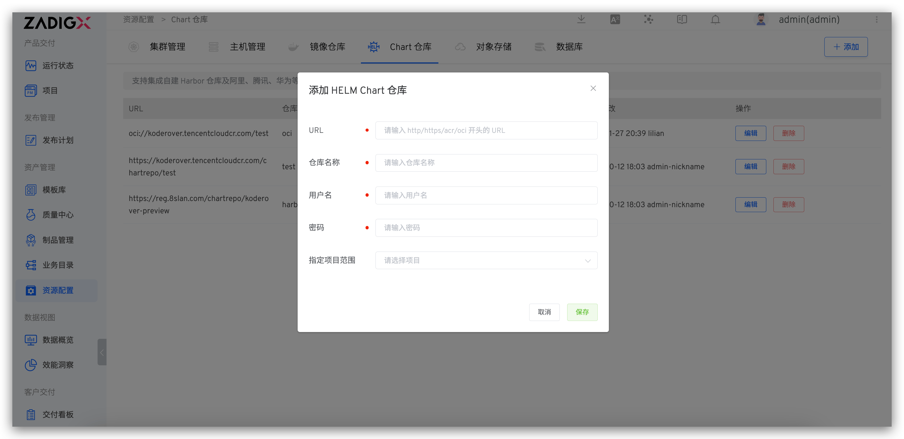

This article describes how to integrate a Chart repository in the Zadig system.

## How to Integrate

Access `Resource Configuration` → `Chart Repository` → `Add`, fill in the Chart repository configuration information, and save it.

Field Description:

- `URL`: Repository access address. Supports http, https, acr, and oci protocols
- `Repository Name`: Repository name
- `Username`: Repository username
- `Password`: Repository password
- `Specified Project Scope`: Specifies which projects can use the Chart repository. `All Projects` includes projects created after the repository is added

## Using the Chart Repository

1. Import Chart configuration from the Chart repository to quickly create services. See [import service from Chart repository](/en/Zadig%20v4.3/project/service/helm/chart/#import-service-from-chart-repository).
2. Add Chart configuration from the Chart repository to the production environment to quickly instantiate deployments. See [add services](/en/Zadig%20v4.3/project/env/helm/chart/#add-a-service).
3. Upload validated Charts to the Chart repository for version delivery. See [version management](/en/Zadig%20v4.3/project/version/#create-a-version).