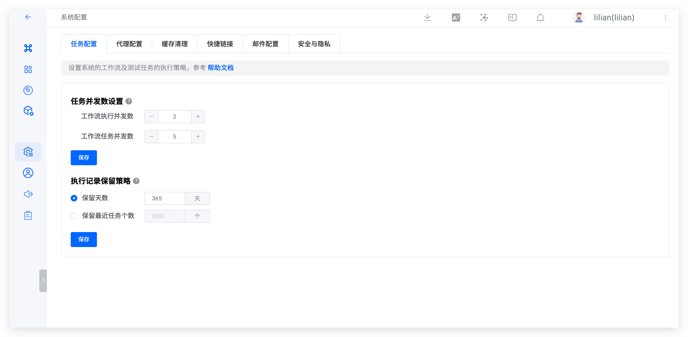
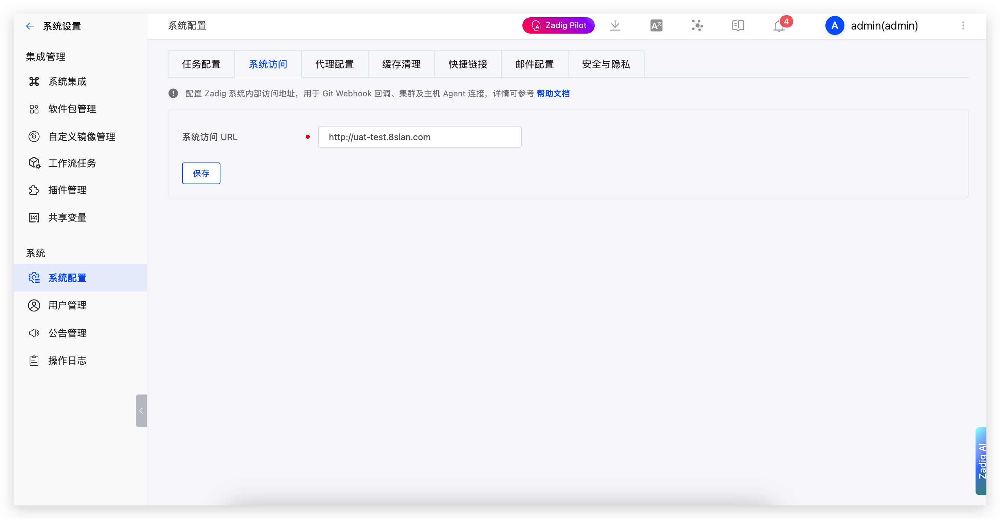
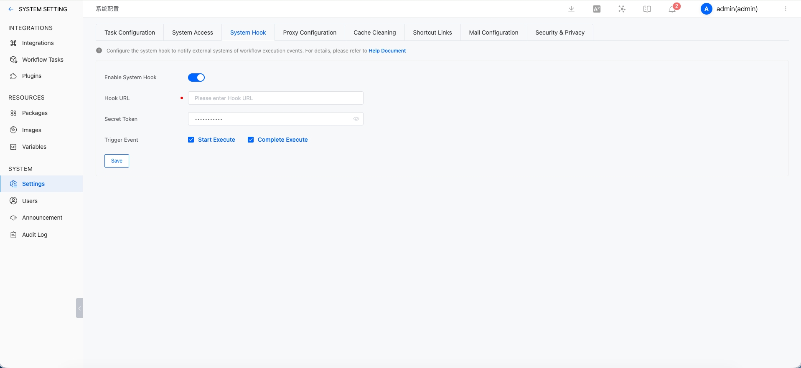
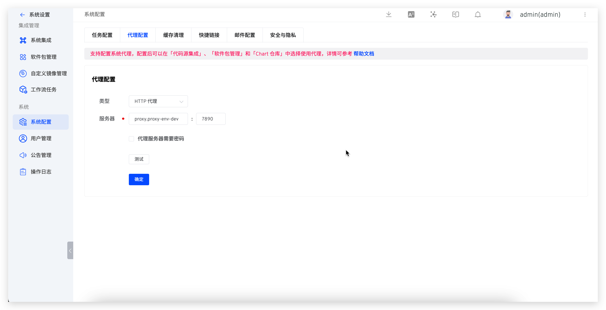
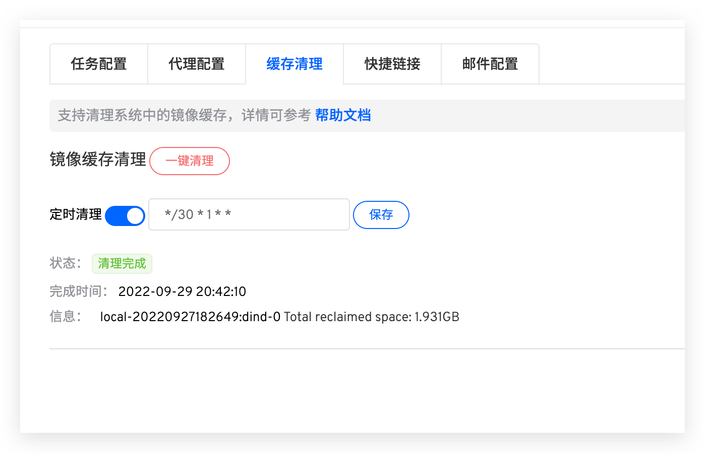
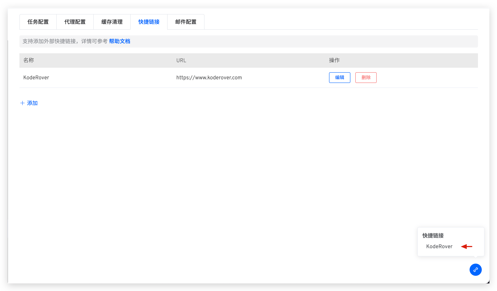
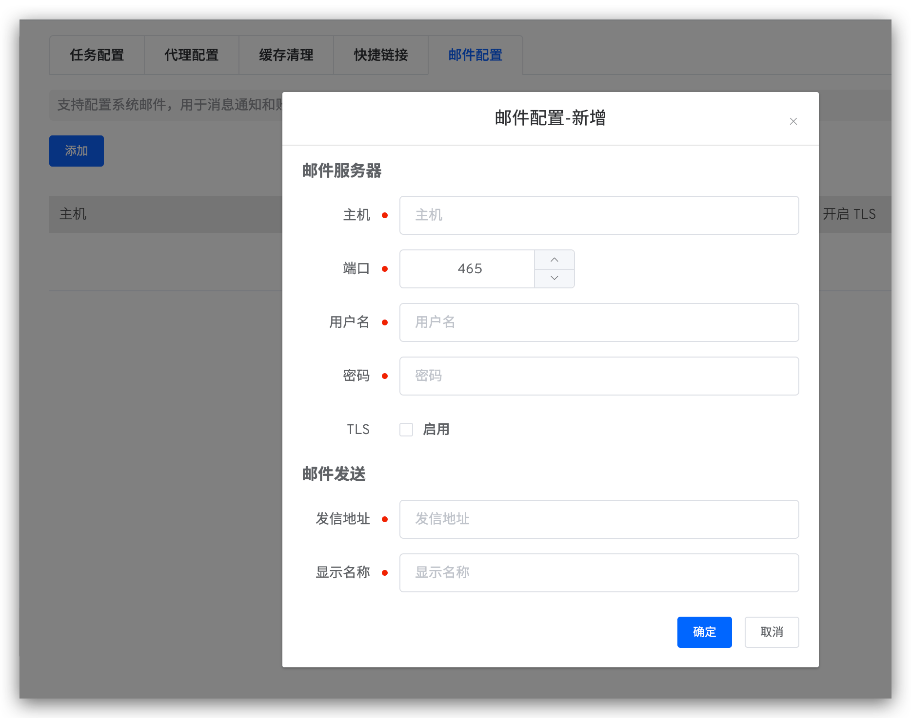
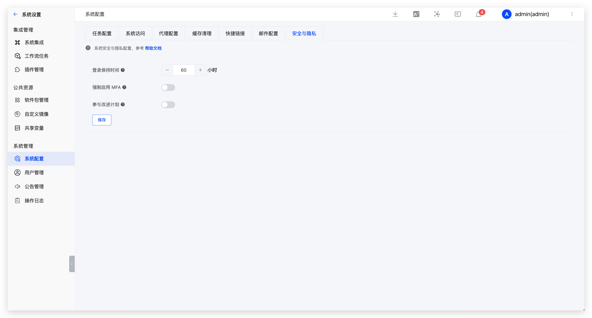

This article introduces the basic functions of Zadig system configuration, including task configuration, proxy configuration, cache cleaning, shortcut links, mail configuration, and security and privacy.

## Task Configuration

System administrators can go to `System Setting` → `System Settings` → `Task Configuration` to configure the number of concurrent tasks and the retention policy for historical tasks.



### Task Concurrency Settings
- Workflow execution concurrency: Controls the number of concurrent workflow/test tasks.
- Workflow task concurrency: Controls the number of services that can be deployed simultaneously within a workflow.

Each workflow task requires at least 1C2G resources. When setting the number of concurrent tasks, the following relationship must be satisfied:

```bash
Workflow execution concurrency * Workflow task concurrency * 1C2G ≤ Cluster resources
```

For example: If the cluster resources are 8C16G, it is recommended to set the workflow execution concurrency to 2 and the workflow task concurrency to 4.

### Execution Record Retention Policy

::: danger
Proceed with caution, as cleared data cannot be recovered
:::

- Set the retention period for workflow data (including workflow tasks and the build logs, binary files, test logs, and test reports they generate). The default retention period is 365 days, and data exceeding this period will be permanently deleted.
- The system will automatically clean up data at 2:00 AM daily according to the configured rules.

## System Access

System administrators can go to `System Setting` → `System Settings` → `System Access` to configure the system access method.



Parameter Description:
- `System Access URL`: Configure the internal access address of the Zadig system, used for Git Webhook callback, cluster and host Agent connections.

## System Webhook

System administrators can go to `System Setting` → `System Settings` → `System Webhook` to configure a system-level Webhook for sending notifications to external systems when workflows start and complete.



**Configuration:**

- `Enable System Webhook`: Enable or disable the system webhook feature.
- `Hook URL`: The external service endpoint used to receive system event notifications.
- `Secret Token`: The authentication token included in the webhook request header as `X-Zadig-Token`.
- `Trigger Events`: Select which system events should trigger notifications. Currently supported: `Start Execute`, `Complete Execute`.

Notes:
- The `start_execute` event is sent when a workflow starts.
- The `complete_execute` event is sent when a workflow finishes.
- Intermediate states such as waiting for manual execution do not trigger system webhooks.

### Payload Example

When a workflow starts:

```json
{
  "object_kind": "workflow",
  "event": "start_execute",
  "workflow": {
    "task_id": 300,
    "project_name": "yaml",
    "project_display_name": "K8sYAML-1",
    "workflow_name": "cache-test",
    "workflow_display_name": "cache-test",
    "status": "created",
    "remark": "1",
    "detail_url": "https://xxx/v1/projects/detail/project-a/pipelines/custom/workflow-a?display_name=workflow-a",
    "error": "",
    "create_time": 1779795193,
    "start_time": 1779795194,
    "end_time": 0,
    "stages": [],
    "task_creator": "admin",
    "task_creator_id": "user-id-xxx",
    "task_creator_email": "admin@koderover.com",
    "task_type": "workflow"
  },
  "release_plan": null
}
```

When a workflow completes:

```json
{
  "object_kind": "workflow",
  "event": "complete_execute",
  "workflow": {
    "task_id": 300,
    "project_name": "yaml",
    "project_display_name": "K8sYAML-1",
    "workflow_name": "cache-test",
    "workflow_display_name": "cache-test",
    "status": "passed",
    "remark": "",
    "detail_url": "https://xxx/v1/projects/detail/project-a/pipelines/custom/workflow-a?display_name=workflow-a",
    "error": "",
    "create_time": 1779795193,
    "start_time": 1779795215,
    "end_time": 1779795245,
    "stages": [],
    "task_creator": "admin",
    "task_creator_id": "user-id-xxx",
    "task_creator_email": "admin@koderover.com",
    "task_type": "workflow"
  },
  "release_plan": null
}
```

**Payload Fields**

| Field | Type | Description |
| --- | --- | --- |
| `object_kind` | string | Object type. Currently fixed as `workflow`. |
| `event` | string | Event name. Currently supported: `start_execute`, `complete_execute`. |
| `workflow` | object | Workflow task details. |
| `release_plan` | object / null | Release plan information. If the current task is not triggered by a release plan, this field is `null`. |
| `workflow.task_id` | int | Workflow task ID. |
| `workflow.project_name` | string | Project identifier. |
| `workflow.project_display_name` | string | Project display name. |
| `workflow.workflow_name` | string | Workflow identifier. |
| `workflow.workflow_display_name` | string | Workflow display name. |
| `workflow.status` | string | Current task status. |
| `workflow.remark` | string | Execution remark. |
| `workflow.detail_url` | string | Link to the task details page. |
| `workflow.error` | string | Error message. |
| `workflow.create_time` | int | Task creation time. |
| `workflow.start_time` | int | Task start time. |
| `workflow.end_time` | int | Task end time. |
| `workflow.stages` | array | Stage and job details. |
| `workflow.task_creator` | string | Task creator name. |
| `workflow.task_creator_id` | string | Task creator ID. |
| `workflow.task_creator_email` | string | Task creator email. |
| `workflow.task_type` | string | Task type. Currently `workflow`. |

## Proxy Configuration

The Zadig system supports the use of proxies. System administrators can go to `System Setting` → `System Settings` → `Proxy Configuration` to configure the proxy settings as shown in the figure below.



::: warning
Only configuring the proxy without enabling it in specific modules will not make the proxy effective
:::

Currently, proxies can be used when executing build tasks. The specific settings are as follows:
1. When pulling code, the proxy must be enabled in `System Settings` → `Integrations` → `Git Provider`
2. When pulling installation packages, the proxy must be enabled in `System Settings` → `Packages`
3. When pulling Chart packages, the proxy must be enabled in `Resourcing` → `Chart Repository`

## Cache Cleaning
System administrators can go to `System Setting` → `System Settings` → `Cache Cleaning` to clean up component caches in the system, including stopped containers, all unused networks, unused images, and `Build Cache Image`.

1. `One-click Clean`: After this operation, the cache will be cleaned immediately
2. `Scheduled Clean`: The system will parse the Cron expression according to `Minutes Hours Date Month Week` and clean the cache at the specified intervals. The figure below represents a cleanup every 30 minutes on the 1st of each month



## Shortcut Links
System administrators can go to `System Settings` → `System Settings` → `Shortcut Links` to add common external links, making it convenient for users to access them quickly.



## Mail Configuration

System administrators can go to `System Settings` → `System Configuration` → `Mail Configuration` and click `Add` to define mail configurations.



Host Information Parameter Description:
- `Host`: The address of the mail server, for example: `smtp.example.163.com`
- `Port`: The port number of the mail server, default is `465`
- `Username`: The username for the email client, which can be obtained from the email service provider
- `Password`: The password for the email client, which can be obtained from the email service provider
- `TLS`: Whether to enable the TLS security protocol

Mail Sending Settings Parameter Description:
- `Sender Address`: The email address for sending emails, for example: `no-reply@koderover.com`
- `Display Name`: The name displayed in the email, for example: `no-reply`

## Security and Privacy

System administrators can go to `System Settings` -> `System Configuration` -> `Security and Privacy` to configure security and privacy settings.



### Login Session Duration

Set how long users stay logged in after signing in. Users are automatically logged out after the configured duration.

### Enforce MFA

When enabled, all users must complete TOTP binding before they can sign in. Currently, only TOTP (Authenticator App) is supported. Users who have already enabled MFA cannot disable it.
