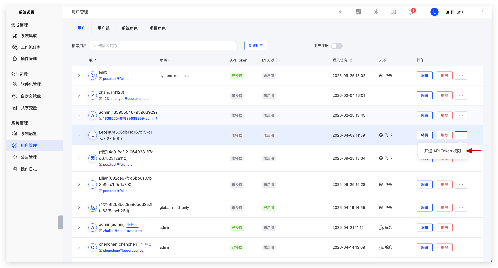
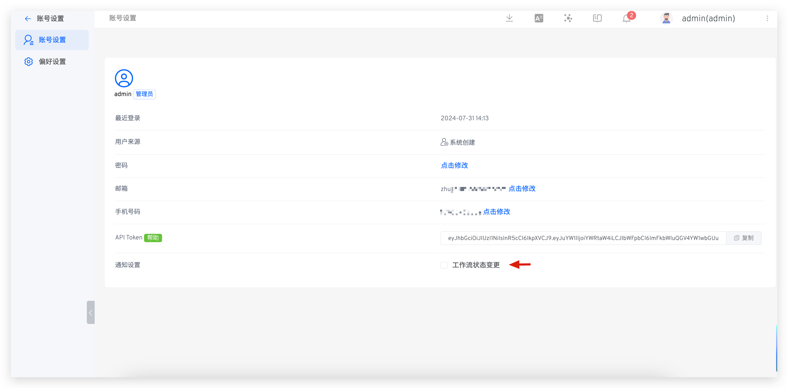
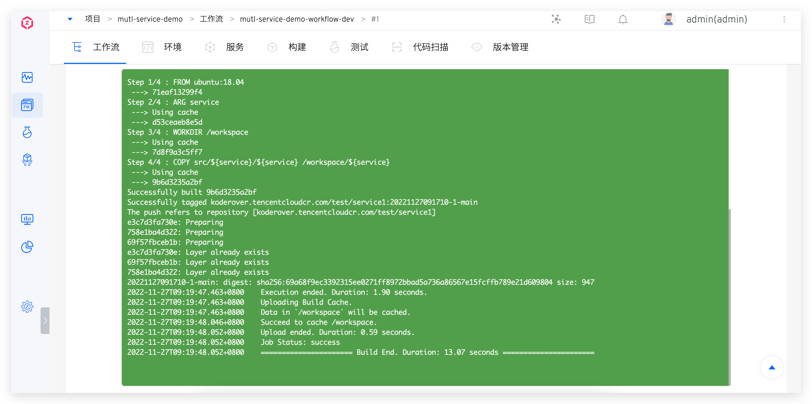

This article primarily introduces Zadig account settings, including:

- Account settings: basic account information and API token management
- Security settings: multi-factor authentication (MFA)
- Preference settings: workflow logs, environment logs, and background/font color for environment debugging

## Account Settings

Click your avatar -> `Profile` to modify your basic account information.

### API Token

::: tip
Regular users can obtain an API token only after being authorized by a system administrator. System administrators can go to `System Management` -> `User Management` and enable API token permission for specific users.
:::

Click your avatar -> `Profile` -> `API Token` to get an API token for OpenAPI calls. The token is visible only when generated, so keep it safe.

### System Notification Settings

The following events currently trigger notifications:

- Environment: Notifications for adding, deleting, or updating environments in a project
- System Quota: Notifications for the timely cleanup of workflow products
- Workflow: Notifications for creating or deleting workflows

If you enable workflow status change notifications:
- you will be notified when a workflow task is successful, fails, or is canceled
- When a workflow task is pending approval, the approver will be notified

## Security Settings

Multi-factor authentication (MFA) is a security measure that improves account security.

Click your avatar -> `Profile` -> `Security Settings` to enable MFA.

::: tip
If the system administrator enables `Enforce MFA` in `System Configuration` -> `Security and Privacy`, users cannot disable MFA.
:::

## Preference

Click on your avatar -> `Profile` -> `Preference` to set the background color and font color, as shown in the figure below.

After saving your changes, the background color and font color for workflow logs, environment logs, and environment debugging will take effect.

