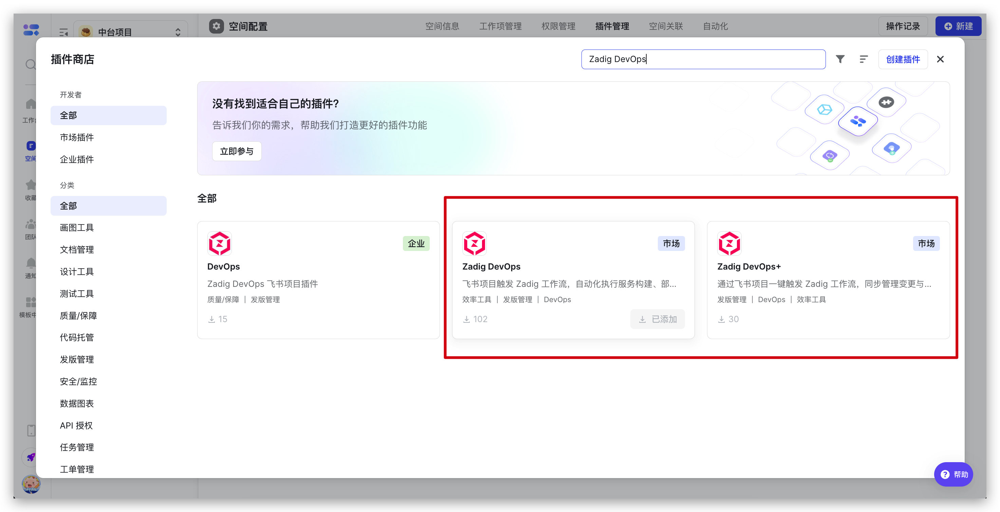
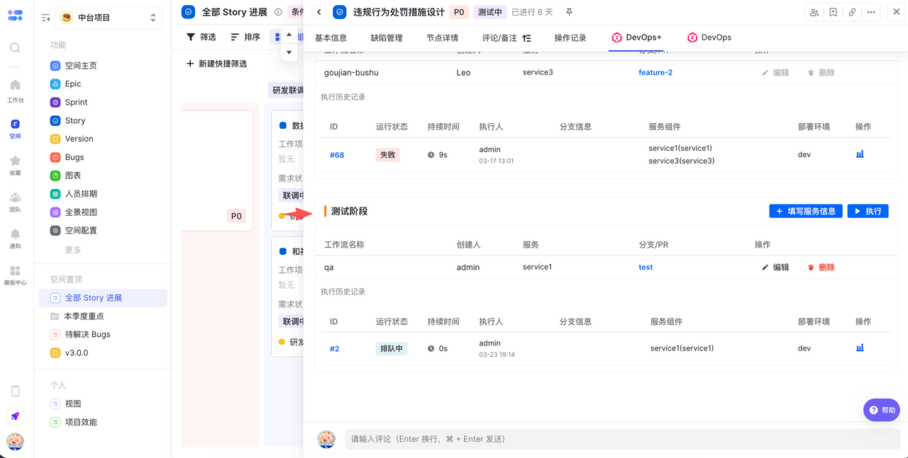
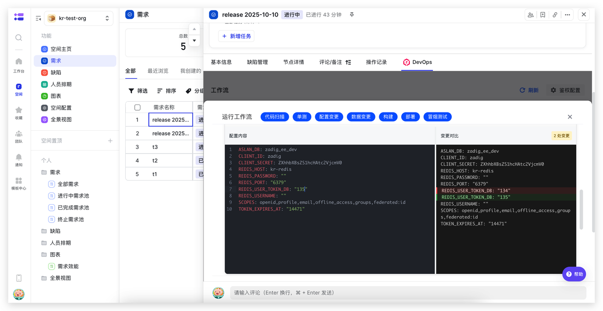
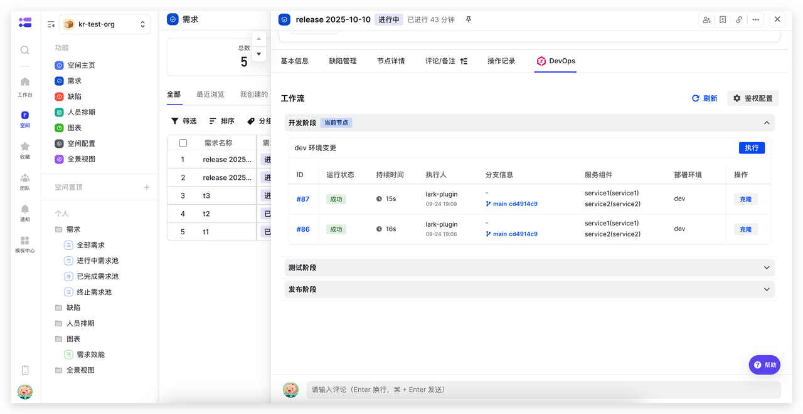
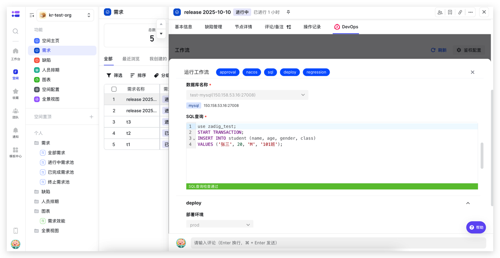
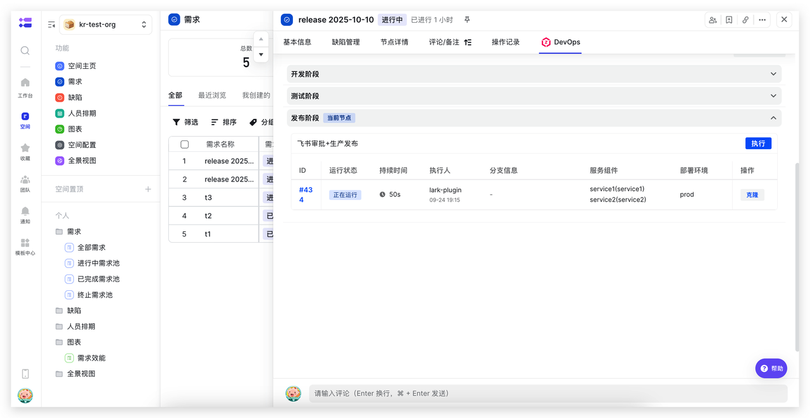

Zadig Lark Project plugins enable triggering Zadig workflows from Lark Project, automating service build, deployment, and release operations to improve efficiency and ensure quality. Two plugins are available: **Zadig DevOps** and **Zadig DevOps+**.

Zadig DevOps works out of the box with zero configuration and suits small teams for quick integration and simple release scenarios. Zadig DevOps+ builds on it with change tracing, release order management, bidirectional data sync, and customization for large enterprises with complex release and compliance needs.

## Install Plugin

Lark Project space administrators can find the "Zadig DevOps" or "Zadig DevOps+" plugin in plugin management and click "Add" to complete installation.

## Zadig DevOps+

### Plugin Configuration

After installation, find the installed "Zadig DevOps+" plugin in plugin management and click "Configure" on the right. Set the mapping between each phase and Zadig workflows, as well as the branch strategy.

### Use Cases

Zadig DevOps+ provides end-to-end change tracing and release order management for large enterprises. Developers submit change information (associated services, branches) in Lark Project and add it to release orders. Test results are automatically synced back, and releases use change information from the order directly. After confirmation, one-click release; execution runs automatically upon approval.

**Development Phase: Submit Changes and Associate with Release Order**

After development, developers submit change information (associated services, branches) in Lark Project and add it to the release order with one click. Changes can be reused multiple times. No system switching required; change records remain clear.

**Test Phase: View Execution Results in Real Time**

After the test node runs a workflow, execution results are automatically synced to Lark Project. Pass/fail status at each stage is visible at a glance for quick response.

**Release Phase: One-Click Release After Confirming Changes**

When the release node runs a workflow, it uses change information from the release order. After confirming code is merged, release can proceed. Execution runs automatically after approval. The release process is efficient and controllable.

## Zadig DevOps

### Plugin Configuration

After installation, find the installed "Zadig DevOps" plugin in plugin management and click "Configure" on the right to start configuration. Configure the corresponding relationship between work item nodes and Zadig workflows, as shown in the figures below.

### Use Cases

**Development and Self-Testing Phase: Update Development Environment and Perform Self-Testing Integration**

Execute Zadig development workflows directly on Lark Project development nodes. Automate code scanning, unit testing, build, deployment, smoke testing, and other steps. Combined with configuration and data changes, achieve consistent changes in development, reduce system switching, and improve efficiency.

**Integration Verification Phase: Update Test Environment and Perform Automated Verification**

Execute Zadig test workflows directly on Lark Project test nodes. Automate interface testing, performance testing, security scanning, and other steps to improve test verification efficiency and quality.

**Production Release Phase: Combine Lark Approval for Production Release**

Execute Zadig release workflows directly on Lark Project release nodes. Automate service updates, configuration changes, data changes, and other steps. Combined with Lark approval, achieve efficient and stable releases.

