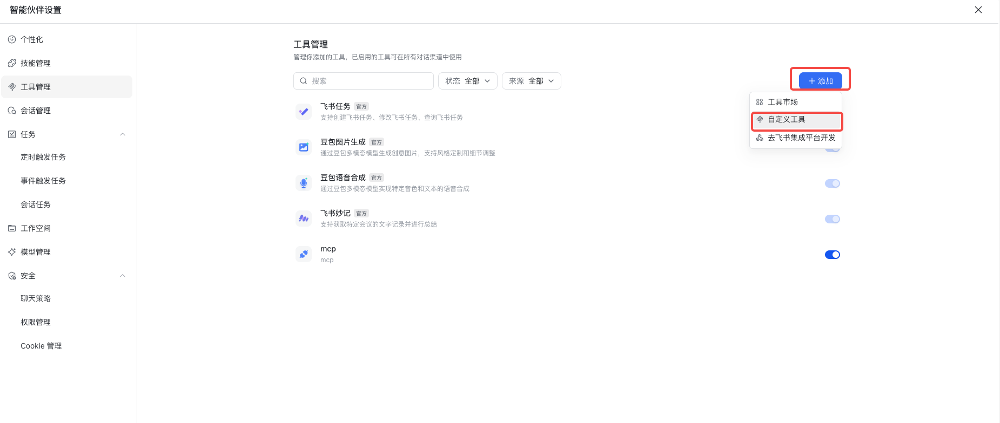
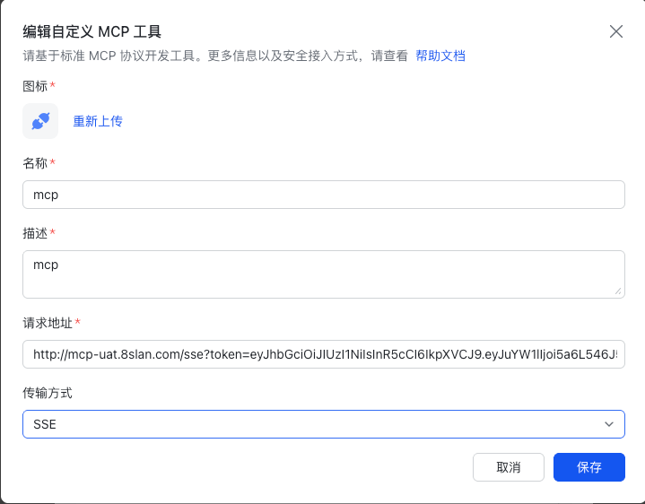

This article describes how to install and configure the Zadig MCP service.

## Usage

::: tip
- MCP Server requires Zadig v4.2.0 or later.
- The API Token can be obtained from **Account Settings** in the Zadig platform.
- Zadig MCP supports both `stdio` and `sse` startup modes. Choose the one that fits your scenario.
:::

### stdio Startup Mode

#### Applicable Scenarios

- Suitable for IDEs and clients such as Cursor, Claude Code, Trae, and VS Code that support launching MCP Server locally through `stdio`.
- Suitable for developers who want to install and use MCP locally without deploying an additional standalone server.

#### Installation

The installation script supports automatic configuration for the following clients: Cursor, Claude Code, Trae, and VS Code. Other clients that support the MCP standard can also be configured manually.

```bash
# Linux / macOS / Windows (WSL)
curl -fsSL https://resources.koderover.com/zadig-mcp/install.sh | sh

# Windows (PowerShell)
irm https://resources.koderover.com/zadig-mcp/install.ps1 | iex
```

#### Silent Installation

Suitable for scenarios where you want to pass the Zadig URL and Token in advance from a script.

```bash
curl -fsSL https://resources.koderover.com/zadig-mcp/install.sh | \
ZADIG_API_HOST=https://your-zadig.com ZADIG_API_TOKEN=your-token sh
```


### SSE Startup Mode

::: tip
- Replace `https://your-zadig.com`, `https://mcp.your-company.com`, and `your-token` in the examples with your actual address and token.
- This mode is suitable for accessing Zadig MCP through a remote URL, and requires MCP Server to be started or deployed separately.
- It is suitable for clients such as Feishu Aily that need to access MCP through a remote URL.
:::

#### Applicable Scenarios

- The client does not support launching MCP Server locally through `stdio`, and must access it through a public or private URL.
- MCP Server needs to be deployed in a shared testing, office, or team environment for multiple users.
- You need to connect clients such as Feishu Aily through a remote address.

#### A Practical Example: Deploying SSE Service in Zadig

- This approach deploys Zadig MCP Server as a service in a Zadig environment and exposes it externally through Ingress in SSE mode.
- Make sure port `3000` is not already in use before deployment.
- Update `ZADIG_API_HOST`, `MCP_BASE_URL`, `ingressClassName`, `name`, `namespace`, and the Ingress domain according to your environment.

##### Steps

1. Create a K8s project in Zadig, for example: `mcp`.
2. Add the following K8s YAML to the service configuration, name it `zadig-mcp`, and modify the key parameters based on your actual environment.
3. Save the service configuration.
4. Add the service to an environment.
5. Check the Pod status and confirm that the service starts successfully.

##### Service Configuration YAML Example

```yaml
apiVersion: v1
kind: ConfigMap
metadata:
  name: zadig-mcp-config
  labels:
    app: zadig-mcp
data:
  ZADIG_API_HOST: "https://your_zadig.com"
  MCP_TRANSPORT_TYPE: "sse"
  MCP_LISTEN_ADDR: "0.0.0.0:3000"
  MCP_BASE_URL: "http://your_domain:3000"
  MCP_SSE_ENDPOINT: "/sse"
  MCP_MESSAGE_ENDPOINT: "/message"
---
apiVersion: apps/v1
kind: Deployment
metadata:
  name: zadig-mcp
  labels:
    app: zadig-mcp
spec:
  replicas: 1
  selector:
    matchLabels:
      app: zadig-mcp
  template:
    metadata:
      labels:
        app: zadig-mcp
    spec:
      containers:
        - name: zadig-mcp
          image: koderover.tencentcloudcr.com/test/zadig-mcp:0.1.4
          imagePullPolicy: IfNotPresent
          args:
            - "-t"
            - "$(MCP_TRANSPORT_TYPE)"
            - "-a"
            - "$(MCP_LISTEN_ADDR)"
          ports:
            - name: http
              containerPort: 3000
              protocol: TCP
          env:
            - name: ZADIG_API_HOST
              valueFrom:
                configMapKeyRef:
                  name: zadig-mcp-config
                  key: ZADIG_API_HOST
            - name: MCP_TRANSPORT_TYPE
              valueFrom:
                configMapKeyRef:
                  name: zadig-mcp-config
                  key: MCP_TRANSPORT_TYPE
            - name: MCP_BASE_URL
              valueFrom:
                configMapKeyRef:
                  name: zadig-mcp-config
                  key: MCP_BASE_URL
            - name: MCP_SSE_ENDPOINT
              valueFrom:
                configMapKeyRef:
                  name: zadig-mcp-config
                  key: MCP_SSE_ENDPOINT
            - name: MCP_MESSAGE_ENDPOINT
              valueFrom:
                configMapKeyRef:
                  name: zadig-mcp-config
                  key: MCP_MESSAGE_ENDPOINT
            - name: MCP_LISTEN_ADDR
              valueFrom:
                configMapKeyRef:
                  name: zadig-mcp-config
                  key: MCP_LISTEN_ADDR
          resources:
            requests:
              cpu: 200m
              memory: 512Mi
            limits:
              cpu: 400m
              memory: 1024Mi
          readinessProbe:
            tcpSocket:
              port: 3000
            initialDelaySeconds: 5
            periodSeconds: 10
          livenessProbe:
            tcpSocket:
              port: 3000
            initialDelaySeconds: 10
            periodSeconds: 20
---
apiVersion: v1
kind: Service
metadata:
  name: zadig-mcp
  labels:
    app: zadig-mcp
spec:
  selector:
    app: zadig-mcp
  ports:
    - name: http
      port: 3000
      targetPort: 3000
      protocol: TCP
  type: ClusterIP
---
apiVersion: networking.k8s.io/v1
kind: Ingress
metadata:
  name: zadig-mcp
  namespace: your_namespace
  annotations:
    nginx.ingress.kubernetes.io/backend-protocol: "HTTP"
    nginx.ingress.kubernetes.io/service-upstream: "true"
    nginx.ingress.kubernetes.io/proxy-buffering: "off"
    nginx.ingress.kubernetes.io/proxy-request-buffering: "off"
    nginx.ingress.kubernetes.io/proxy-read-timeout: "3600"
    nginx.ingress.kubernetes.io/proxy-send-timeout: "3600"
    nginx.ingress.kubernetes.io/proxy-http-version: "1.1"
    nginx.ingress.kubernetes.io/ssl-redirect: "false"
    nginx.ingress.kubernetes.io/force-ssl-redirect: "false"
spec:
  ingressClassName: your_ingress_class_name
  rules:
    - host: your_domain.com
      http:
        paths:
          - path: /sse
            pathType: Prefix
            backend:
              service:
                name: zadig-mcp
                port:
                  number: 3000
          - path: /message
            pathType: Prefix
            backend:
              service:
                name: zadig-mcp
                port:
                  number: 3000
          - path: /
            pathType: Prefix
            backend:
              service:
                name: zadig-mcp
                port:
                  number: 3000
```

#### Client Configuration (MCP Client Side)

##### IDE Configuration

Configure `mcp.json` in the IDE Settings:

```json
{
  "mcpServers": {
    "zadig-mcp": {
      "url": "https://mcp.your-company.com/sse",
      "headers": {
        "Authorization": "Bearer your-token"
      }
    }
  }
}
```

##### Feishu Aily Configuration

Add the following URL in Feishu Aily:

```text
https://your_domain/sse?token=your_token
```

The following example shows how to connect Zadig MCP Server through a remote URL in Feishu Aily:

1. Add a new MCP service in Feishu Aily.
2. Fill in the SSE URL above.
3. Save the configuration and verify that the connection succeeds.





## Upgrade or Uninstall

```bash
# Upgrade to the latest version
curl -fsSL https://resources.koderover.com/zadig-mcp/install.sh | sh -s -- --update

# Check for a new version
curl -fsSL https://resources.koderover.com/zadig-mcp/install.sh | sh -s -- --check

# Uninstall
curl -fsSL https://resources.koderover.com/zadig-mcp/install.sh | sh -s -- --uninstall
```

## Verify Installation

### stdio Mode

If you use an IDE, you can verify whether the installation succeeded in the MCP Servers settings of the corresponding tool.


### sse Mode

If you use Feishu Aily, you can verify whether the connection succeeds in the corresponding configuration page.


