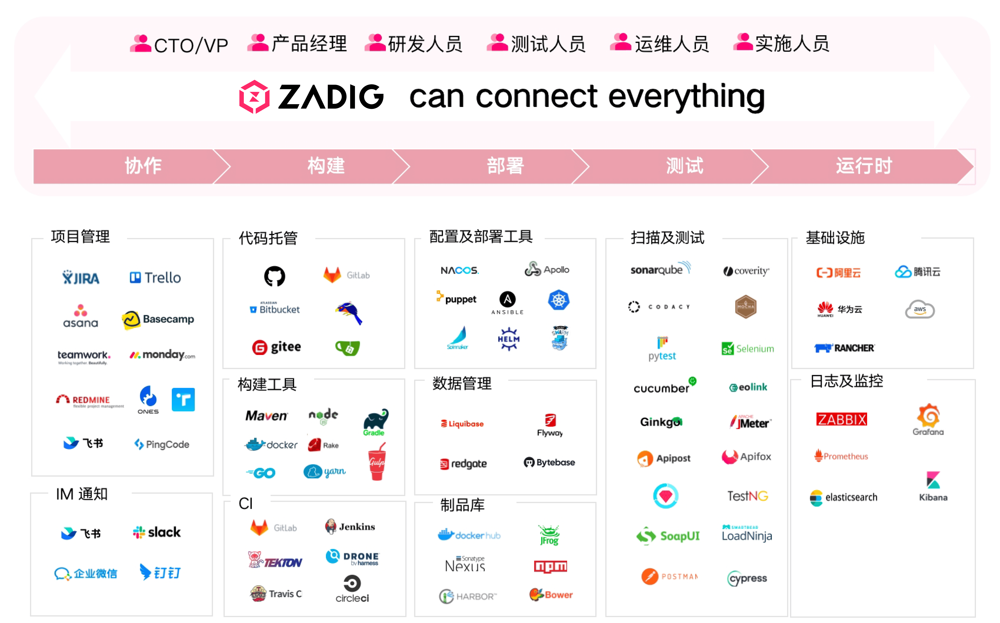
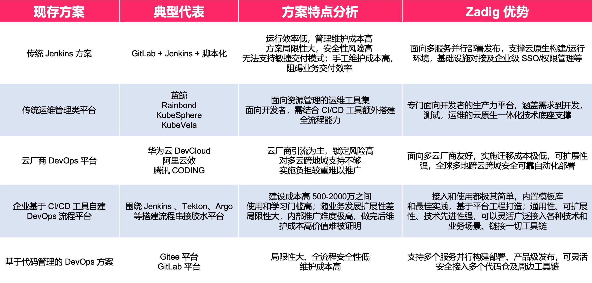
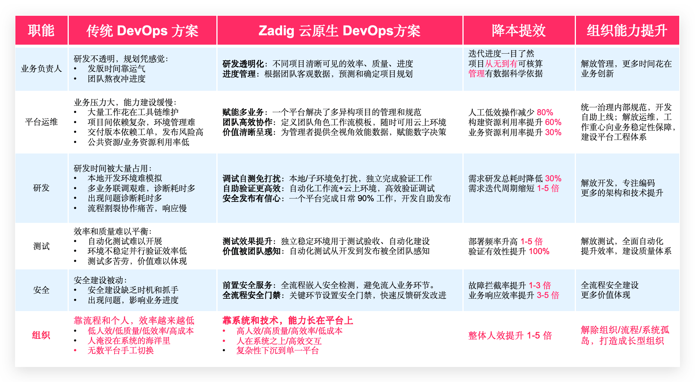

## Platform Introduction

Zadig is an open-source cloud-native DevOps platform independently developed by KodeRover, built on Kubernetes and AI large models, with 100% open-source code. It is committed to helping enterprises achieve digital transformation in product and R&D. Core capabilities cover flexible and scalable workflows, multiple release strategy orchestrations, one-click security audits, AI environment inspection and efficiency diagnostics, and customized enterprise-level XOps agile dashboards. It also supports deep integration with enterprise platforms and project template-based batch management of thousands of services. Zadig fully incorporates intelligent capabilities such as AI code review, AI release risk assessment, AI task orchestration, and agent management, shifting the code quality defense line earlier, making release decisions more precise, and delivery processes more automated—empowering engineers as engines of innovation and providing a solid foundation for continuous innovation in the digital economy.

## Zadig Value Chain

## Comparison with Traditional DevOps Solutions

Most existing practices are primarily "single-point tools + scripting" or operation and management platforms. In contrast, Zadig is a developer-centric, neutral, cloud-native integrated value chain platform.

## Business Architecture

## User Value

Establish a baseline for full-process engineering collaboration in product and research, operate scientifically, and unleash team productivity, ensuring that everyone's value is reflected.

## Product Features

- **AI-Driven End-to-End Efficiency**

  Deeply integrates AI large models across the development, release, and operations chain: AI code review accurately identifies code defects and security vulnerabilities; AI release risk assessment intelligently analyzes change impact to support safe and controlled releases; AI task orchestration seamlessly embeds enterprise agents into the R&D process. Also provides AI efficiency diagnostics and environment inspection to pinpoint efficiency bottlenecks and periodically warn of environment risks.

- **Flexible and Easy-to-Use High-Concurrency Workflows**

  Simple configuration can automatically generate high-concurrency workflows, allowing multiple microservices to be built, deployed, and tested in parallel, significantly improving code verification efficiency. Customizable workflow steps, combined with manual approval, ensure flexible and controllable business delivery quality.

- **Developer-Friendly Cloud-Native Environment**

  Create or replicate a complete isolated environment within minutes to handle frequent business changes and product iterations. Based on a full-scale baseline environment, quickly provide developers with an independent self-test environment. One-click cluster resource management enables easy debugging of existing services and verification of business code.

- **Efficient Collaborative Testing Management**

  Conveniently integrate mainstream testing frameworks such as JMeter and Pytest, and manage and accumulate UI, API, and E2E test case assets across projects. Through workflows, provide pre-test verification capabilities to developers. Continuous testing and quality analysis fully leverage the value of testing.

- **Powerful and Maintenance-Free Template Library**

  Share K8s YAML templates, Helm Chart templates, build templates, and workflow templates across projects to achieve unified configuration management. Based on a single template, hundreds of microservices can be created, and developers can use them with minimal configuration, significantly reducing the burden of operations and maintenance.

- **Safe and Reliable Release Management**

  Custom workflows connect people, processes, and internal and external systems for compliance approval, supporting flexible orchestration of blue-green, canary, batched gray, and Istio release strategies. The production environment is presented through multi-cluster and multi-project perspectives, ensuring transparent and reliable release processes.

- **Objective and Precise Performance Insights**

  Gain a comprehensive understanding of the system's operating status, including clusters, projects, environments, workflows, and key process pass rates. Provide objective performance measurement data for build, test, and deployment at the project level, accurately analyze R&D performance bottlenecks, and promote steady improvement.
