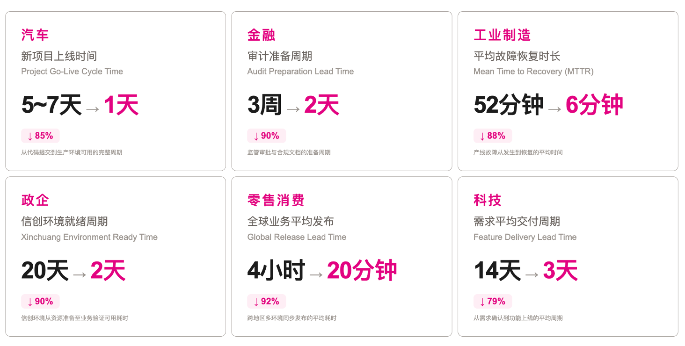

## Platform Introduction

Zadig is an open-source cloud-native DevOps platform independently developed by KodeRover, built on Kubernetes and AI large models, with 100% open-source code. It is committed to helping enterprises achieve digital transformation in product and R&D. Core capabilities cover flexible and scalable workflows, multiple release strategy orchestrations, one-click security audits, AI environment inspection and efficiency diagnostics, and customized enterprise-level XOps agile dashboards. It also supports deep integration with enterprise platforms and project template-based batch management of thousands of services. Zadig fully incorporates intelligent capabilities such as AI code review, AI release risk assessment, AI task orchestration, and agent management, shifting the code quality defense line earlier, making release decisions more precise, and delivery processes more automated—empowering engineers as engines of innovation and providing a solid foundation for continuous innovation in the digital economy.

## Modern Software Delivery Challenges

Five minutes to write code, two hours to ship it. AI has multiplied the volume of generated code, yet delivery still jumps across seven or eight systems: toolchains are fragmented, systems are complex, efficiency has not kept up, and release risk is higher.

## Design Philosophy

Zadig moves from a single-service "code pipeline" to a multi-service "product delivery workflow".

|  | Traditional | Zadig |
| --- | --- | --- |
| Model | Linear pipeline for a single service | Unified orchestration for the whole product and multiple services |
| Flow | Coding → build → deploy → test → release, repeated for every service | Parallel build, deploy, and test across services, plus coordinated data, configuration, and service changes |
| Outcome | Hard to collaborate, slow feedback, clunky releases | Faster delivery, earlier quality assurance, more stable releases |

## Business Architecture

## Product Features

- **AI-Driven End-to-End Efficiency**

  Deeply integrates AI large models across the development, release, and operations chain: AI code review accurately identifies code defects and security vulnerabilities; AI release risk assessment intelligently analyzes change impact to support safe and controlled releases; AI task orchestration seamlessly embeds enterprise agents into the R&D process. Also provides AI efficiency diagnostics and environment inspection to pinpoint efficiency bottlenecks and periodically warn of environment risks.

- **Flexible and Easy-to-Use High-Concurrency Workflows**

  Simple configuration can automatically generate high-concurrency workflows, allowing multiple microservices to be built, deployed, and tested in parallel, significantly improving code verification efficiency. Customizable workflow steps, combined with manual approval, ensure flexible and controllable business delivery quality.

- **Developer-Friendly Cloud-Native Environment**

  Create or replicate a complete isolated environment within minutes to handle frequent business changes and product iterations. Based on a full-scale baseline environment, quickly provide developers with an independent self-test environment. One-click cluster resource management enables easy debugging of existing services and verification of business code.

- **Efficient Collaborative Testing Management**

  Conveniently integrate mainstream testing frameworks such as JMeter and Pytest, and manage and accumulate UI, API, and E2E test case assets across projects. Through workflows, provide pre-test verification capabilities to developers. Continuous testing and quality analysis fully leverage the value of testing.

- **Powerful and Maintenance-Free Template Library**

  Share K8s YAML templates, Helm Chart templates, build templates, and workflow templates across projects to achieve unified configuration management. Based on a single template, hundreds of microservices can be created, and developers can use them with minimal configuration, significantly reducing the burden of operations and maintenance.

- **Safe and Reliable Release Management**

  Custom workflows connect people, processes, and internal and external systems for compliance approval, supporting flexible orchestration of blue-green, canary, batched gray, and Istio release strategies. The production environment is presented through multi-cluster and multi-project perspectives, ensuring transparent and reliable release processes.

- **Objective and Precise Performance Insights**

  Gain a comprehensive understanding of the system's operating status, including clusters, projects, environments, workflows, and key process pass rates. Provide objective performance measurement data for build, test, and deployment at the project level, accurately analyze R&D performance bottlenecks, and promote steady improvement.

## Proven Results

Across industries, Zadig has shortened time to launch, audit preparation, incident recovery, and requirement delivery.

- **Automotive**: New project launch time from 5–7 days to 1 day, covering the full cycle from code commit to production
- **Finance**: Audit preparation cycle from 3 weeks to 2 days, covering regulatory approval and compliance documentation
- **Manufacturing**: Mean time to recovery from 52 minutes to 6 minutes
- **Public sector**: Xinchuang environment ready time from 20 days to 2 days
- **Retail**: Average global release time from 4 hours to 20 minutes, for synchronized multi-region, multi-environment releases
- **Technology**: Average requirement delivery cycle from 14 days to 3 days, covering requirement confirmation through feature go-live

## Open Access

Zadig covers the full path from development to operations, with 40+ mainstream tools and systems already integrated. Connect what you need, extend as you grow, and run delivery on one platform. It serves roles such as CTO/VP, product, R&D, QA, operations, and implementation, across collaboration, build, configuration and deployment, test, and runtime:

- **Collaboration**: Project management such as Jira, Feishu Project, PingCode, and Tapd, plus notifications and approvals in Feishu, WeCom, DingTalk, and Slack
- **Build**: Code hosts such as GitHub, GitLab, Gitee, and Gerrit, plus CI systems such as Jenkins
- **Configuration and deployment**: Configuration changes in Nacos and Apollo, plus Kubernetes, Helm, and artifact registries such as Harbor and Nexus
- **Test**: Scanning and testing tools such as SonarQube, JMeter, Pytest, Ginkgo, Selenium, and Apifox
- **Runtime**: Mainstream clouds and Kubernetes clusters, plus monitoring systems such as Grafana and Prometheus

### Enterprise Extension

- **[Custom navigation](/en/Zadig%20v5.0/settings/plugin/)**: Connect external systems and tailor the workbench by role
- **[Business metadata](/en/Zadig%20v5.0/directory/)**: Manage repositories, owners, tech stack, and deployment information
- **[OpenAPI](/en/Zadig%20v5.0/api/usage/)**: Full API access to call platform capabilities programmatically
- **AI ecosystem**: Connect internal agents through [CLI](/en/Zadig%20v5.0/zadig-cli/), [MCP](/en/Zadig%20v5.0/mcp-settings/), and the [OpenClaw plugin](/en/Zadig%20v5.0/openclaw-plugin/)
