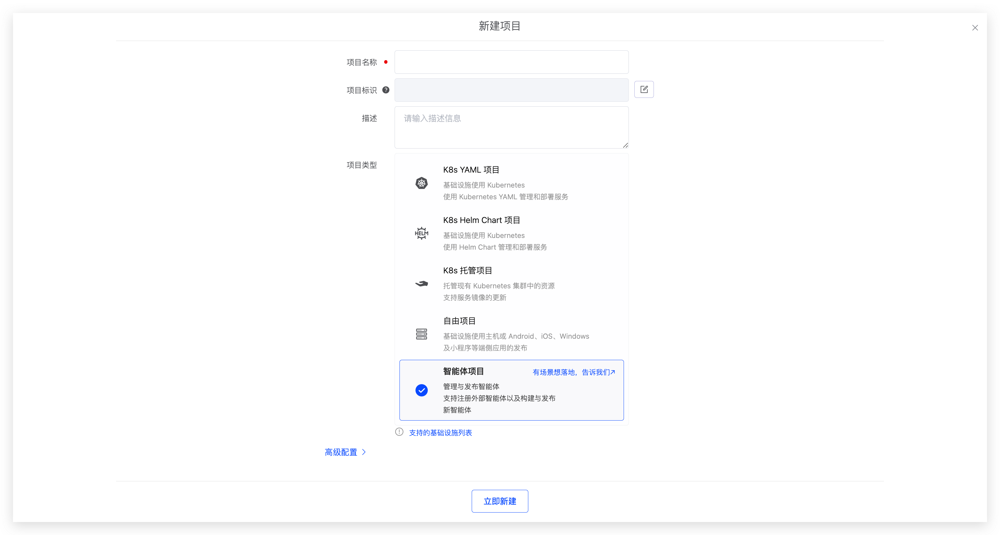
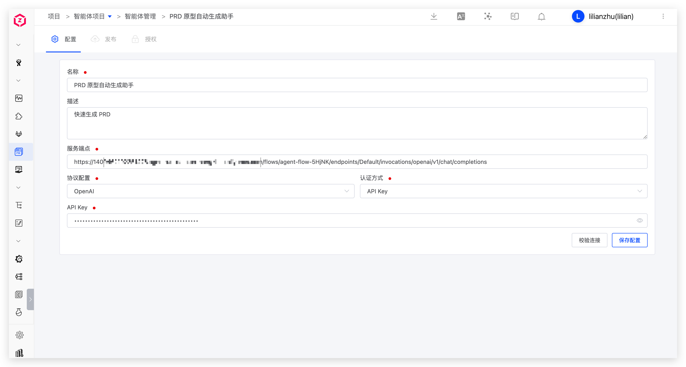

Agents are becoming a new unit of product and engineering collaboration. Zadig Agent Projects are used to manage and publish agents. You can currently register external agents into the platform for unified management; building and publishing new agents will be supported later.

Scenario value:
- Bring scattered agents under unified project management so teams can view and use them in one place.
- Connect existing agent services quickly via the OpenAI and Anthropic protocols.

## Create a Project

In Zadig, go to "Project" → "New Project", enter the project name, select `Agent Project`, and create it.

If you have an agent scenario you want to implement, submit it through the [feedback form](https://koderover.feishu.cn/share/base/form/shrcnGBw4s7V6lIk8pFBETsGGag). We will prioritize evaluation and support.

## Register an Agent

After the project is created, go to Agent Management to register external agents into the current project for unified viewing and management.

When registering, configure the agent's basic information, service endpoint, protocol, and authentication. You can validate the connection before saving.

Parameter description:
- `Name`: Agent name.
- `Description`: A brief description of the agent.
- `Service Endpoint`: The API address of the agent service.
- `Protocol`: OpenAI and Anthropic protocols are supported.
- `Authentication`: API Key and AK/SK authentication are supported.
- `API Key`: The key used to access the agent service.
- `AK/SK`: The AK/SK used to access the agent service.

Agents registered in Zadig can be invoked by AI Tasks in other project workflows. See [Workflow Tasks](/en/Zadig%20v5.0/project/workflow-jobs/#ai-task).

Tools and Skills, models, knowledge bases, memory, as well as building, publishing, and authorization of agents will be available later. Stay tuned.
