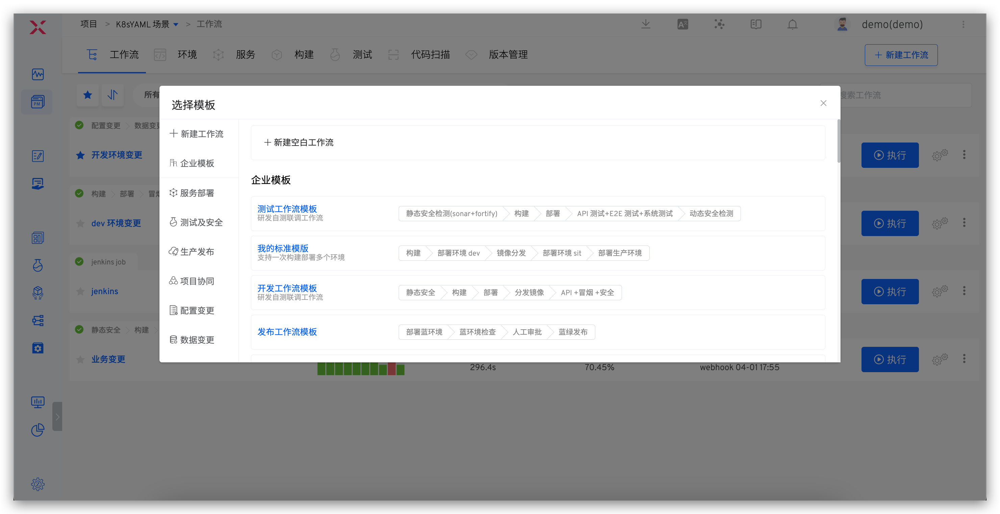
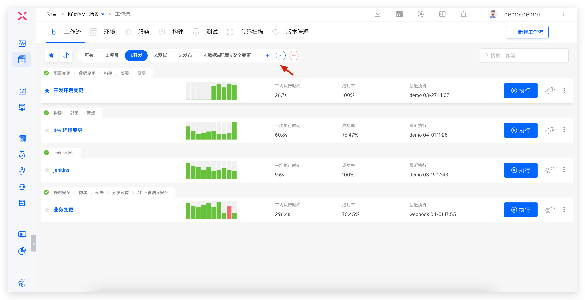
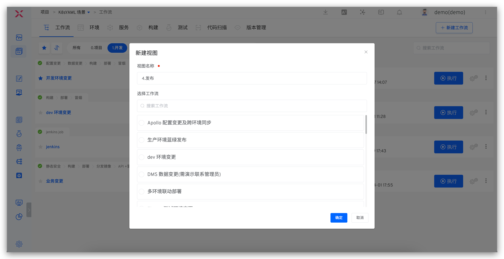

This article introduces the basic concepts of Zadig workflows. Zadig workflows support flexible orchestration of workflow processes, custom execution steps, and also possess capabilities such as configuration changes, data changes, and grayscale releases.

## Basic Concepts

Workflows consist of `stages` and `tasks`:
- Stage: Logically group the tasks of the workflow, such as the build stage, the deployment stage... Multiple stages run in series, and one stage can include multiple tasks.
- Task: An independent and complete operation, such as building, deploying, testing, custom tasks... Multiple tasks can be executed serially or concurrently. Tasks are divided into two types:
    - Custom tasks: Interact with third-party systems through the development of custom tasks. For specific development methods, see [Custom Tasks](/en/Zadig%20v5.0/settings/custom-task/)
    - Official tasks: Zadig officially provides tasks that can meet complex needs for building, deploying, testing, and releasing. The specific task types are as follows:

| Task Type | Task Name | Description | Configuration |
| --- | --- | --- | --- |
| Build | Build | You can directly reference the configuration in the "Project"-"Build" module | [Check](/en/Zadig%20v5.0/project/workflow-jobs/#build-1) |
| Deploy | Container Service Deployment | Update service images, variables, and service configurations in Zadig environments | [Check](/en/Zadig%20v5.0/project/workflow-jobs/#container-service-deployment) |
|  | Container Service Restart | Restart container services in Zadig environments | [Check](/en/Zadig%20v5.0/project/workflow-jobs/#container-service-restart) |
|  | Host Service Deployment | Update the host service version in the Zadig environment | [Check](/en/Zadig%20v5.0/project/workflow-jobs/#host-service-deployment) |
|  | K8s Service Deployment | Update container images in Kubernetes | [Check](/en/Zadig%20v5.0/project/workflow-jobs/#k8s-service-deployment) |
|  | K8s YAML Update | Use native Kubernetes Patch capabilities to update YAML | [Check](/en/Zadig%20v5.0/project/workflow-jobs/#k8s-yaml-update) |
|  | Service Offline | Delete service-related resources from the specified environment | [Check](/en/Zadig%20v5.0/project/workflow-jobs/#service-offline) |
| Verification | Code Scanning | You can directly reference the configuration in the "Project"-"Code Scan" module | [Check](/en/Zadig%20v5.0/project/workflow-jobs/#code-scanning) |
|  | Test Execution | You can directly reference the test configuration in the "Project"-"Test" module | [Check](/en/Zadig%20v5.0/project/workflow-jobs/#test-execution) |
| Process Control | Manual Approval | Follow-up operations can only be performed after approval | [Check](/en/Zadig%20v5.0/project/workflow-jobs/#manual-approval) |
|  | Send Notification | Send notifications during workflow execution | [Check](/en/Zadig%20v5.0/project/workflow-jobs/#send-notification) |
| Release and Rollback | Blue-Green Environment Deployment | Deploy blue-green environments based on the configuration in the "Service" module | [Check](/en/Zadig%20v5.0/project/release-workflow/#blue-green-release) |
|  | Blue-Green Release | Combined with the preceding "Blue-Green Environment Deployment", perform blue-green releases | [Check](/en/Zadig%20v5.0/project/release-workflow/#blue-green-release) |
|  | Canary Environment Deployment | Deploy canaries based on Kubernetes native capabilities | [Check](/en/Zadig%20v5.0/project/release-workflow/#canary-release) |
|  | Canary Release | Combined with the preceding "Canary Environment Deployment" task, perform canary releases | [Check](/en/Zadig%20v5.0/project/release-workflow/#canary-release) |
|  | Grayscale Release | Perform grayscale releases based on Kubernetes native capabilities | [Check](/en/Zadig%20v5.0/project/release-workflow/#batch-gray-scale-release) |
|  | Grayscale Rollback | Perform rollback tasks based on Kubernetes native capabilities, rolling back to the state before grayscale | [Check](/en/Zadig%20v5.0/project/release-workflow/#grayscale-rollback) |
|  | Istio Release | Perform the release process based on Istio | [Check](/en/Zadig%20v5.0/project/release-workflow/#istio-release) |
|  | Istio Rollback | Perform rollback tasks based on Istio, rolling back to the state before the Istio release | [Check](/en/Zadig%20v5.0/project/release-workflow/#istio-rollback) |
|  | Istio Grayscale Policy Update | Update the configuration of Istio grayscale policy in the environment | [Check](/en/Zadig%20v5.0/project/workflow-jobs/#istio-grayscale-policy-update) |
|  | MSE Grayscale Release | Create full-link grayscale publishing resources based on MSE | [Check](/en/Zadig%20v5.0/project/release-workflow/#mse-grayscale-release) |
|  | MSE Grayscale Service Offline | Delete MSE specified grayscale tag-related resources from the environment | [Check](/en/Zadig%20v5.0/project/release-workflow/#mse-grayscale-release) |
|  | Helm Chart Deployment | Directly deploy Charts from the Helm repository to the environment | [Check](/en/Zadig%20v5.0/project/workflow-jobs/#helm-chart-deployment) |
| Project Collaboration | Feishu Work Item Status Change | Modify the status of the specified Feishu project work item | [Check](/en/Zadig%20v5.0/project/workflow-jobs/#feishu-work-item-status-change) |
|  | JIRA Issue Status Change | Modify the status of the specified JIRA issue | [Check](/en/Zadig%20v5.0/project/workflow-jobs/#jira-issue-status-change) |
|  | PingCode Work Item Status Change | Modify the status of the specified PingCode project work item | [Check](/en/Zadig%20v5.0/project/workflow-jobs/#pingcode-work-item-status-change) |
|  | Tapd Work Item Status Change | Modify the status of the specified Tapd project work item | [Check](/en/Zadig%20v5.0/project/workflow-jobs/#tapd-work-item-status-change) |
| Configuration Changes | Nacos Configuration Change | Update the specified Nacos configuration | [Check](/en/Zadig%20v5.0/project/workflow-jobs/#nacos-configuration-change) |
|  | Apollo Configuration Change | Update and publish the specified Apollo configuration | [Check](/en/Zadig%20v5.0/project/workflow-jobs/#apollo-configuration-change) |
| Data Changes | SQL Change Execution | Perform data changes for the specified database | [Check](/en/Zadig%20v5.0/project/workflow-jobs/#sql-change-execution) |
|  | DMS Ticket Execution | Select an existing work order on DMS for execution and wait for the result | [Check](/en/Zadig%20v5.0/project/workflow-jobs/#dms-ticket-execution) |
| Gateway Changes | APISIX Gateway Changes | Update the configuration of the specified APISIX gateway | [Check](/en/Zadig%20v5.0/project/workflow-jobs/#apisix-gateway-changes) |
| Service Monitoring | Grafana Service Monitoring | Use Grafana to monitor whether services are healthy | [Check](/en/Zadig%20v5.0/project/workflow-jobs/#grafana-service-monitoring) |
| CI/CD Integration | Jenkins Job Execution | Execute multiple Jenkins jobs simultaneously and obtain corresponding logs | [Check](/en/Zadig%20v5.0/project/workflow-jobs/#jenkins-job-execution) |
|  | BlueKing Job Execution | Trigger the execution plan of the BlueKing Job Platform | [Check](/en/Zadig%20v5.0/project/workflow-jobs/#blueking-job-execution) |
| General Tools | General Script Execution | Support functions such as pulling code, executing shell scripts, file storage, etc. | [Check](/en/Zadig%20v5.0/project/workflow-jobs/#general-script-execution) |
|  | Image Distribution | Push the retagged image to the image repository | [Check](/en/Zadig%20v5.0/project/workflow-jobs/#image-distribution) |
|  | Workflow Trigger | Trigger other workflows | [Check](/en/Zadig%20v5.0/project/workflow-jobs/#workflow-trigger) |
|  | Custom Tasks | Custom task implementation, supporting interaction with third-party systems | [Check](/en/Zadig%20v5.0/project/workflow-jobs/#custom-tasks) |

## Trigger

Supported trigger types:
| Type | Description | Configuration and Usage |
| --- | --- | --- |
| Git Trigger | Automatically trigger the workflow after code changes | [Check](/en/Zadig%20v5.0/project/workflow-trigger/#git-trigger) |
| Timer | Schedule the workflow to trigger at a specific time | [Check](/en/Zadig%20v5.0/project/workflow-trigger/#timer) |
| JIRA Trigger | Automatically trigger the workflow after JIRA issue status changes | [Check](/en/Zadig%20v5.0/project/workflow-trigger/#jira-trigger) |
| Feishu Project Trigger | Automatically trigger the workflow after Feishu project status changes | [Check](/en/Zadig%20v5.0/project/workflow-trigger/#feishu-project-trigger) |
| Universal Trigger | Third-party systems can automatically trigger the workflow through webhooks | [Check](/en/Zadig%20v5.0/project/workflow-trigger/#universal-trigger) |

## Notification

Workflows support notifications to Feishu, Enterprise WeChat, and DingTalk groups. For specific configuration and usage, see [Workflow Notifications](/en/Zadig%20v5.0/workflow/im/)

## Workflow View

> Organize workflows in different views for quick preview and use.

Enter the project -> workflow, click the View tab to view the workflow information in the current view, and click the `+` button to create a new view.

- Only system administrators and project administrators can perform `Create View`, `Edit View`, and `Delete View` operations
- The `All` view contains all workflows under the current project and cannot be deleted
- After creating a new workflow in a view, the workflow will automatically belong to the current view

