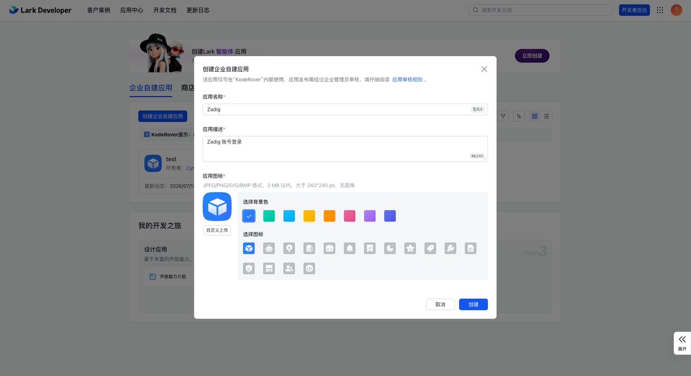
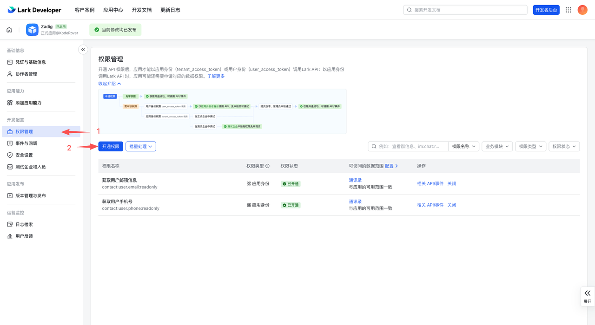
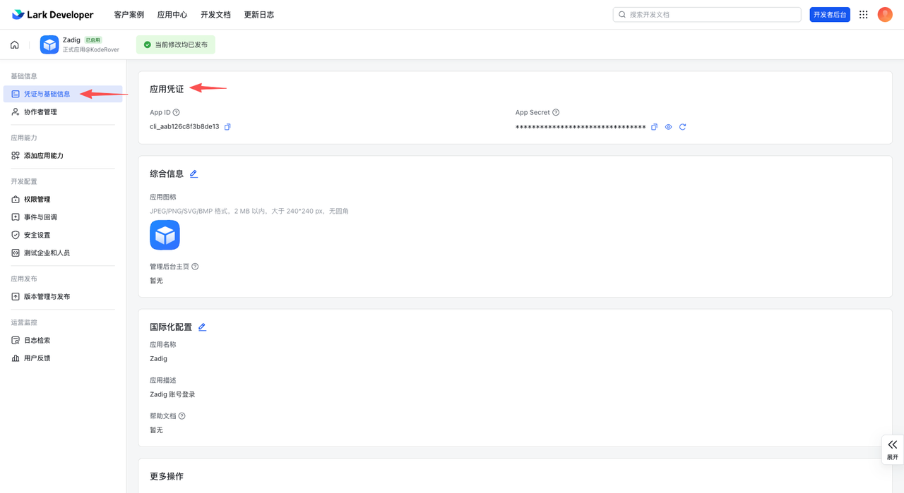
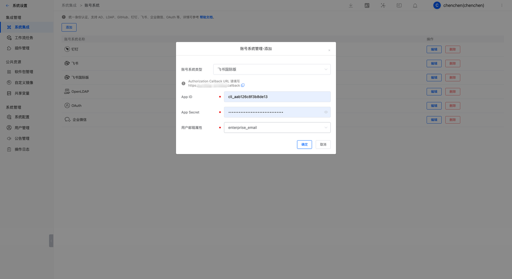
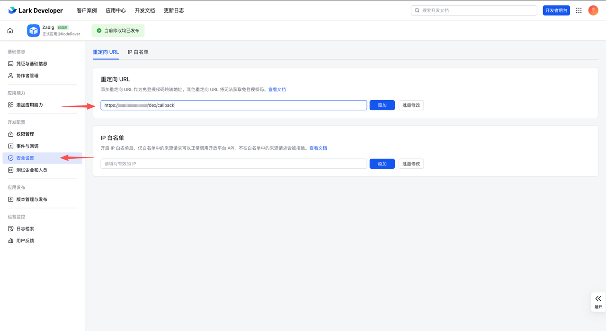

The Zadig account system supports integrating Lark accounts, allowing users to log in to Zadig by configuring the Lark application.

## Step 1: Create a Lark App

1. Visit [Lark Open Platform](https://open.larksuite.com/) and create an "Custom Apps," as shown below.

2. Configure the permission scope in permission management, as shown below.

Required permissions:

- `contact:user.email:readonly`
- `contact:user.phone:readonly`

3. Retrieve the `App ID` and `App Secret`, as shown below.
   

4. Create a version and publish the Lark application.

## Step 2: Configure Zadig Account Integration

Visit Zadig, click `System Settings` -> `Integration` -> `Account System`, select `Lark`, and enter the `App ID` and `App Secret` obtained in step 1, as shown below.

Retrieve the Callback URL and configure the callback address in the Lark Open Platform, as shown below.

