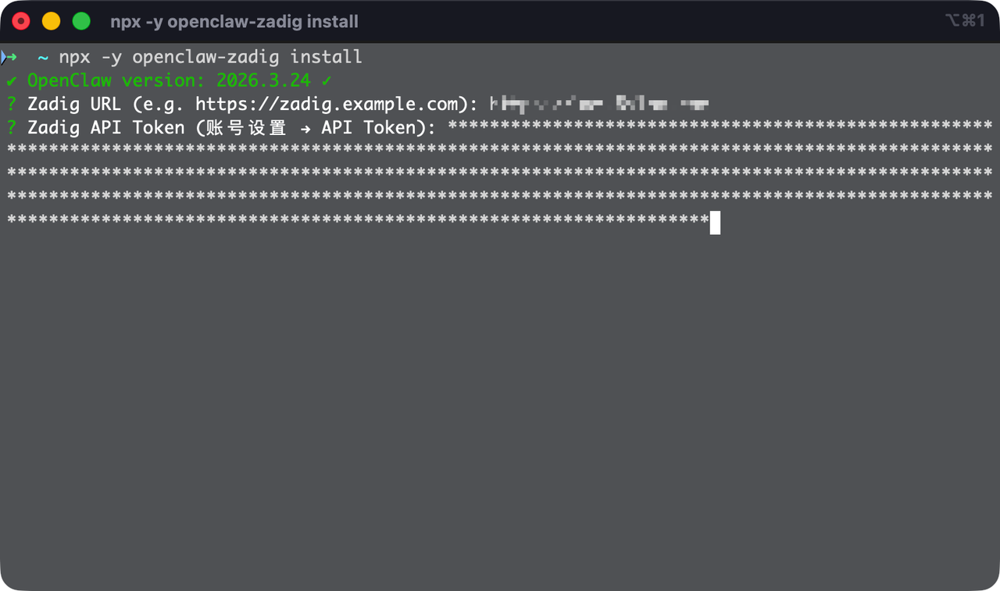
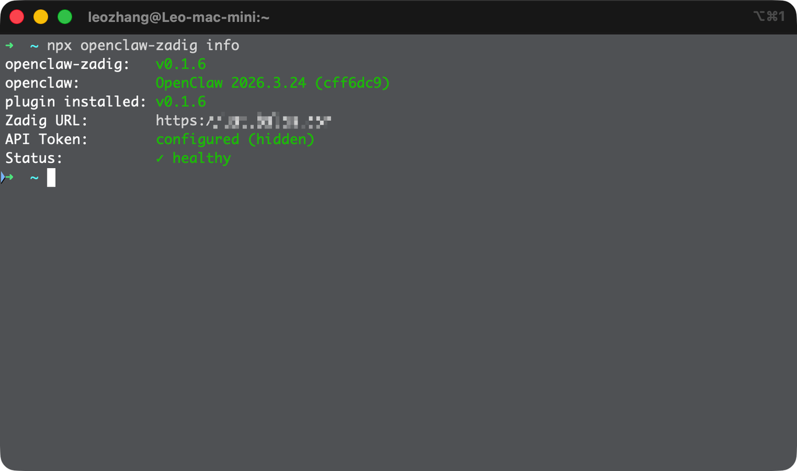
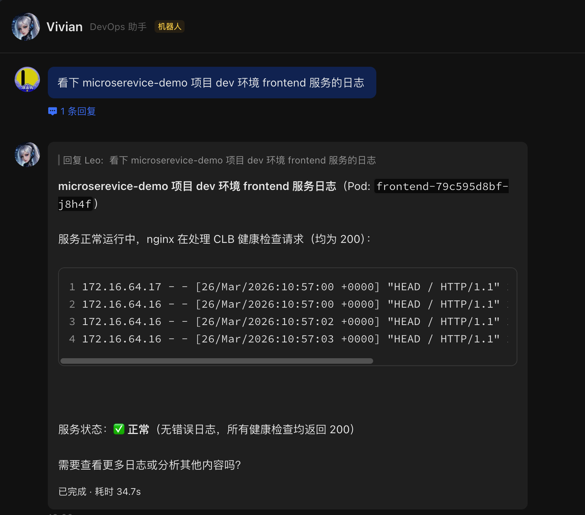
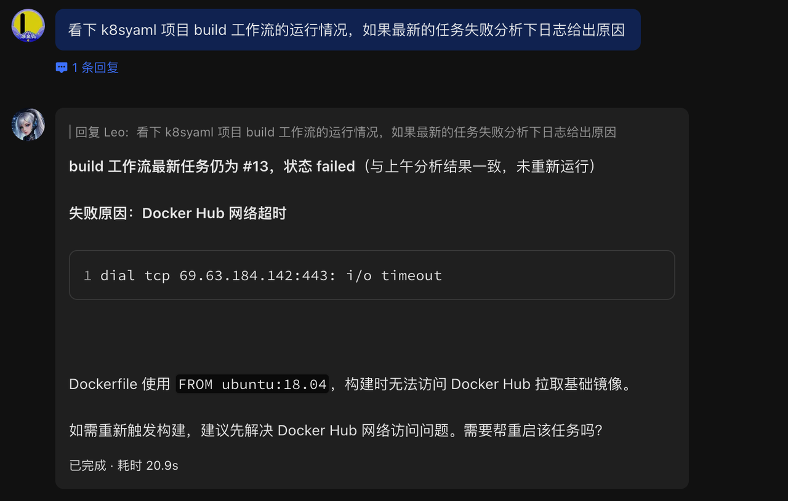
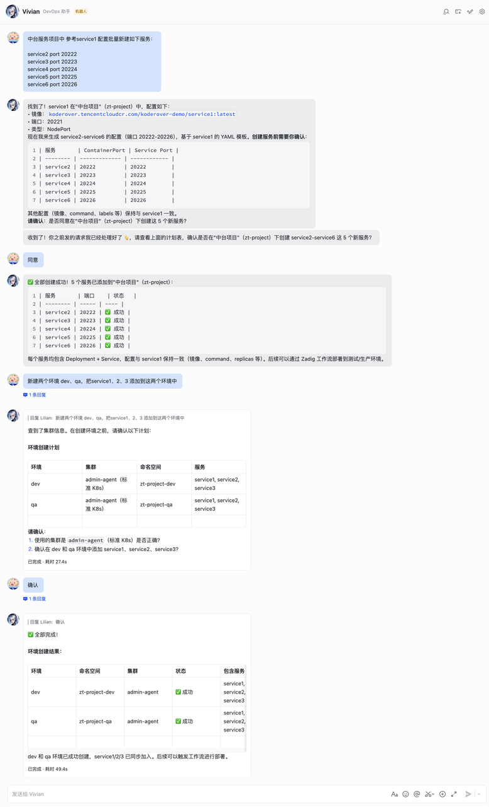
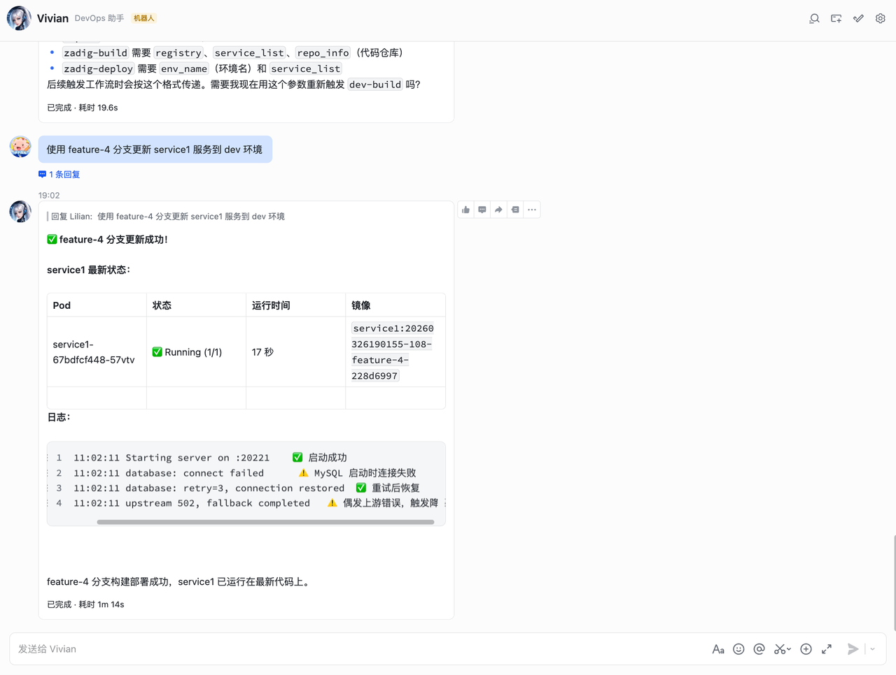
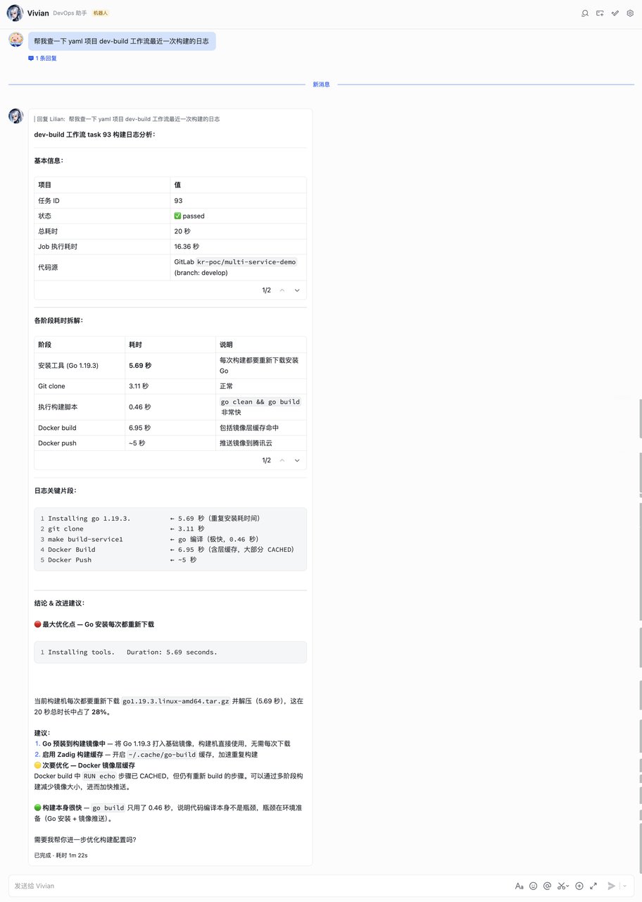

This article introduces how to install and configure the Zadig OpenClaw plugin.

## Supported Zadig Capabilities

| Business Category | Supported Capabilities |
| -------- | -------- |
| Project | Project list, details, creation, and deletion |
| Workflow | Workflow triggering, task status, approval, cancellation, retry, approval, view management, and task log viewing |
| Environment | Environment management, including adding K8s YAML/Helm services, image updates, replica adjustment, and restart |
| Service | K8s YAML / Helm service query and management |
| Build | Build configuration management |
| Test | Test task execution and result query |
| Code Scanning | Code scanning configuration and execution |
| Users and Permissions | User and user group management |
| Performance Insights | Performance insights, including build/deployment/rollback/test statistics |
| Audit Logs | System operation logs |

## Important Risk Notice (Read Before Use)

🔴 Critical Risks
- This plugin interacts with platform data through APIs. Information accessible to AI may be exposed to potential leakage risks. Although security protections have been implemented, AI systems are not yet mature and stable enough to guarantee absolute security.

🔴 Strong Recommendations
- If the plugin is provided to multiple users as a bot, stay alert to risks such as data leakage and permission abuse.
- Before use, strictly follow your organization's internal data security and privacy policies.

📌 Other Operational Risks
- AI may hallucinate and misinterpret intentions or generate inaccurate content.
- Some operations are irreversible, such as deleting resources. Although confirmation prompts are provided, deleted resources cannot be recovered.
- Recommendation: for write operations, strictly follow the principle of previewing before confirmation. Do not allow AI to execute write operations directly without human intervention.

## Install Plugin

1. Run the installation command:

:::tip
Make sure your Zadig version is 4.2.0 or later.
:::

```bash
npx -y openclaw-zadig install
```

2. Configure connection information: during installation, enter the Zadig access address and API Token. You can obtain the API Token from Account Settings in Zadig.




3. Verify the installation: run the following command. If the status is normal, the installation is successful.

```bash
npx openclaw-zadig info
```



4. Start using it: after installation, send a message in any integrated channel, such as Lark, to activate Zadig capabilities.




## Use Cases

1. Batch create services and add them to an environment. Batch create services based on service configuration examples, and create a new environment.



2. Development self-testing and integration. Run workflows and view service status and service logs.



3. Build log analysis and optimization. Analyze workflow build logs.



4. Batch clean up unused builds. Batch delete builds that are not referenced.


