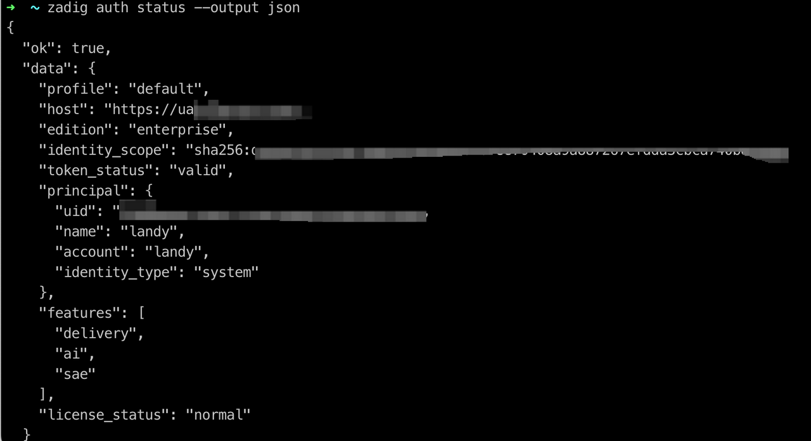
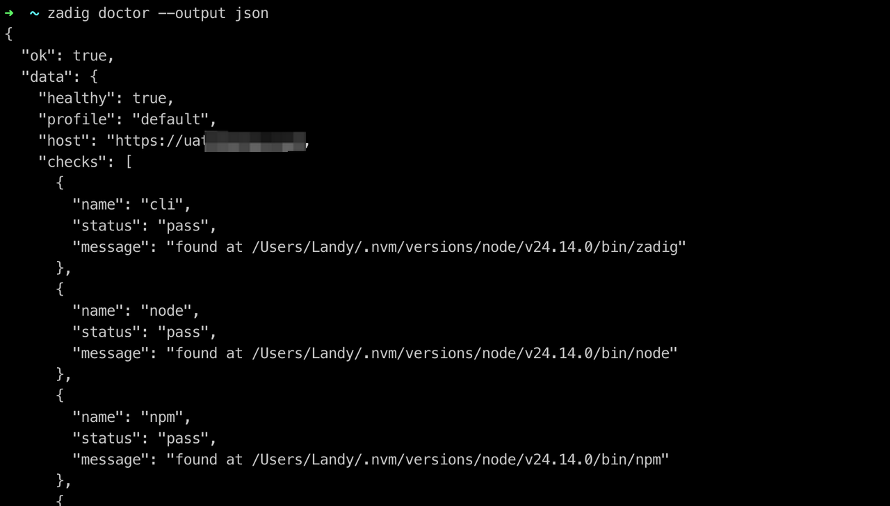
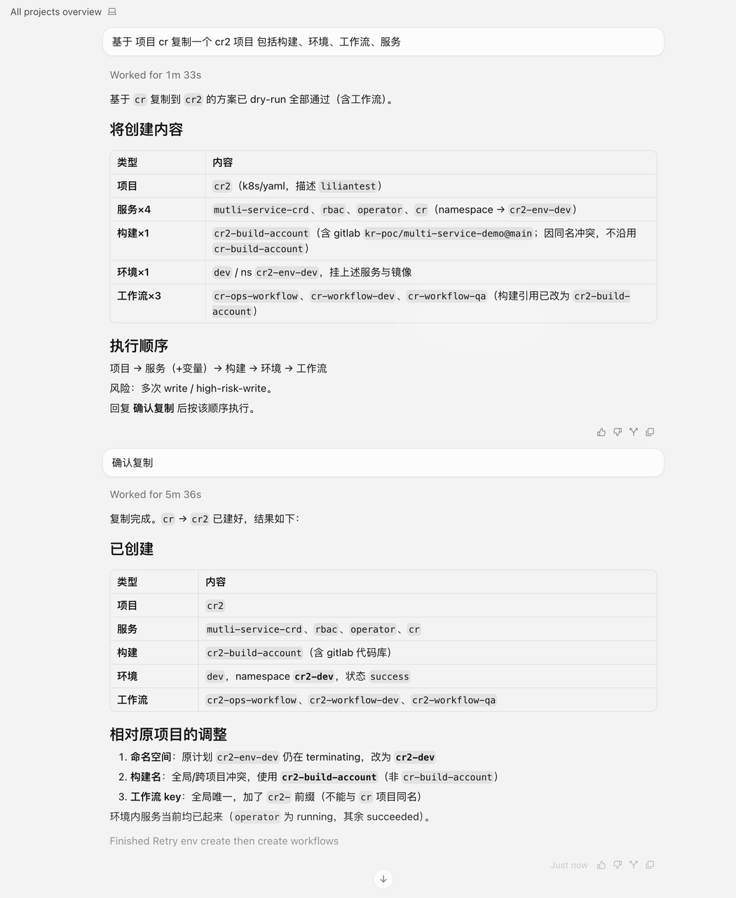
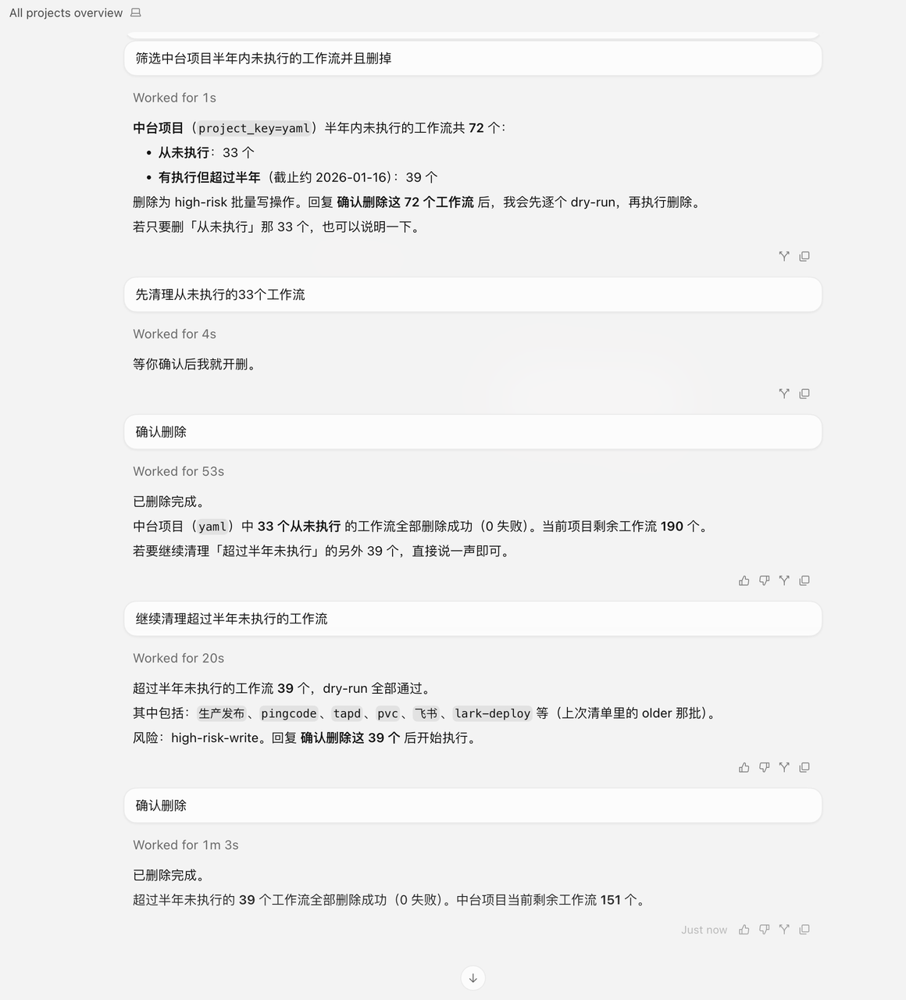
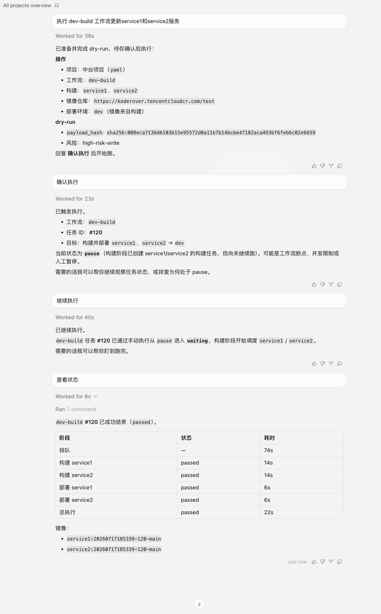
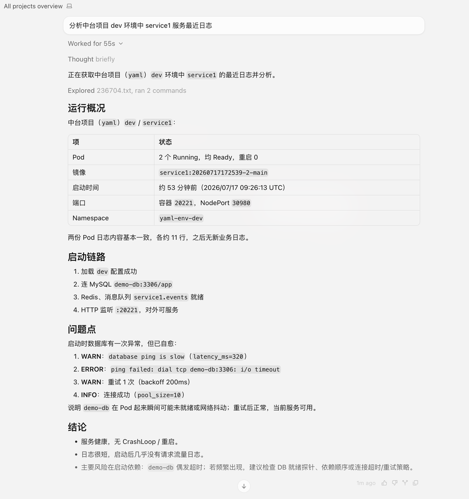

Zadig CLI is the command-line tool for Zadig. Use it in a terminal to manage projects, services, environments, workflows, and other resources. It is also the unified entry point for AI Agents to call Zadig. Codex, Claude Code, and Hermes Agent can discover and run the CLI through Skills. Optional read-only MCP access is available for clients such as Cursor and VS Code.

## Supported Capabilities

> Capabilities are continuously updated.

| Area | Currently supported |
| --- | --- |
| Project | Create, list, detail, delete |
| Service | List, detail, YAML create, configuration update, variable update, delete |
| Environment | Create, list, detail, update, delete, service change, Pod query, restart, logs |
| Build | Create, list, detail, update, delete |
| Workflow | Create, list, detail, update, delete, run, wait for result |
| Workflow task | List, detail, cancel, retry, approve, remark, logs |
| Execution gate | Identify manual execution stages, determine whether the current user can execute, continue execution |
| Test | Run test tasks, query task results |
| Code scan | Run scan tasks, query task results |
| Registry | List, detail |
| Cluster | Cluster list |
| User | User list, detail, delete; user group list |
| Permission | Resource actions, role CRUD, user and user group role binding |
| Operation logs | System operation logs, environment operation logs |
| Agent integration | Codex, Claude Code, Hermes Agent Skill |
| MCP compatibility | Optional read-only MCP access for clients such as Cursor and VS Code |
| Automation output | Table, JSON, and Raw output, structured errors, and explicit exit codes |
| Write protection | `--dry-run` preview, `--yes` confirmation, local request audit |

## Prerequisites

::: tip
- Zadig version must be v5.0 or later.
- You need a Zadig API Token (available in Account Settings).
:::

## Installation

### One-click CLI and Skill install

Run the following command in a terminal (macOS / Linux / Windows):

```bash
npx -y @koderover/zadig-cli@latest install && zadig skill install
```


The installer will:

- Install the latest Zadig CLI as a global command
- Prompt you for the Zadig server URL and API Token
- Save local credentials and check the connection
- Install the Zadig Skill for detected AI coding tools

::: tip
The token is not displayed in plaintext when entered, and is not written to Skill or client configuration.
:::

### Verify the installation

Check the CLI version:

```bash
zadig version
```


Check the Zadig connection status:

```bash
zadig auth status --output json
```



Check the local installation and network status:

```bash
zadig doctor --output json
```



Check whether AI Agents have discovered the Zadig Skill:

```bash
zadig doctor agent codex --output json
zadig doctor agent claude-code --output json
zadig doctor agent hermes-agent --output json
```


After installing or updating the Skill, restart the corresponding AI coding tool.

## Usage Scenarios

The following are some example scenarios. Explore more as needed.

### Operations setup: copy a project

Copy a new project from an existing one, including services, builds, environments, and workflows.



### Day-to-day operations: clean up workflows

Batch-clean unused workflows.



### Delivery: update a service

Update a service by running a workflow.



### Troubleshooting: view service logs

View and analyze service logs.



### Efficiency analysis: view build logs

View workflow build logs to identify efficiency bottlenecks.


