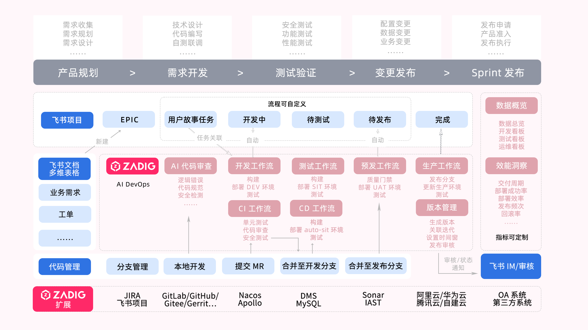

Software delivery involves multiple elements such as personnel, technology, processes, and tools. Common challenges include: difficulty in simulating development environments, complex multi-service integration, low R&D efficiency, high proportion of manual testing, unstable environments, difficulties in automation, complex O&M tools, frequent manual operations, low delivery efficiency, and time-consuming cross-department communication and process formulation. Zadig enhances organizational efficiency through platform engineering and technology upgrades, establishing an integrated engineering collaboration baseline to help enterprises efficiently deliver software and improve team productivity.

## Zadig R&D Collaboration Solution

Zadig provides an engineering foundation for unified collaboration of R&D teams, supporting agile delivery across the entire lifecycle from development to testing to release. It supports custom processes, tool extension, and orchestration of test, IT, and security services. Automation is achieved through Zadig, improving engineering efficiency.

## Introduction to Core Scenarios

Development, testing, operation and maintenance engineers are based on the Zadig unified collaboration plane and deliver using automated workflows and cloud-native environments. In addition, the business person in charge/enterprise management personnel can analyze the overall operation of the project in the performance board and analyze the performance shortcomings in each process of the project. The following is an introduction to different roles.

| Role | Description |
| --- | --- |
| [Admin](/en/Zadig%20v5.0/product-manual/admin/) | Configure the engineering foundation required for team collaboration, including environments and workflows for R&D, testing, and O&M roles |
| [Developer](/en/Zadig%20v5.0/product-manual/developer/) | Submit code and CI, self-testing, multi-engineer integration, configuration/data changes, and service debugging |
| [Tester](/en/Zadig%20v5.0/product-manual/tester/) | Manage test cases, sit/uat release verification, and analysis of automated test results |
| [Release](/en/Zadig%20v5.0/product-manual/release/) | Production rolling, blue-green, canary, batched gray, and Istio releases |
| [Managers](/en/Zadig%20v5.0/product-manual/manager/) | View overall project status and analyze performance bottlenecks through the performance dashboard |
