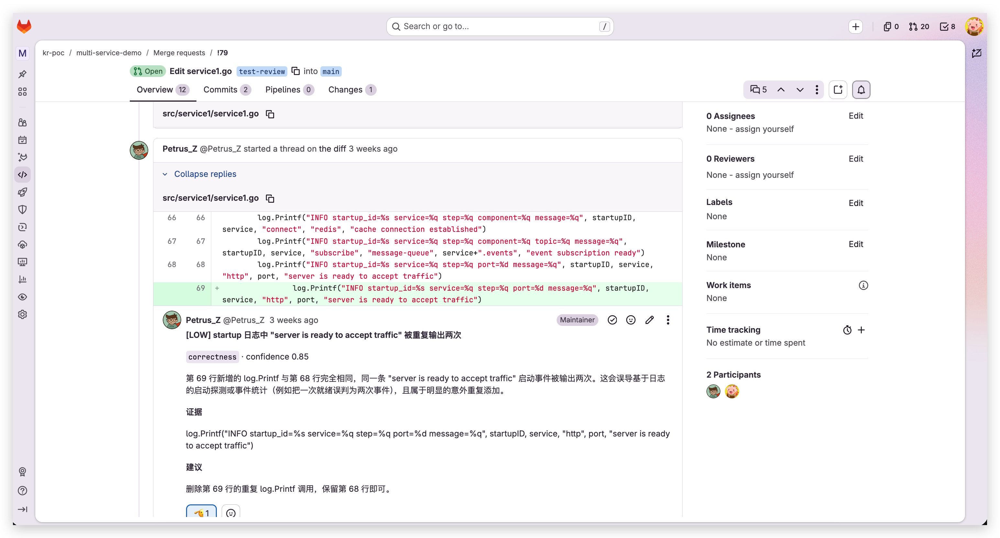
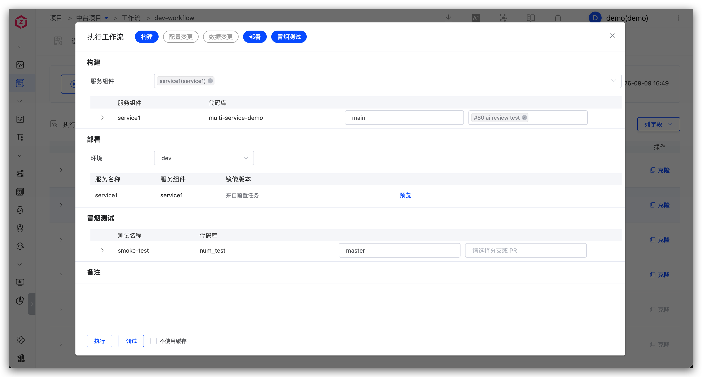
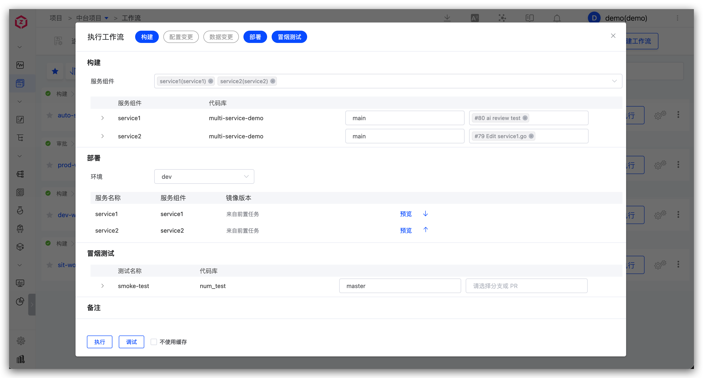
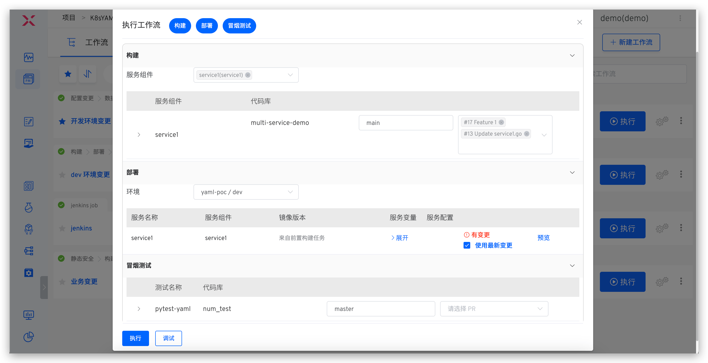
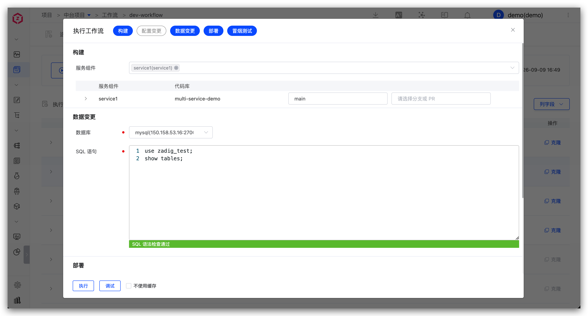
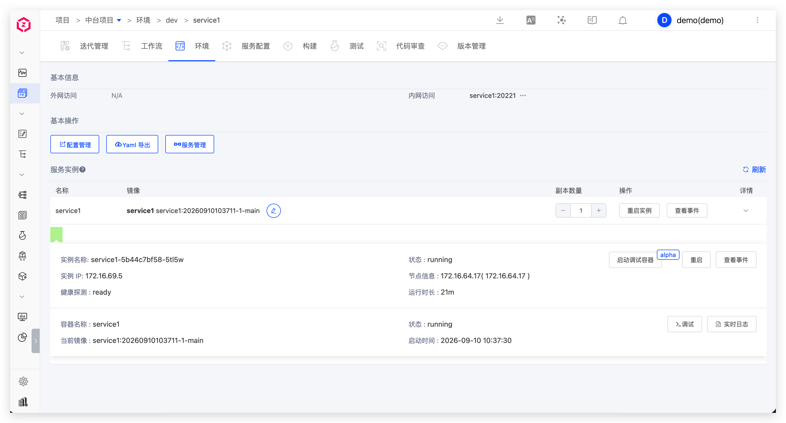
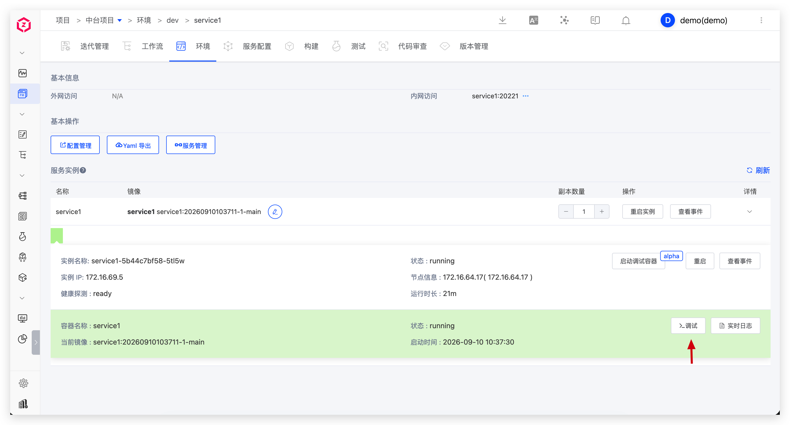
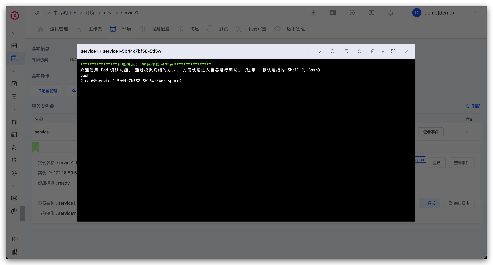
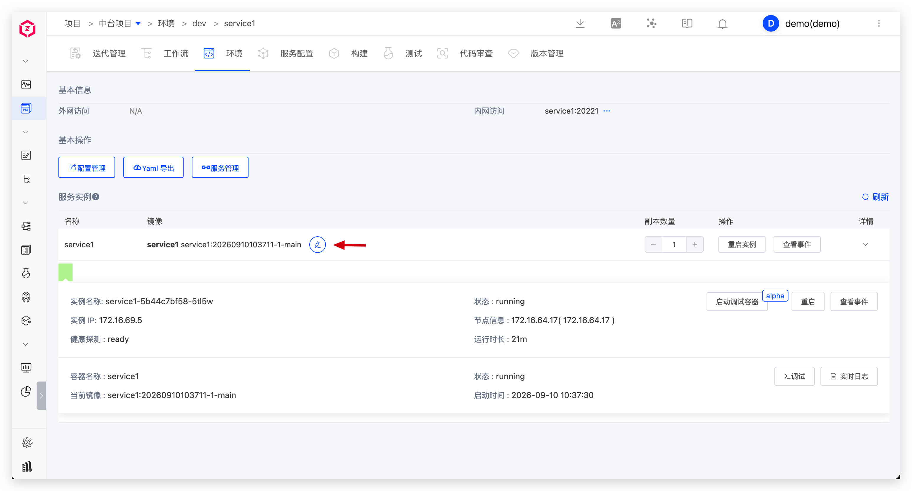

Development engineers use Zadig to submit code, perform self-testing, integrate and debug, update configuration and data, and debug services.

## Submit Code and CI Process

1. Create a new branch locally based on the develop branch, complete development, push to the remote repository, and create a PR/MR (Pull Request/Merge Request).
2. The system automatically triggers the CI process, including unit testing, code style checking, and code scanning.
3. CI results (such as unit tests, AI code review, etc.) are fed back on the PR/MR page.

## Self-Testing by a Single Engineer

Manually or automatically trigger the dev workflow, including: build, deploy dev environment, smoke test, IM notification.

## Multi-Engineer Integration and Debugging

Execute the dev workflow, select multiple services and corresponding code changes.

## Multiple Code Changes for the Same Service

Execute the dev workflow, select the service and multiple code changes.

## Update Business Configuration

> Applicable scenarios: Changes involve configuration updates

For configuration changes, use the corresponding environment workflow, select and modify the Nacos configuration.

## Update Project Management Task Status

> Applicable scenarios: After a feature is implemented, update the status of the tracking task with one click

For project management task status updates, use the workflow to select the corresponding Jira task.

## Update the Database

> Applicable scenarios: Changes involve data modifications (such as table structure changes, field changes, etc.)

For database changes, use the workflow to input SQL statements and update data (e.g., table structure or field changes).

## Service Debugging

View environment and service status.

View real-time service logs.

Enter container debugging.

Temporarily replace service image.

Adjust replica count or restart instances.

