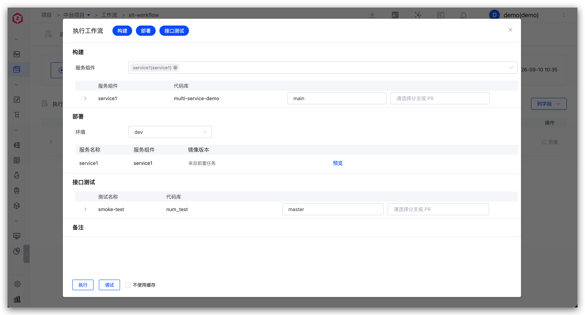
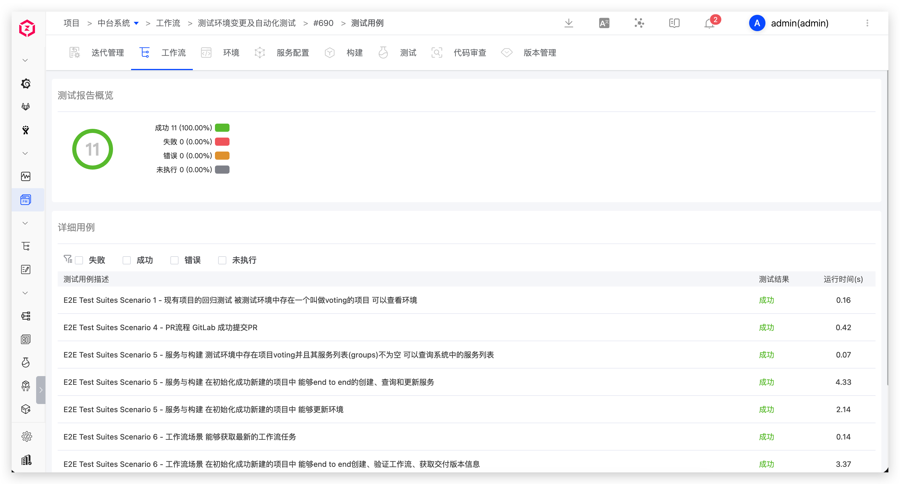

Test engineers use Zadig to manage test cases, complete sit/uat release verification, and analyze automated test results.

## Manage Test Cases

1. Write test case scripts locally and perform self-testing for the sit environment.
2. After passing the self-test, submit to the code repository.

## Sit Release Verification

Execute the sit workflow to update the environment for integration verification, including: build, deploy sit environment, interface test, IM notification.

## Uat Release Verification

Execute the uat workflow for pre-release verification, including: quality gate, build, configuration change, deploy uat environment, regression test, IM notification.

## Analysis of Automated Test Results

Analyze automated test results and continuously optimize the test suite based on coverage.

