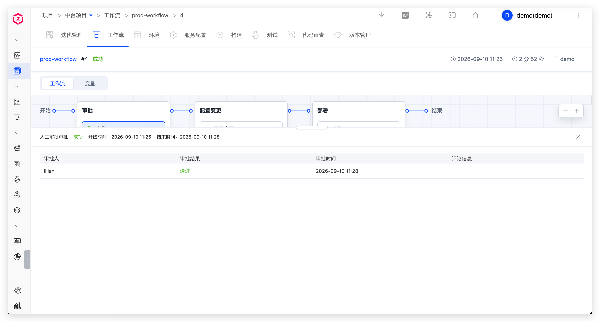
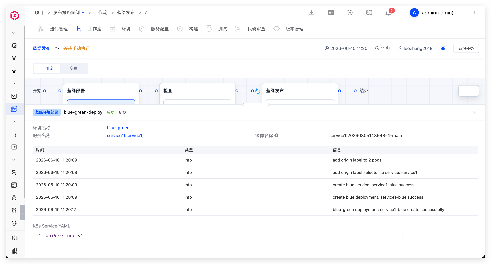
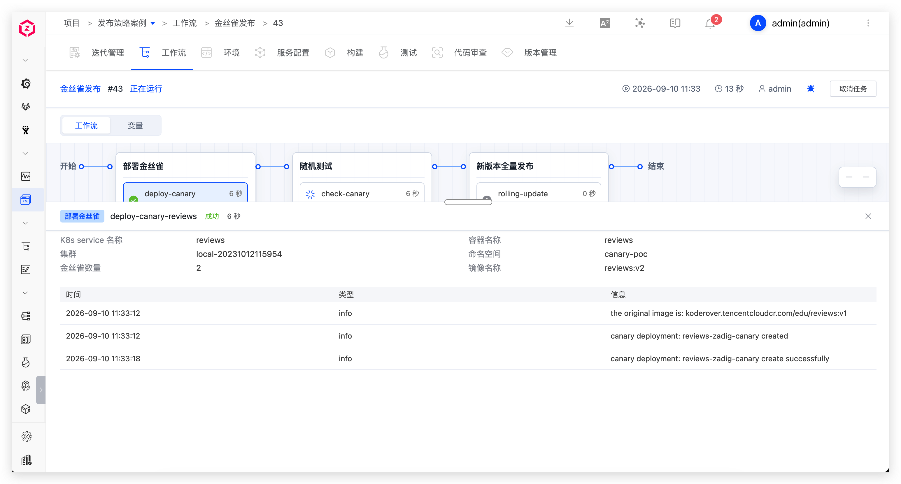
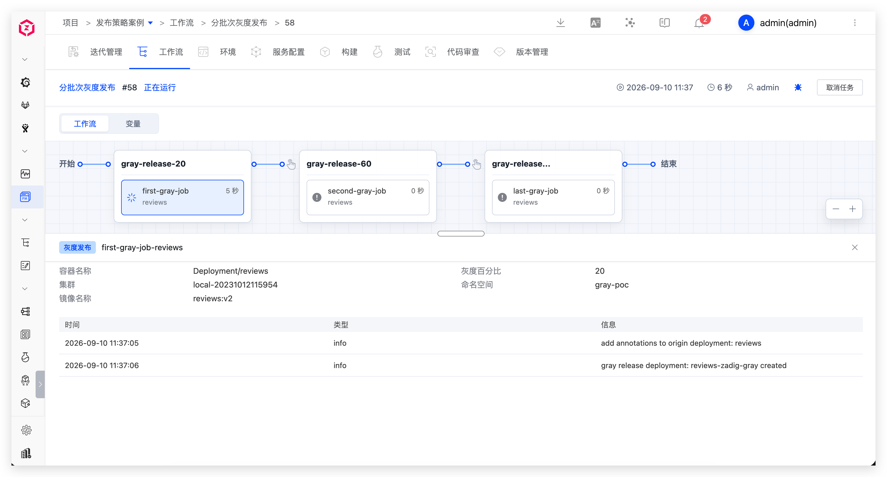
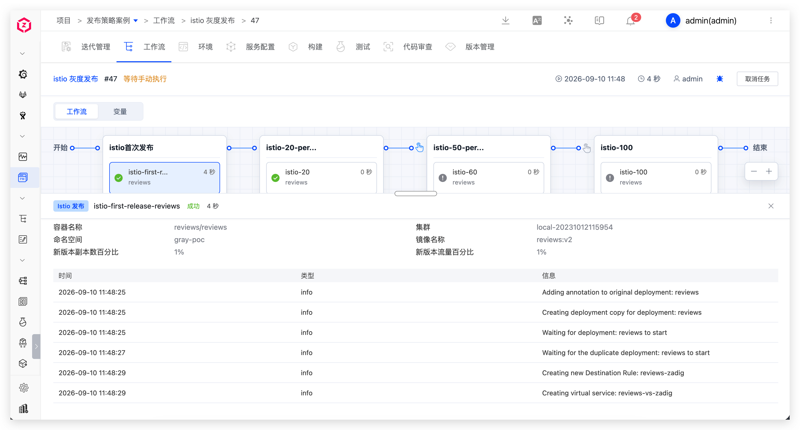

Release engineers update production environments through workflows and support multiple release strategies.

## Rolling Release

Execute the prod workflow to update the production environment, including: release approval, configuration change, deployment.

## Blue-Green Release

Execute the workflow to update the production environment, including: deploy blue environment, automatic detection, manual confirmation, switch production version.

## Canary Release

Execute the workflow to update the production environment, including: deploy canary, random testing, manual confirmation, full release of new version.

## Batched Gray Release

Execute the workflow to update the production environment, including: gray 20%, manual confirmation, gray 60%, manual confirmation, full release of new version.

## Istio Release

Execute the workflow to update the production environment, including: deploy new version 20% traffic, manual confirmation, 100% traffic to new version.

