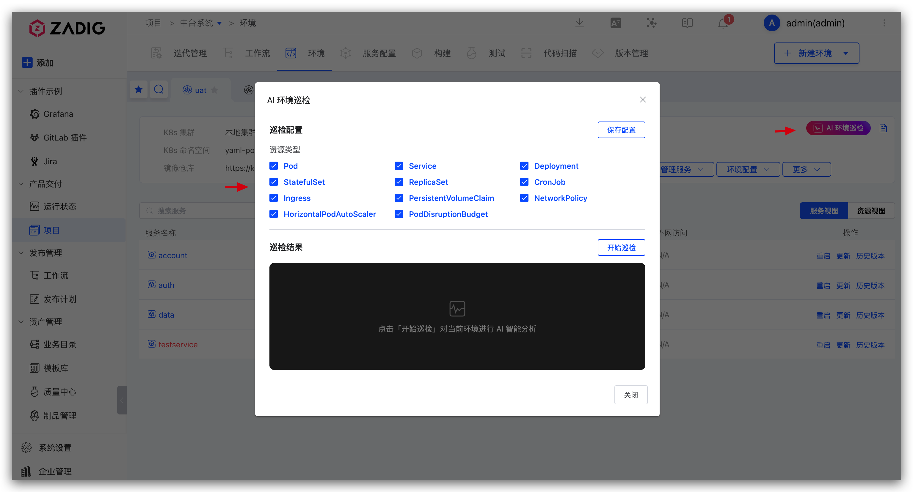
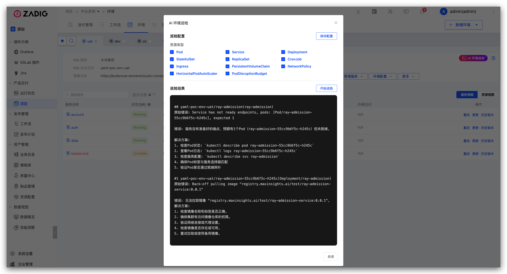

Facing complex Kubernetes production environments, traditional manual inspections are time-consuming and often fail to uncover latent risks. Zadig's AI environment inspection uses intelligent analysis to keep environments stable.

Scenario value:
- AI automatically performs environment health checks, greatly reducing labor cost.
- Automatically identifies common environment issues and provides remediation guidance.

## Intelligent Analysis

AI performs comprehensive checks on Kubernetes environments, covering key metrics such as resource status and service health.

## Intelligent Issue Identification

Automatically identifies common environment issues such as abnormal Pods, insufficient resources, and configuration errors, and provides remediation guidance.

