This article introduces how to use Zadig code review. Code review includes AI Review, Sonar Scan, and Custom Scan, and currently supports the following capabilities:

- AI Review: built-in AI review with configurable rules; results are written back to the MR comment section
- Sonar Scan: scan code with SonarQube, configure quality gates based on scan results, and jump to the Sonar system to analyze results
- Custom Scan: scan code in any language with custom tools
- Scan multiple code repositories
- Automatically trigger scans on code changes
- Notify scan results to DingTalk, WeCom, and Lark

## Create a Code Review

Go to the project → Code Review, click `Create Code Review`, then select the scan type and fill in the repository information.

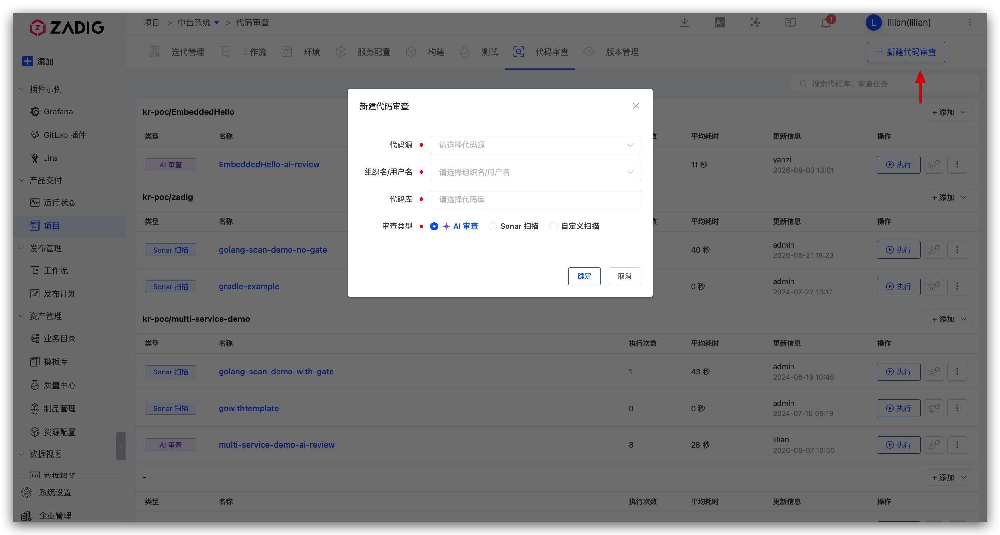

## AI Review

AI Review uses an integrated large language model to review code changes and identify defects and risks. After the review completes, results can be written back to the GitLab / GitHub MR / PR comment section.

Complete [AI Services](/en/Zadig%20v5.0/settings/ai/) integration before using this feature.

### Configuration

When creating a code review, select `AI Review` as the scan type.

#### Scan Rules

Configure repository review rules. You can add multiple rules, and each rule can include multiple checks by Glob path. When a repository rule and a global rule overlap in scope, the repository rule takes precedence.

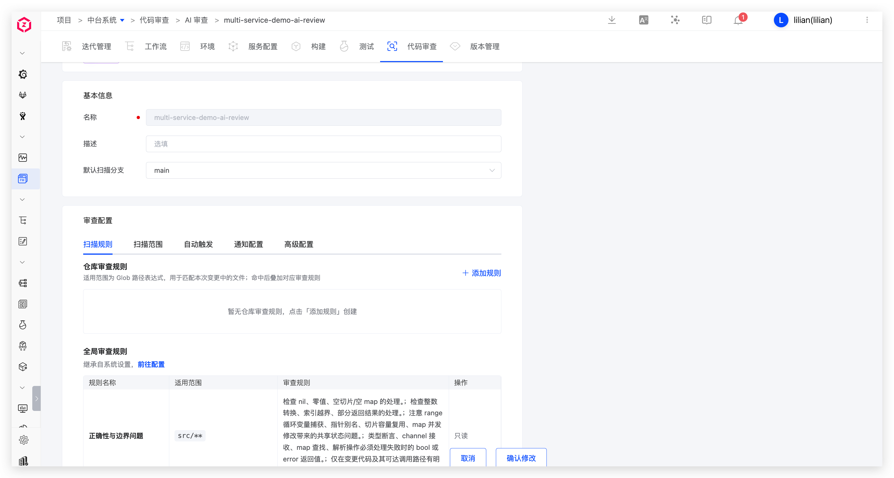

Repository rules can also be managed in the code repository. The rule file path is `{repository-name}/.zadig-review/rules.json`. Example:

`.zadig-review/rules.json` example:

```json
{
  "include": [
    "src/**/*.go"
  ],
  "exclude": [
    "**/*.lock",
    "**/vendor/**",
    "**/generated/**"
  ],
  "rules": [
    {
      "path": "**/*.go",
      "rule": ".zadig-review/docs/go-review.md",
      "merge_system_rule": true
    }
  ]
}
```
`.zadig-review/docs/go-review.md` example:

```markdown
Review Go changes for concrete correctness and maintainability risks:

Verify error values are handled and wrapped without losing actionable context.
Check goroutine, channel, mutex, timer, and context lifecycles for leaks or races.
Preserve API compatibility and established zero-value behavior.
Confirm resources are closed on every return path.
Require focused tests for changed boundary conditions and failure paths.
```

#### Scan Scope

Use Glob paths to limit the files included in AI Review.

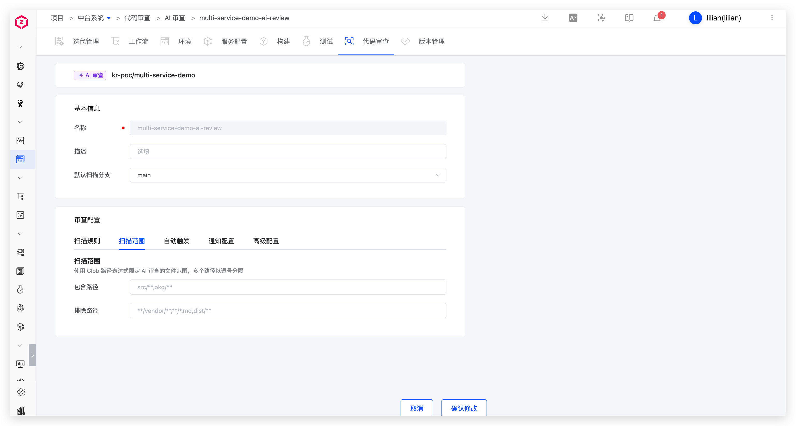

#### Auto Trigger

After auto trigger is enabled, a new MR / PR automatically starts AI Review.

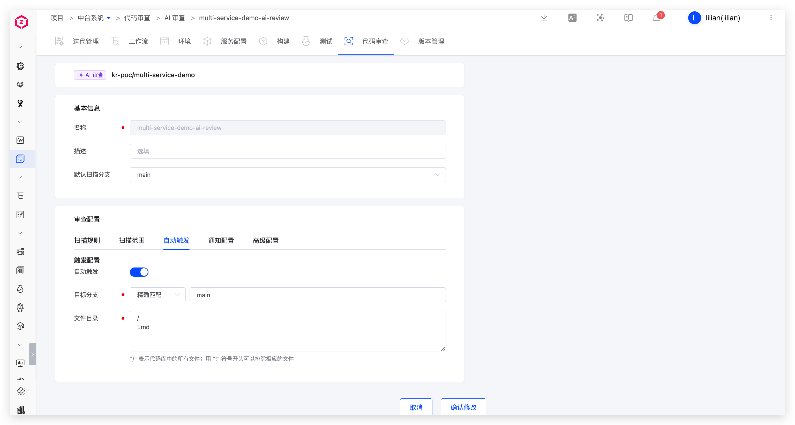

#### Notification

For configuration details, refer to [Workflow Notification](/en/Zadig%20v5.0/workflow/im/).

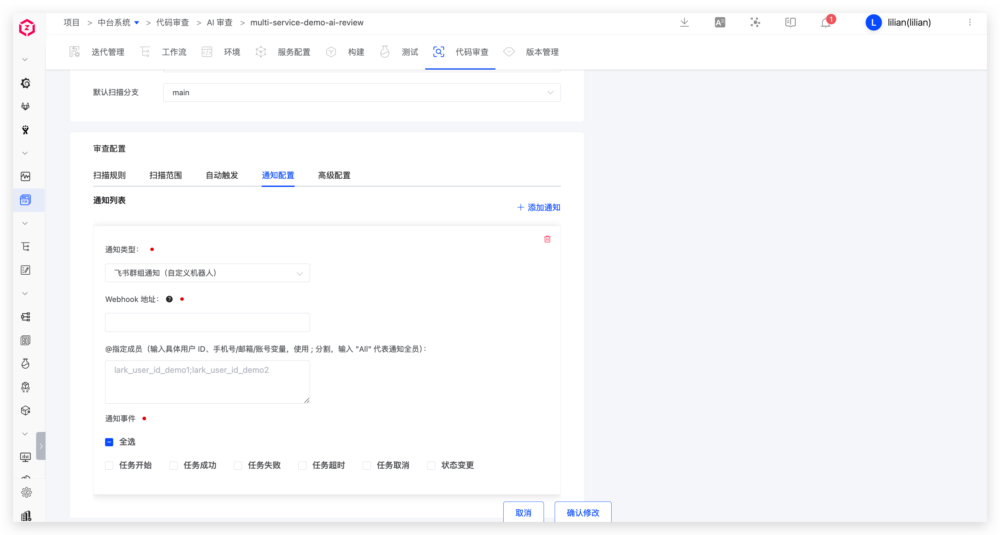

#### Advanced Configuration

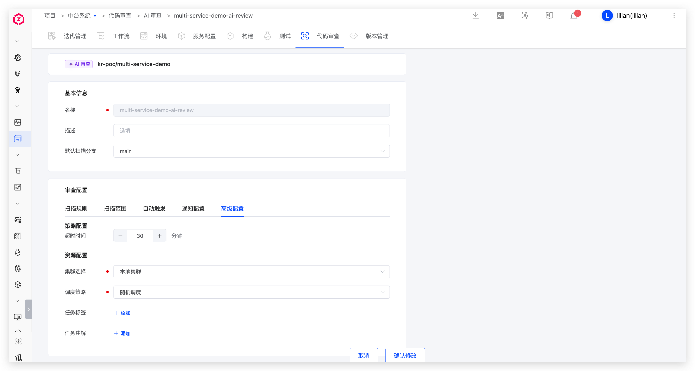

- `Timeout`: If the review does not finish within the configured threshold, the task is treated as a timeout failure
- `Cluster`: Select the cluster used to run the review task. The local cluster is the cluster where Zadig is installed. Refer to [Cluster Management](/en/Zadig%20v5.0/pages/cluster_manage/) to add more clusters
- `Scheduling Policy`: Select the cluster scheduling policy. The default is `Random Scheduling`. Refer to [Setting Scheduling Policies](/en/Zadig%20v5.0/pages/cluster_manage/#setting-scheduling-policies)
- `Task Labels`: Configure Pod labels for the review task
- `Task Annotations`: Configure Pod annotations for the review task

### Usage

Select an AI Review task → click `Run`, or submit an MR / PR, to review the specified branch and PR.

After the review completes:
- View the results in the task details
- Results are automatically written back to the GitLab / GitHub MR comment section

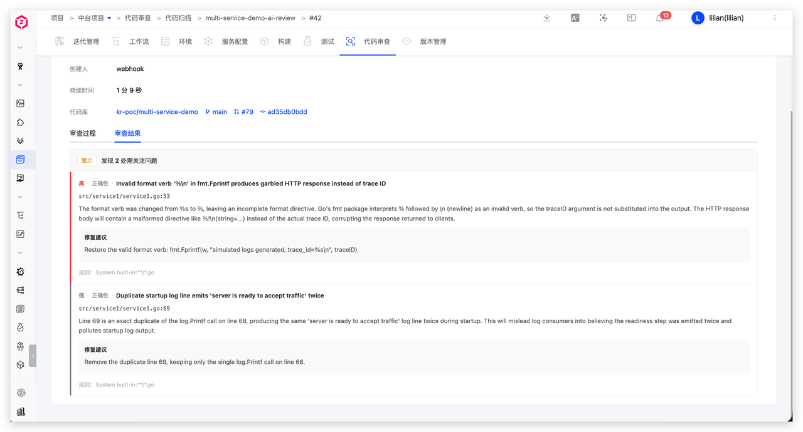
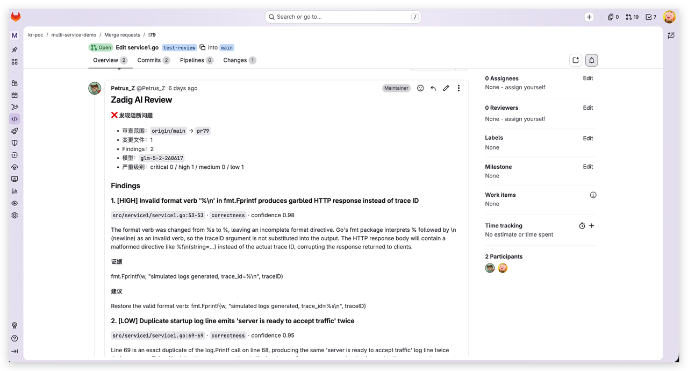

For local IDE or CI scenarios, you can also use the open-source CLI. See [zadig-review-agent](https://github.com/koderover/zadig-review-agent).

## Sonar Scan

Use SonarQube for static code scanning. Scan results are uploaded to the specified Sonar system. For more practices, refer to [Sonar Scan Practices](/en/Zadig%20v5.0/sonar-scan/practice/).

### Configuration

When creating a code review, select `Sonar Scan` as the scan type.

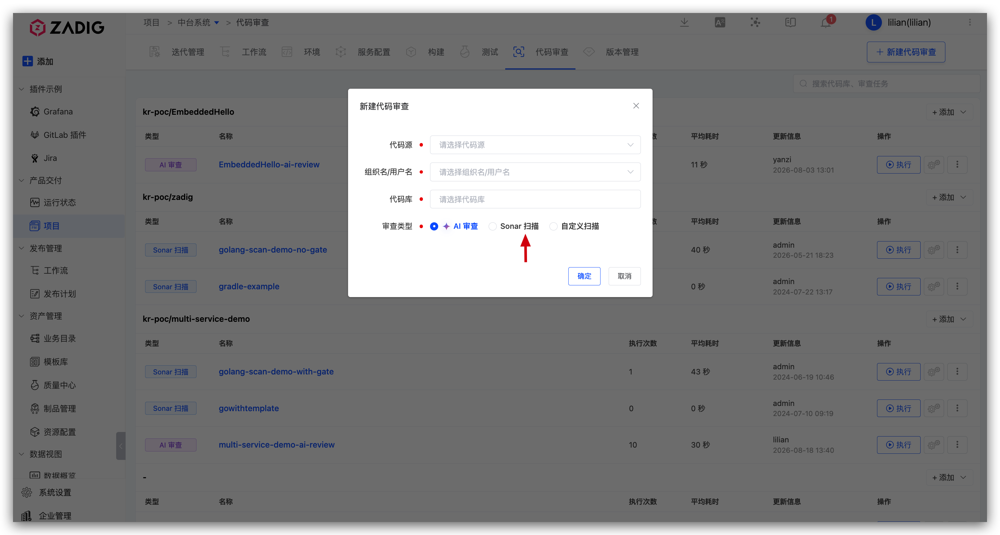

#### Basic Information

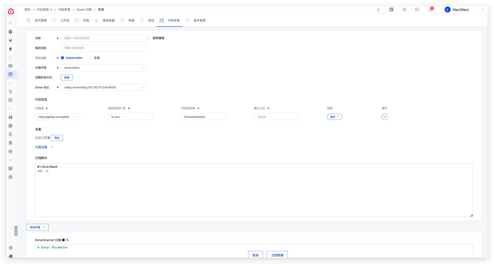

- `Name`: Code scan name. Duplicates are not allowed in the same project
- `Infrastructure`: Supports running code scan tasks on Kubernetes and hosts
- `Basic Image`: The runtime environment for the scan task. The system provides a built-in `sonar` environment for this tool; select `sonar`
- `Packages`: Specify software packages needed during the scan, such as different versions of Java, Go, and Node
    - Pay attention to package dependencies and install them in order. For example, Govendor depends on Go, so select Go first, then Govendor
    - The platform includes common packages. For other packages or versions, a system administrator can configure installation scripts in [Package Management](/en/Zadig%20v5.0/settings/app/)
- `Sonar Host`: Integrate Sonar first. Refer to [Sonar Integration](/en/Zadig%20v5.0/settings/sonar/). After the scan completes, Zadig uploads the results to the specified system

#### Code Information

Configure code information for the scan. During execution, Zadig pulls code according to this configuration. For supported code sources, refer to [Code Source Information](/en/Zadig%20v5.0/settings/codehost/overview/#function-compatibility-list). For field descriptions, refer to [Code Information](/en/Zadig%20v5.0/project/build/#code-information).

#### Variables

Includes built-in variables and custom variables, which can be used directly in scan scripts.

> Tip: Add the `env` command in [Scan Script](#scan-script) to view all variables.

**Built-in Variables**

Built-in variables and their descriptions:

|Variable Name|Description|
|-------|---|
|`SONAR_URL`|Sonar Server access address|
|`WORKSPACE`|Working directory of the current code scan|
|`PROJECT`|Project identifier|
|`TASK_ID`|Code scan task ID|
|`TASK_URL`|Code scan task URL|
|`CI`|Always `true`. Use it as needed, for example to distinguish CI scripts from other scripts|
|`Zadig`|Always `true`. Use it as needed, for example to determine whether the script is running in Zadig|
|`REPONAME_<index>`|1. Get the repository name at the specified `<index>`<br>2. `<index>` is the position of the repository in the scan configuration, starting from 0<br>3. In the example below, `$REPO_0` in the script returns the first repository name `voting-app`|
|`REPO_<index>`|1. Get the repository name at the specified `<index>` and replace hyphens `-` with underscores `_`<br>2. `<index>` is the position of the repository in the scan configuration, starting from 0<br>3. In the example below, `$REPO_0` in the script returns the converted name `voting_app`|
|`<REPO>_PR`|1. Get the Pull Request information for `<REPO>` during the scan. Replace `<REPO>` with the repository name<br>2. If `<REPO>` contains a hyphen `-`, replace it with `_`<br>3. To get the Pull Request of `voting-app`, use `$voting_app_PR` or `eval PR=\${${REPO_0}_PR}`<br>4. If multiple PRs are specified, such as 1, 2, and 3, the value is `1,2,3`<br>5. Not supported when the repository source is `Other`|
|`<REPO>_BRANCH`|1. Get the branch for `<REPO>` during the scan. Replace `<REPO>` with the repository name<br>2. If `<REPO>` contains a hyphen `-`, replace it with `_`<br>3. To get the branch of `voting-app`, use `$voting_app_BRANCH` or `eval BRANCH=\${${REPO_0}_BRANCH}`|
|`<REPO>_PRE_MERGE_BRANCHES`|1. Pre-merge branches for multi-branch merge builds. `<REPO>` is the repository name and can be used directly or with `$<REPO_INDEX>`<br>2. If `<REPO>` contains a hyphen `-`, replace it with `_`<br>3. For example, use `eval BRANCH=\${${REPO_0}_PRE_MERGE_BRANCHES}` to get the pre-merge branches of the first repository|
|`<REPO>_TAG`|1. Get the Tag for `<REPO>` during the scan. Replace `<REPO>` with the repository name<br>2. If `<REPO>` contains a hyphen `-`, replace it with `_`<br>3. To get the Tag of `voting-app`, use `$voting_app_TAG` or `eval TAG=\${${REPO_0}_TAG}`|
|`<REPO>_COMMIT_ID`|1. Get the Commit ID for `<REPO>` during the scan. Replace `<REPO>` with the repository name<br>2. If `<REPO>` contains a hyphen `-`, replace it with `_`<br>3. To get the Commit ID of `voting-app`, use `$voting_app_COMMIT_ID` or `eval COMMIT_ID=\${${REPO_0}_COMMIT_ID}`<br>4. Not supported when the repository source is `Other`|
|`<REPO>_ORG`|1. Get the organization/user for `<REPO>` during the scan. Replace `<REPO>` with the repository name<br>2. If `<REPO>` contains a hyphen `-`, replace it with `_`<br>3. To get the organization/user of `voting-app`, use `$voting_app_ORG` or `eval ORG=\${${REPO_0}_ORG}`|

**Custom Variables**

Notes:

- Supports string (single-line/multi-line), single-select, multi-select, and file variables
- String variables can be marked as sensitive. Sensitive values are not printed in scan logs

#### Scanning Script

Configure the scan script as needed.

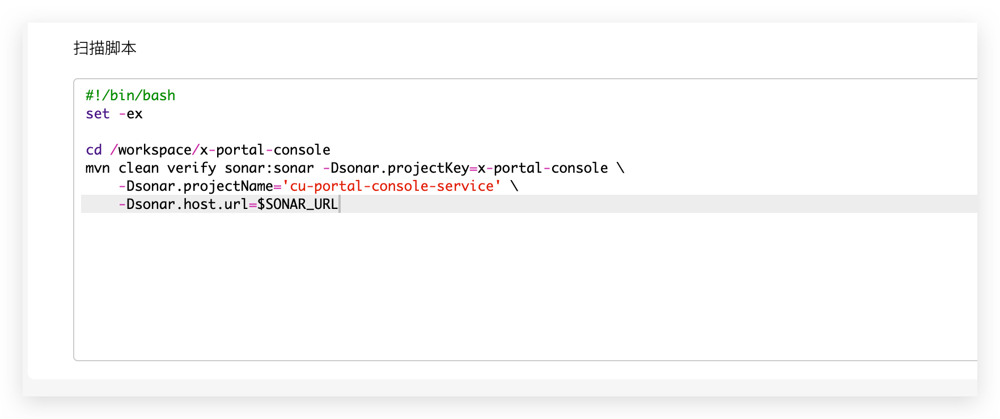

#### SonarScanner Scan

In `Add Step`, you can configure SonarScanner. `sonar.host.url` and `sonar.login` do not need to be set; Zadig injects them at runtime. For more parameters, refer to the [SonarQube documentation](https://docs.sonarqube.org/latest/analysis/analysis-parameters/).

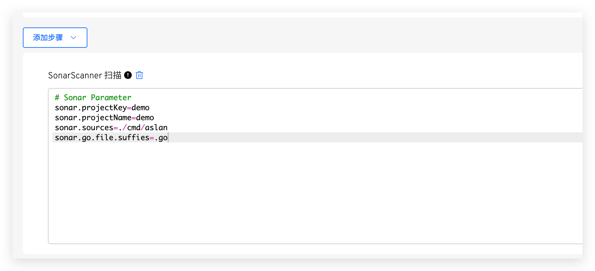

#### Advanced Configuration

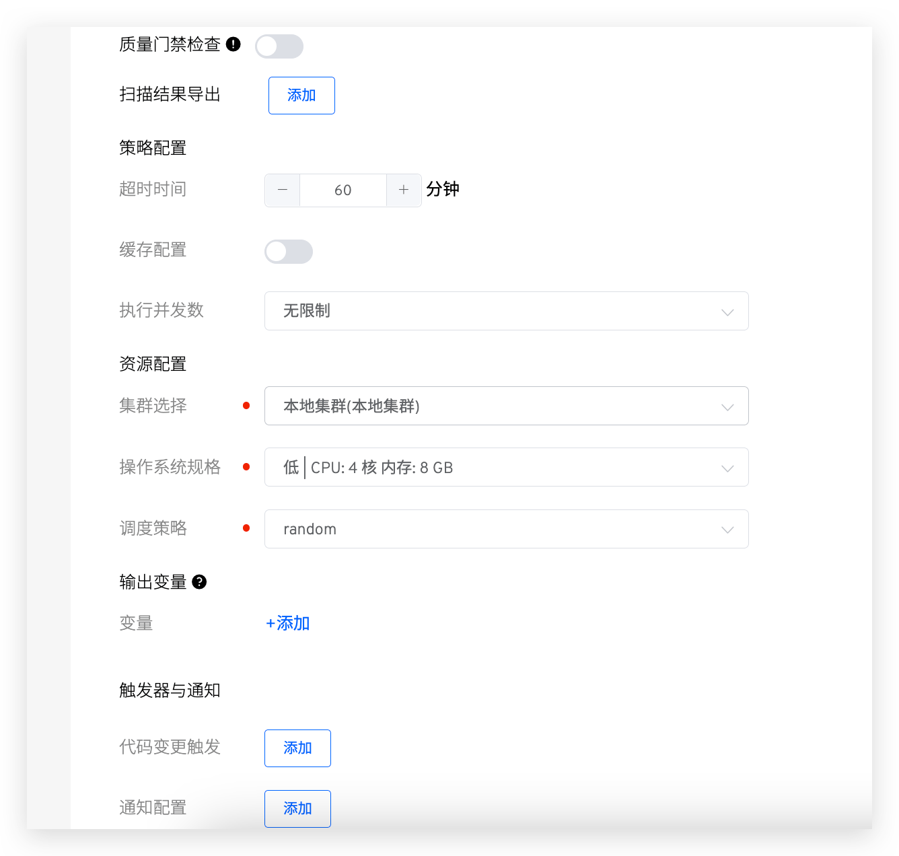

Notes:
- `Quality Gate`: Refer to [Quality Gate Check](#quality-gate-check)
- `Report Export`: Configure the scan report path
- `Timeout`: If the scan does not finish within the configured threshold, the task is treated as a timeout failure
- `Cache`: After cache is enabled, the configured cache directory is used during the scan
- `Cluster`: Select the cluster used to run the scan task. The local cluster is the cluster where Zadig is installed. Refer to [Cluster Management](/en/Zadig%20v5.0/pages/cluster_manage/) to add more clusters
- `Resources`: Configure resource specs for the scan task. The platform provides High/Medium/Low/Lowest presets. You can also customize them. For GPU resources, use `vendorname.com/gpu:num`. Refer to [Schedule GPUs](https://kubernetes.io/docs/tasks/manage-gpus/scheduling-gpus/)
- `Scheduling Policy`: Select the cluster scheduling policy. The default is `Random Scheduling`. Refer to [Setting Scheduling Policies](/en/Zadig%20v5.0/pages/cluster_manage/#setting-scheduling-policies)
- `Output Variables`: Output environment variables from the scan so that other workflow jobs can use them. Refer to [Variable Passing](/en/Zadig%20v5.0/project/workflow-config/#variable-passing)
- `Triggers and Notifications`: Configure Webhook events to automatically trigger the scan. Refer to [Triggers and Notifications](#triggers-and-notifications)

#### Triggers and Notifications

##### Triggers

> For supported code sources, refer to [Code Source Information](/en/Zadig%20v5.0/settings/codehost/overview/#function-compatibility-list)

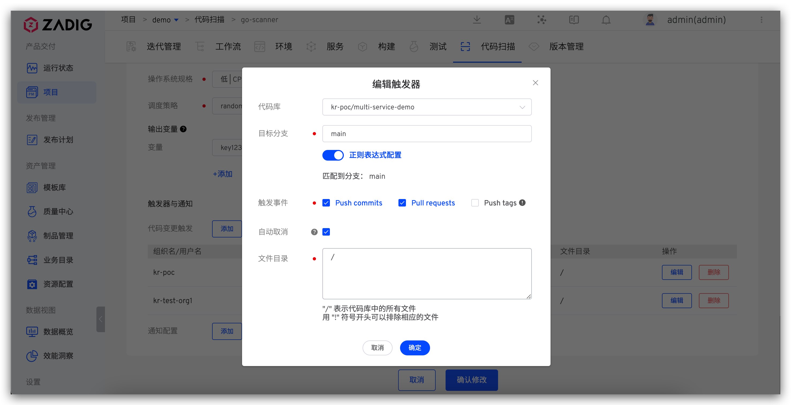

Parameter description:

- `Repository`: The repository configured in [Code Information](#code-information)
- `Target Branch`: The branch to watch for code change events
- `Trigger Event`: Webhook events that trigger the scan:
    - `Push commits` (merge operations)
    - `Pull requests` when a pull request is submitted
    - `Push tags` after a tag is created
- `Auto Cancel`: If selected, when multiple Webhook events trigger scans in sequence, queued tasks are cancelled automatically
- `File Directory`: Trigger the scan when the specified files or directories change (add/modify/delete). Example repository layout:

```bash
├── reponame  # Repository name
  ├── Dockerfile 
  ├── Makefile
  ├── README.md   
  ├── src        
    ├── service1/
    ├── service2/
    └── service3/
```

| Trigger Scenario | File Directory Configuration |
|----|------------|
| All file updates|`/`|
| All file updates except `*.md`|`/`<br>`!.md`|
| All file updates except those under `service1` | `/`<br>`!src/service1/`|
| All file updates under `service1` | `src/service1/` |
| File updates under `src` except those under `service1`|`src`<br>`!src/service1/`|

##### Notification

Supports notifying scan results to DingTalk, WeCom, Lark, email, and Webhook. Refer to [Notification](/en/Zadig%20v5.0/workflow/im/).

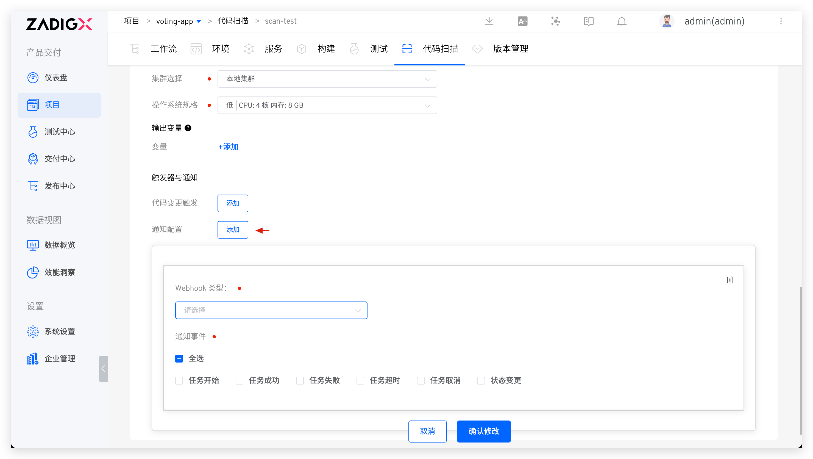

### Quality Gate Check

In advanced configuration, enable quality gate check. After it is enabled, Zadig fetches quality gate rules from SonarQube. If the gate fails, the task is marked as failed, and the specific rules and evaluation results are returned.

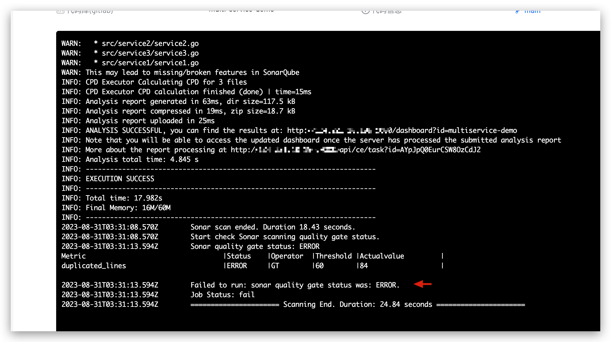

To set rules, go to the SonarQube system and modify or add a Quality Gate.

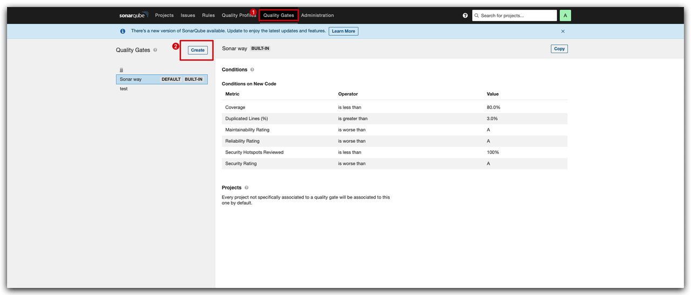

### Usage

Select a code scan → click `Run` to scan the specified branch or Tag.

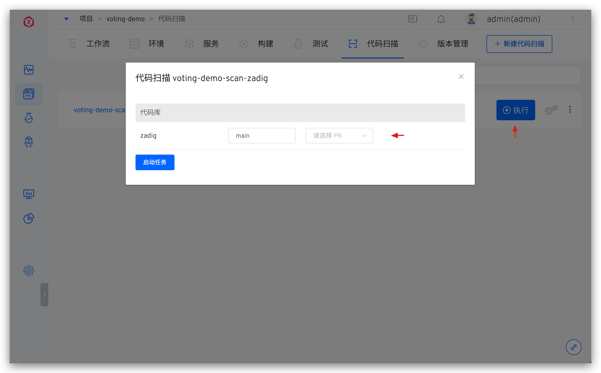

When the scan completes, click the link to open the SonarQube system and view the results.

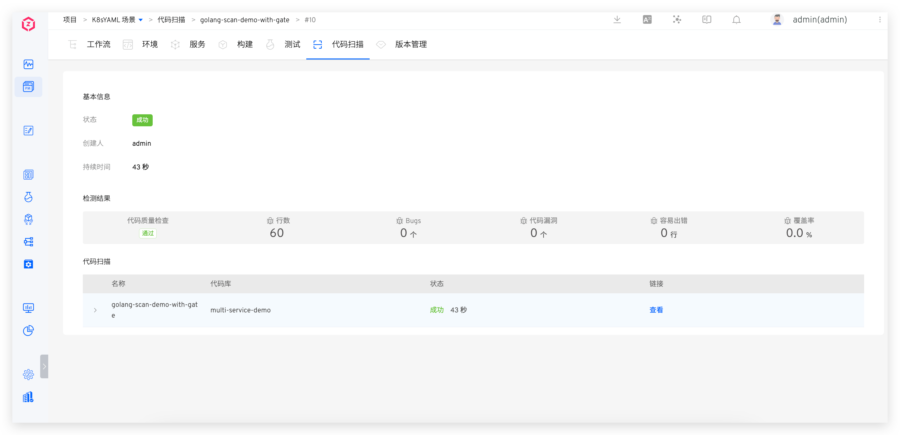

## Custom Scan

Scan code with a third-party scanning tool.

### Configuration

When creating a code review, select `Custom Scan` as the scan type.

#### Basic Information
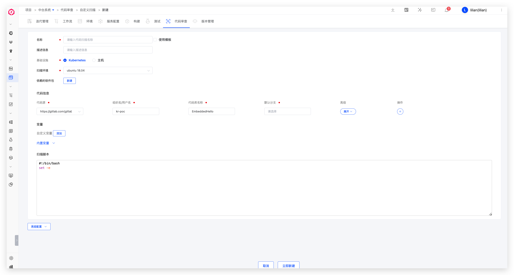

- `Name`: Code scan name. Duplicates are not allowed in the same project
- `Infrastructure`: Supports running code scan tasks on Kubernetes and hosts
- `Scan Environment`: The runtime environment for the scan task. Refer to [Custom Image](/en/Zadig%20v5.0/settings/custom-image/) to add an image as needed. You can preinstall the scanning tool in the custom image
- `Packages`: Specify software packages needed during the scan

#### Code Information, Variables, and Scan Script

Same as [Sonar Scan](#sonar-scan). Write the scan script for the selected tool.

#### Advanced Configuration, Triggers, and Notifications

Same as [Sonar Scan](#sonar-scan). Custom Scan does not support quality gate check.

### Usage

Select a code scan → click `Run` to scan the specified branch or Tag.


