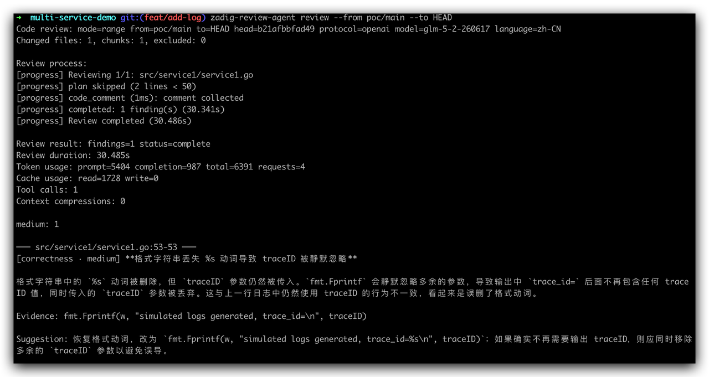
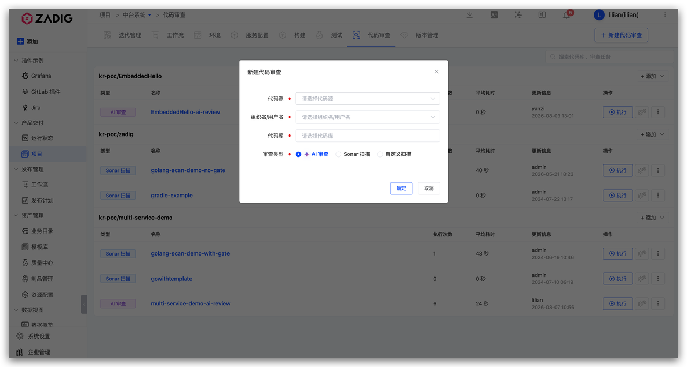

This article describes how to embed AI Review into daily development: review locally after you finish writing code, then let Zadig review automatically after you submit a PR.

## Scenario 1: Local Review with CLI

Use the open-source CLI [zadig-review-agent](https://github.com/koderover/zadig-review-agent) to review local code.

### Step 1: Install
```bash
go install github.com/koderover/zadig-review-agent@latest
```

### Step 2: Configure
```bash
zadig-review-agent config set model.protocol <protocol, e.g. openai>
zadig-review-agent config set model.name <model name, e.g. gpt-4o>
zadig-review-agent config set model.endpoint <model endpoint, e.g. https://api.openai.com/v1>
export ZADIG_REVIEW_MODEL_API_KEY='your-api-key'
```

### Step 3: Run Locally

Run the following command in the repository root:

```bash
zadig-review-agent review --from <remote>/main --to HEAD
```



## Scenario 2: Automatic PR Review

After code is pushed to the repository, Zadig automatically triggers AI Review and writes the results back to the PR/MR comment section. Use the results as a reference for human review and merge.

### Step 1: Configure the Model

Go to Zadig System Settings → System Integration → AI Models and add a large language model. Refer to [AI Services](/en/Zadig%20v5.0/settings/ai/).

### Step 2: Configure AI Review

Go to Zadig System Settings → AI Code Review, then configure the AI model, output language, and global review rules. The system already includes [fallback rules](https://github.com/koderover/zadig-review-agent/blob/main/internal/rules/system_rules.json). If you do not configure global rules, AI Review still runs against the default standards.


### Step 3: Add AI Review for a Repository

In the Zadig project, open the Code Review module, create a review task, bind the target repository, and select the `AI Review` type. After the basic association is complete, open the configuration page and set repository-specific review rules, scan scope, auto-trigger conditions (for example, run automatically when a PR/MR is created), and notifications as needed.




### Step 4: Submit Code to Trigger AI Review Automatically

After the configuration above is complete, developers submit a PR/MR as usual, and Zadig automatically starts AI Review. When the review finishes, results are written back to the PR/MR comment section. Developers can read the AI comments without switching tools, including severity, file and line number, description, and fix suggestions.


After you update the code based on the comments and push again, AI Review runs again and updates the comments. No extra steps are required, and the development workflow is not interrupted.
