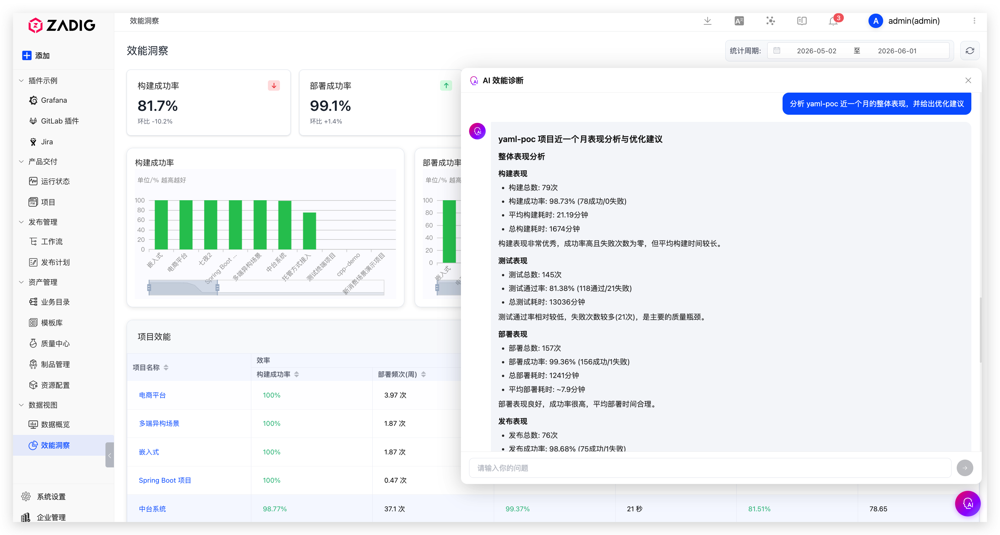
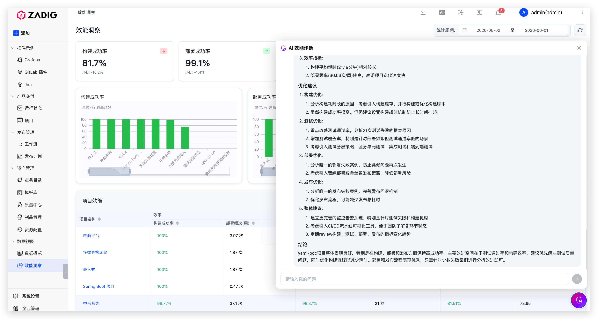

Traditional engineering effectiveness analysis often relies on manual statistics and subjective judgment, which is inefficient and error-prone. Zadig accumulates large volumes of effectiveness data across builds, deployments, tests, and other stages of the R&D process. Leveraging integrated AI large language models, it intelligently analyzes this data to provide objective, actionable improvement recommendations for teams.

Scenario value:
- No need to manually analyze massive datasets—effectiveness reports are generated automatically, saving significant time.
- Data-driven optimization recommendations help teams implement improvements quickly and boost delivery efficiency.

## Intelligent Data Analysis

Through natural language interaction (prompt-based), you can quickly analyze effectiveness data across pipelines, builds, tests, and other stages to identify bottlenecks.

## Actionable Improvement Recommendations

Based on the analysis, specific optimization suggestions are provided—such as parallel testing strategies and resource allocation adjustments—to help teams improve effectiveness quickly.

