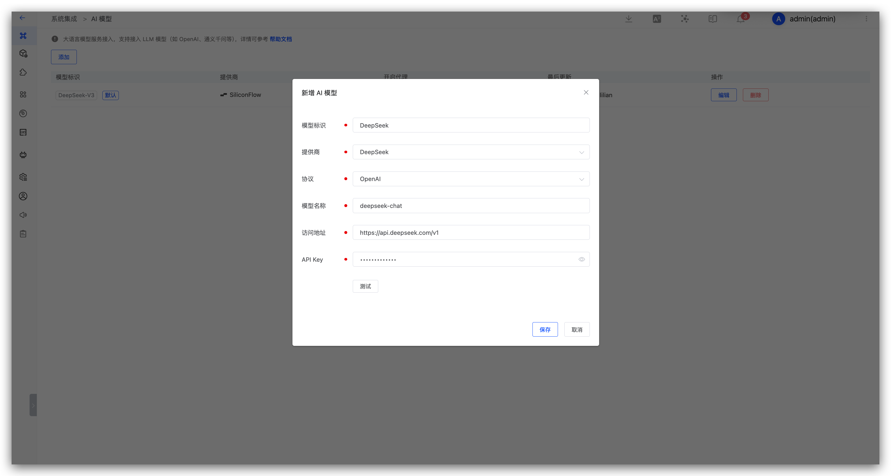
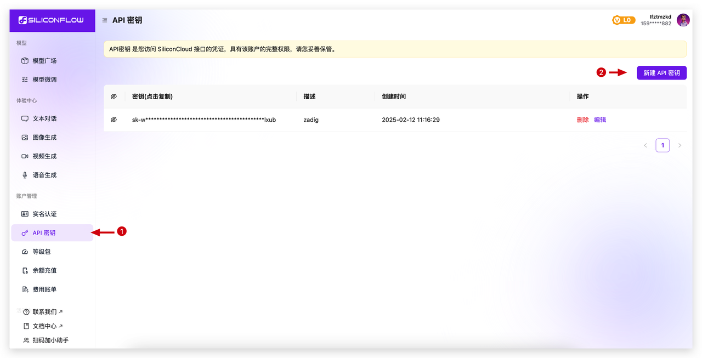
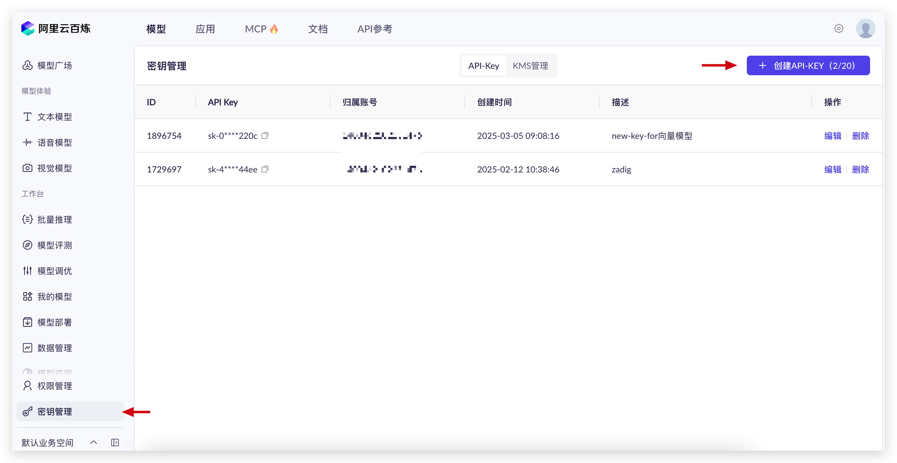
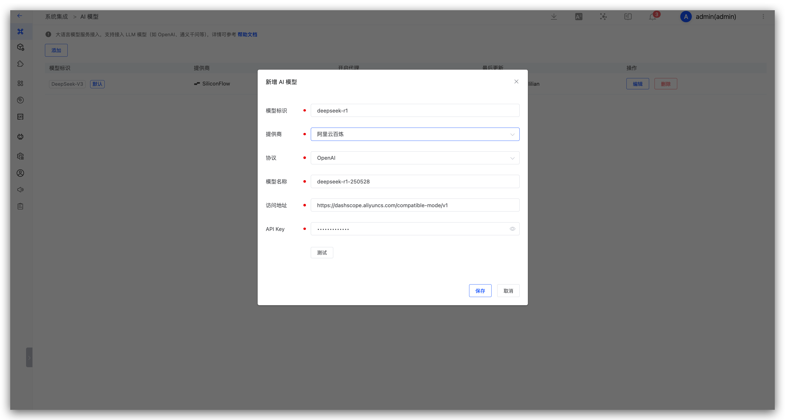

This article introduces AI model integration in Zadig. Supported providers include OpenAI, Azure, Azure AD, DeepSeek, SiliconFlow, Volcengine Ark, Aliyun Bailian, and Huawei Cloud ModelArts Studio.

After a model is integrated, it can be used in the following scenarios:

- [AI Efficiency Diagnostics](/en/Zadig%20v5.0/ai/insight-analysis/): Analyze build, deploy, and test efficiency data to identify bottlenecks and recommend improvements
- [AI Environment Inspection](/en/Zadig%20v5.0/ai/env-analysis/): Check Kubernetes environment health, identify common issues, and provide remediation guidance
- [AI Code Review](/en/Zadig%20v5.0/project/scan/#ai-review): Review code changes, identify defects and risks, and write results back to the MR comment section
- [AI Release Specialist](/en/Zadig%20v5.0/project/workflow-jobs/#ai-release-specialist): Analyze release risk based on change and release context, and output conclusions and recommendations
- [AI Task](/en/Zadig%20v5.0/project/workflow-jobs/#ai-task): Connect to an AI model and automatically execute intelligent tasks based on the prompt

## Add an AI Model

Go to `System Settings` → `Integrations` → `AI Models`, select a provider, and fill in the model information.

Parameter description:

- `Model ID`: The identifier used to recognize the model in Zadig.
- `Provider`: Select the model provider.
- `Protocol`: OpenAI and Anthropic protocols are supported.
- `Model Name`: The model name on the provider side.
- `Address`: The API address of the model service.
- `API Key`: The key used to access the model service.

::: tip
After integrating multiple models, you can set one of them as the default. [AI Efficiency Diagnostics](/en/Zadig%20v5.0/ai/insight-analysis/), [AI Environment Inspection](/en/Zadig%20v5.0/ai/env-analysis/), and [AI Release Specialist](/en/Zadig%20v5.0/project/workflow-jobs/#ai-release-specialist) use the default model.
:::

The following examples show how to obtain an API Key and address from common providers.

## DeepSeek

1. Complete registration on DeepSeek, generate [API Key](https://platform.deepseek.com/api_keys), create a new API Key, and copy it.

2. In Zadig, go to `System Settings` → `Integrations` → `AI Models`, and add the DeepSeek AI model.

**Parameter Description:**

1. Provider: Select DeepSeek
2. Model Name: Enter the model provided by DeepSeek
3. Address: https://api.deepseek.com/v1
4. API Key: The API Key obtained in the previous step

## SiliconFlow

1. Complete registration on SiliconFlow, generate [API Key](https://cloud.siliconflow.cn/account/ak), create a new API Key, and copy it.

2. In Zadig, go to `System Settings` → `Integrations` → `AI Models`, and add the AI model.

**Parameter Description:**

1. Provider: Select SiliconFlow
2. Model Name: Enter the model provided by SiliconFlow
3. Address: https://api.siliconflow.cn/v1
4. API Key: The API Key obtained in the previous step

## Huawei ModelArts Studio

1. Complete registration on [Huawei ModelArts Studio](https://www.huaweicloud.com/product/modelarts/studio.html), generate API Key, create a new API Key, and copy it.

2. In Zadig, go to `System Settings` → `Integrations` → `AI Models`, and add the Huawei ModelArts Studio AI model.

**Parameter Description:**

1. Provider: Select Huawei ModelArts Studio
2. Model Name: Enter the model provided by Huawei ModelArts Studio, such as `deepseek-r1-250528`
3. Address: https://api.modelarts-maas.com/v1/
4. API Key: The API Key obtained in the previous step

## Volcengine Ark

1. Complete registration on Volcengine Ark, generate [API Key](https://www.volcengine.com/product/ark), create a new API Key, and copy it.

2. In Zadig, go to `System Settings` → `Integrations` → `AI Models`, and add the Volcengine Ark AI model.

**Parameter Description:**

1. Provider: Select Volcengine Ark
2. Model ID: Enter the model ID provided by Volcengine Ark, such as `deepseek-r1-250528`
3. Address: https://ark.cn-beijing.volces.com/api/v3
4. API Key: The API Key obtained in the previous step

## Aliyun Bailian

1. Complete registration on Aliyun Bailian, generate [API Key](https://bailian.console.aliyun.com/?tab=model#/api-key), create a new API Key, and copy it.

2. In Zadig, go to `System Settings` → `Integrations` → `AI Models`, and add the Aliyun Bailian AI model.

**Parameter Description:**

1. Provider: Select Aliyun Bailian
2. Model Name: Enter the model provided by Aliyun Bailian, such as `deepseek-r1-0528`
3. Address: https://dashscope.aliyuncs.com/compatible-mode/v1
4. API Key: The API Key obtained in the previous step
