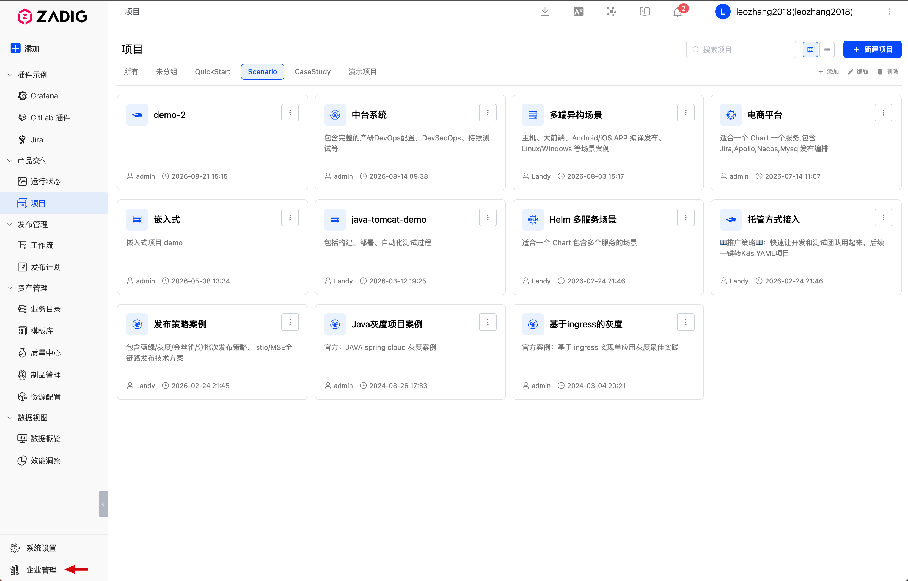
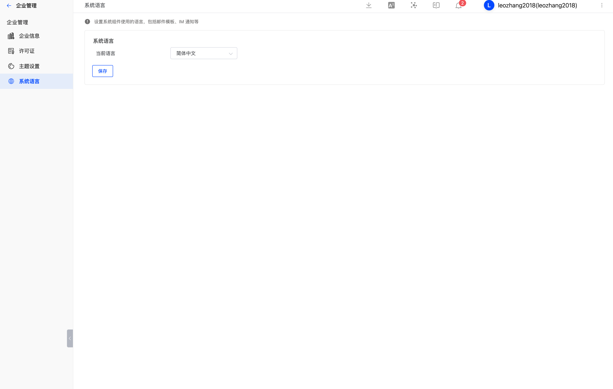

This article describes how to manage enterprise information in Zadig, including:

- Enterprise information (name, website, login page copyright display, enterprise logo)
- License
- Theme settings
- System language

## Enterprise Information

System administrators can go to `Enterprise Management` -> `Enterprise Information` to modify the enterprise name, website, login page copyright display, and enterprise logo.

### Login Page Copyright Display

You can control whether the footer information is displayed on the login page.

### Enterprise Logo

1. Icon used on the login page (light). Format: JPEG/PNG/SVG. Recommended size: 200px * 60px.
2. Icon used in the upper-left corner of the login page (dark) and in the upper-left corner of the expanded sidebar (dark). Format: JPEG/PNG/SVG. Recommended size: 200px * 60px.
3. Icon used in the upper-left corner of the collapsed sidebar. Format: JPEG/PNG/SVG. Recommended size: 60px * 60px.
4. Favicon icon. Format: JPEG/PNG/SVG/ICO. Recommended sizes: 16px * 16px, 32px * 32px, 64px * 64px.

## License

### Get a Free 30-Day Trial License

After installation, get a trial license through the [official self-service page](https://koderover.com/getLicense). If you need help during the trial, add the assistant to join the user community.

### Configure License

System administrators can go to `Enterprise Management` -> `License` to configure the license as needed.

## System Theme

System administrators can go to `Enterprise Management` -> `Theme Settings` to select a built-in system color scheme or customize the system theme colors.

> Tip: Once the system theme is configured, it takes effect for all users.

## System Language

Set the language used by system components, including email templates, IM notifications, and more.

