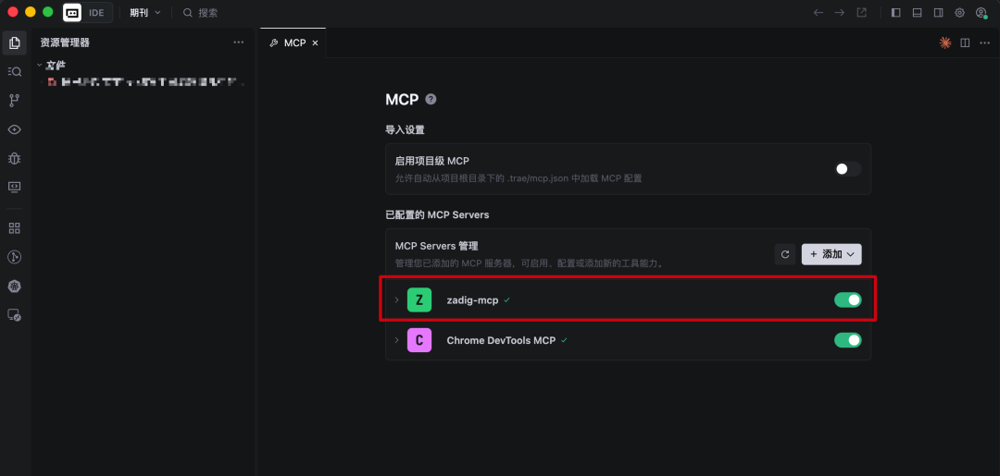

## Introduction

Zadig MCP Server packages Zadig capabilities as MCP tools for clients such as Cursor, Claude Code, Trae, VS Code, Codex, and Feishu Aily.

Zadig MCP supports `stdio` and Streamable HTTP as its primary connection methods, and also provides legacy SSE-compatible endpoints for local development and shared remote services.

## Usage Notes

::: tip
- Zadig v4.2.0 or later is required.
- Create an API Token in **Account Settings** in Zadig.
- Replace `https://your-zadig.com`, `https://mcp.your-company.com`, and `your-token` in the examples with your actual values.
:::

MCP can create, update, and delete resources, as well as run workflows. Use least-privilege API Tokens for each user or integration, and verify the target project, environment, and parameters before performing write operations.

For remote requests, API Tokens are resolved in this order:

1. The `Authorization: Bearer <token>` header.
2. The `api_token` URL parameter.
3. The MCP Server process's `ZADIG_API_TOKEN` environment variable.

::: warning
A Token in a URL may be saved in client configuration or logged by reverse proxies, gateways, and servers. Use `api_token` only if the client cannot set request headers, and keep the URL confidential.
:::

## Connection Methods

| Method | Scenario |
| --- | --- |
| stdio | Install locally and let the MCP client launch Zadig MCP Server. Suitable for Cursor, Claude Code, Trae, VS Code, Codex, and similar clients. |
| Streamable HTTP | Deploy a remote service and expose MCP through `/mcp`. Suitable for centralized deployment and clients supporting remote MCP. |
| SSE compatibility | For legacy clients that do not support Streamable HTTP. The server still starts with HTTP transport. |

### stdio

With `stdio`, the MCP client starts Zadig MCP Server locally. No separate service deployment is required.

#### Install

Linux and macOS:

```sh
# Interactive installation: enter the Zadig URL and Token, then select clients to configure.
curl -fsSL https://resources.koderover.com/zadig-mcp/install.sh | sh
```

Windows PowerShell:

```powershell
irm https://resources.koderover.com/zadig-mcp/install.ps1 | iex
```

Interactive installation downloads the binary for your platform and configures the selected Cursor, Claude Code, Trae, VS Code, or Codex clients. Restart the client after installation.

For unattended installation, which does not write client configuration:

```sh
curl -fsSL https://resources.koderover.com/zadig-mcp/install.sh | \
  ZADIG_API_HOST=https://your-zadig.com \
  ZADIG_API_TOKEN=your-token \
  sh
```

```powershell
$env:ZADIG_API_HOST="https://your-zadig.com"
$env:ZADIG_API_TOKEN="your-token"
irm https://resources.koderover.com/zadig-mcp/install.ps1 | iex
```

#### Verify

After restarting the MCP client, confirm that `zadig-mcp` is healthy in the client's MCP Servers page. You can also ask the client to check the Zadig MCP service, which calls `zadig_ping`.




If the connection fails, check the Zadig URL, API Token, binary path, and the `-a 127.0.0.1:3000 -t stdio` arguments.

#### Use

The installer writes this configuration automatically. To configure a client manually, replace `command` with the actual binary path. The default Linux and macOS installation path is `~/.local/bin/zadig-mcp`.

```json
{
  "mcpServers": {
    "zadig-mcp": {
      "command": "/path/to/zadig-mcp",
      "args": ["--a", "127.0.0.1:3000", "--t", "stdio"],
      "env": {
        "ZADIG_API_HOST": "https://your-zadig.com",
        "ZADIG_API_TOKEN": "your-token"
      }
    }
  }
}
```

Both `-a` and `-t` are required. `stdio` does not use a network listening address, so use `127.0.0.1:3000` for `-a`.

Codex uses TOML. Its default configuration file is `~/.codex/config.toml`, or `$CODEX_HOME/config.toml` when `CODEX_HOME` is set.

```toml
[mcp_servers.zadig-mcp]
command = "/path/to/zadig-mcp"
args = ["--a", "127.0.0.1:3000", "--t", "stdio"]

[mcp_servers.zadig-mcp.env]
ZADIG_API_HOST = "https://your-zadig.com"
ZADIG_API_TOKEN = "your-token"
```

You can then use natural language in the client, for example:

```text
List the workflows in the demo project.
Check the web service status in the demo project's dev environment.
Generate the runnable parameter template for the release workflow.
```

#### Uninstall

Linux and macOS:

```sh
# Upgrade to the latest version
curl -fsSL https://resources.koderover.com/zadig-mcp/install.sh | sh -s -- --update

# Check for a new version
curl -fsSL https://resources.koderover.com/zadig-mcp/install.sh | sh -s -- --check

# Uninstall
curl -fsSL https://resources.koderover.com/zadig-mcp/install.sh | sh -s -- --uninstall
```

Windows PowerShell:

```powershell
# Uninstall
& ([scriptblock]::Create((irm https://resources.koderover.com/zadig-mcp/install.ps1))) -Uninstall
```

### Streamable HTTP

Streamable HTTP is intended for centrally deployed Zadig MCP Server instances. The server exposes MCP through `/mcp` and keeps `/sse` and `/message` for SSE compatibility.

#### Deploy

Create a K8s project and environment in Zadig, then add the following YAML as a service configuration. Update `ZADIG_API_HOST`, the image and version, `MCP_ALLOWED_ORIGINS`, Ingress Class, domain, and namespace for your environment.

```yaml
apiVersion: v1
kind: ConfigMap
metadata:
  name: zadig-mcp-http-config
  labels:
    app: zadig-mcp-http
data:
  ZADIG_API_HOST: "https://your-zadig.com"
  MCP_TRANSPORT_TYPE: "http"
  MCP_LISTEN_ADDR: "0.0.0.0:3000"
  # Streamable HTTP endpoint
  MCP_HTTP_ENDPOINT: "/mcp"
  # Legacy SSE compatibility endpoints
  MCP_SSE_ENDPOINT: "/sse"
  MCP_MESSAGE_ENDPOINT: "/message"
  # For Web app requests, specify the app Origin. Desktop MCP clients can usually leave this empty.
  MCP_ALLOWED_ORIGINS: ""
  # Audit is disabled by default; enable it only when needed.
  MCP_AUDIT_ENABLED: "false"
---
apiVersion: apps/v1
kind: Deployment
metadata:
  name: zadig-mcp-http
  labels:
    app: zadig-mcp-http
spec:
  replicas: 1
  selector:
    matchLabels:
      app: zadig-mcp-http
  template:
    metadata:
      labels:
        app: zadig-mcp-http
    spec:
      containers:
        - name: zadig-mcp
          image: koderover.tencentcloudcr.com/koderover-demo/zadig-mcp:0.1.9
          imagePullPolicy: IfNotPresent
          args:
            - "-t"
            - "$(MCP_TRANSPORT_TYPE)"
            - "-a"
            - "$(MCP_LISTEN_ADDR)"
          ports:
            - name: http
              containerPort: 3000
              protocol: TCP
          envFrom:
            - configMapRef:
                name: zadig-mcp-http-config
          resources:
            requests:
              cpu: 200m
              memory: 512Mi
            limits:
              cpu: 400m
              memory: 1024Mi
          readinessProbe:
            tcpSocket:
              port: 3000
            initialDelaySeconds: 5
            periodSeconds: 10
          livenessProbe:
            tcpSocket:
              port: 3000
            initialDelaySeconds: 10
            periodSeconds: 20
---
apiVersion: v1
kind: Service
metadata:
  name: zadig-mcp-http
spec:
  selector:
    app: zadig-mcp-http
  ports:
    - name: http
      port: 80
      targetPort: 3000
      protocol: TCP
  type: ClusterIP
---
apiVersion: networking.k8s.io/v1
kind: Ingress
metadata:
  name: zadig-mcp-http
  annotations:
    nginx.ingress.kubernetes.io/backend-protocol: "HTTP"
    nginx.ingress.kubernetes.io/service-upstream: "true"
    nginx.ingress.kubernetes.io/proxy-buffering: "off"
    nginx.ingress.kubernetes.io/proxy-request-buffering: "off"
    nginx.ingress.kubernetes.io/proxy-read-timeout: "3600"
    nginx.ingress.kubernetes.io/proxy-send-timeout: "3600"
    nginx.ingress.kubernetes.io/proxy-http-version: "1.1"
spec:
  ingressClassName: your-ingress-class
  rules:
    - host: mcp.your-company.com
      http:
        paths:
          - path: /mcp
            pathType: Prefix
            backend:
              service:
                name: zadig-mcp-http
                port:
                  number: 80
          - path: /sse
            pathType: Prefix
            backend:
              service:
                name: zadig-mcp-http
                port:
                  number: 80
          - path: /message
            pathType: Prefix
            backend:
              service:
                name: zadig-mcp-http
                port:
                  number: 80
```

The example uses the public demo image `koderover.tencentcloudcr.com/koderover-demo/zadig-mcp:0.1.9`. You can replace it with another accessible Zadig MCP Server image when needed. To configure a default Token for the server, inject `ZADIG_API_TOKEN` through a Kubernetes Secret. Remote clients can also pass their own Token through a request header or URL parameter.

#### Verify

1. Confirm that the `zadig-mcp-http` Pod is ready and has no startup errors in its logs.
2. Confirm that the Ingress is available at `https://mcp.your-company.com/mcp`.
3. Configure a client as below, call `zadig_ping`, and query a project that the Token can access.

#### Use

Use `/mcp` and pass the Token in a request header whenever possible:

```json
{"mcpServers":{"zadig-mcp":{"url":"https://mcp.your-company.com/mcp","headers":{"Authorization":"Bearer your-token"}}}}
```

Clients that cannot set custom headers can use:

```text
https://mcp.your-company.com/mcp?api_token=your-token
```

Feishu Aily supports Streamable HTTP. When adding an MCP service, use the `/mcp` URL above; after saving it, call `zadig_ping` or query a project to verify the connection and permissions.

For MCP requests originating from a Web application, configure its exact Origin in `MCP_ALLOWED_ORIGINS`. Desktop IDE clients normally do not send `Origin`. Separate multiple Origins with commas; wildcards are not supported.

#### Parameters

| Setting | Description | Default |
| --- | --- | --- |
| `ZADIG_API_HOST` | Zadig API address | Required |
| `ZADIG_API_TOKEN` | Default Zadig API Token for the server | None |
| `MCP_HTTP_ENDPOINT` | Streamable HTTP path | `/mcp` |
| `MCP_SSE_ENDPOINT` | SSE compatibility event-stream path | `/sse` |
| `MCP_MESSAGE_ENDPOINT` | SSE compatibility message path | `/message` |
| `MCP_ALLOWED_ORIGINS` | Allowed Web application Origins, comma-separated | Empty |
| `MCP_SESSION_IDLE_TTL` | Streamable HTTP session idle timeout, in Go duration format | `30m` |
| `MCP_TRUSTED_PROXIES` | Trusted proxy CIDRs/IPs for audit client-IP resolution | Empty |
| `MCP_AUDIT_ENABLED` | Enable audit logging when set to `true` | `false` |

When audit logging is enabled, use `MCP_AUDIT_OUTPUT=file` and set `MCP_AUDIT_PATH`. `MCP_AUDIT_BODY_MODE` supports `off`, `hash`, `redacted`, and `raw`; use `raw` only for temporary troubleshooting because it records original business data.

Set `MCP_TRUSTED_PROXIES` only when the service is behind a reverse proxy, and list only the actual Ingress or load-balancer egress IPs/minimal CIDRs. Do not trust an entire private network range, because the client IP in audit logs could be spoofed.

### SSE

SSE is retained for legacy clients. Do not start the server with the deprecated `-t sse`; start it with `-t http` and expose `/sse` and `/message` as shown below.

#### Deploy

Add the following YAML as a service configuration in Zadig. SSE uses the same `http` transport as Streamable HTTP; clients access `/sse` instead. Update the address, image, domain, and Ingress Class for your environment.

```yaml
apiVersion: v1
kind: ConfigMap
metadata:
  name: zadig-mcp-sse-config
  labels:
    app: zadig-mcp-sse
data:
  ZADIG_API_HOST: "https://your-zadig.com"
  MCP_TRANSPORT_TYPE: "http"
  MCP_LISTEN_ADDR: "0.0.0.0:3000"
  MCP_HTTP_ENDPOINT: "/mcp"
  MCP_SSE_ENDPOINT: "/sse"
  MCP_MESSAGE_ENDPOINT: "/message"
  MCP_ALLOWED_ORIGINS: ""
  MCP_AUDIT_ENABLED: "false"
---
apiVersion: apps/v1
kind: Deployment
metadata:
  name: zadig-mcp-sse
  labels:
    app: zadig-mcp-sse
spec:
  replicas: 1
  selector:
    matchLabels:
      app: zadig-mcp-sse
  template:
    metadata:
      labels:
        app: zadig-mcp-sse
    spec:
      containers:
        - name: zadig-mcp
          image: koderover.tencentcloudcr.com/koderover-demo/zadig-mcp:0.1.9
          imagePullPolicy: IfNotPresent
          args:
            - "-t"
            - "$(MCP_TRANSPORT_TYPE)"
            - "-a"
            - "$(MCP_LISTEN_ADDR)"
          ports:
            - name: http
              containerPort: 3000
          envFrom:
            - configMapRef:
                name: zadig-mcp-sse-config
          readinessProbe:
            tcpSocket:
              port: 3000
            initialDelaySeconds: 5
            periodSeconds: 10
          livenessProbe:
            tcpSocket:
              port: 3000
            initialDelaySeconds: 10
            periodSeconds: 20
---
apiVersion: v1
kind: Service
metadata:
  name: zadig-mcp-sse
spec:
  selector:
    app: zadig-mcp-sse
  ports:
    - name: http
      port: 80
      targetPort: 3000
  type: ClusterIP
---
apiVersion: networking.k8s.io/v1
kind: Ingress
metadata:
  name: zadig-mcp-sse
  annotations:
    nginx.ingress.kubernetes.io/proxy-buffering: "off"
    nginx.ingress.kubernetes.io/proxy-request-buffering: "off"
    nginx.ingress.kubernetes.io/proxy-read-timeout: "3600"
    nginx.ingress.kubernetes.io/proxy-send-timeout: "3600"
    nginx.ingress.kubernetes.io/proxy-http-version: "1.1"
spec:
  ingressClassName: your-ingress-class
  rules:
    - host: mcp.your-company.com
      http:
        paths:
          - path: /sse
            pathType: Prefix
            backend:
              service:
                name: zadig-mcp-sse
                port:
                  number: 80
          - path: /message
            pathType: Prefix
            backend:
              service:
                name: zadig-mcp-sse
                port:
                  number: 80
```

#### Verify

1. Confirm that the `zadig-mcp-sse` Pod is ready and has no startup errors.
2. Confirm that Ingress forwards `/sse` and `/message` to the service with response buffering disabled.
3. Configure an SSE client as below, then call `zadig_ping` or query a project.


#### Use

Clients that support request headers can use:

```json
{"mcpServers":{"zadig-mcp":{"url":"https://mcp.your-company.com/sse","headers":{"Authorization":"Bearer your-token"}}}}
```

Feishu Aily also supports this SSE compatibility mode. For clients that can only enter a URL, use:

```text
https://mcp.your-company.com/sse?api_token=your-token
```

For Feishu Aily, add an MCP service, enter the SSE URL above, then save and verify the connection. Once connected, you can query Zadig projects, workflows, and environments through the conversation.
