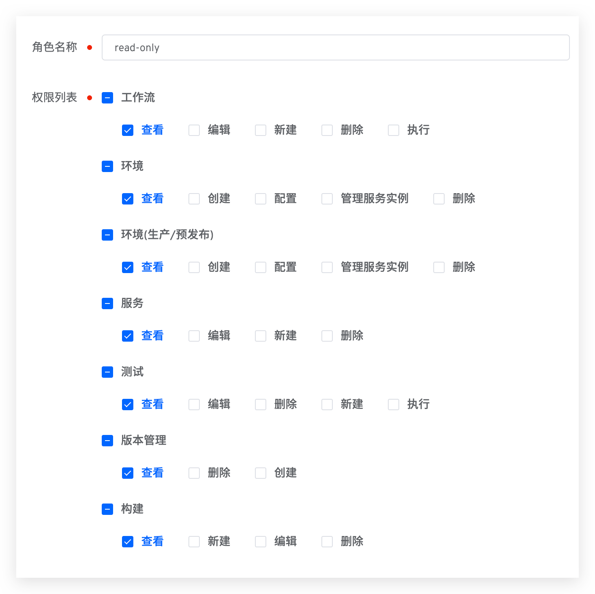
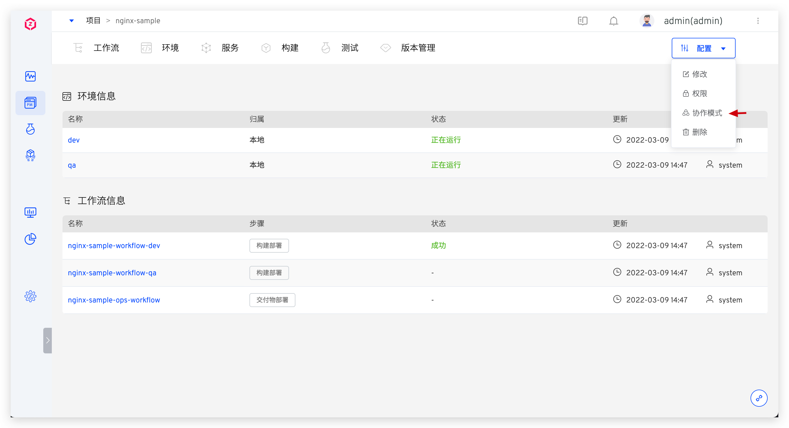
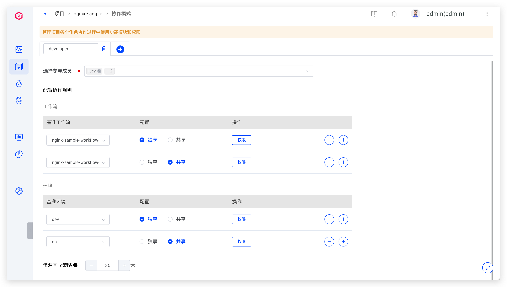
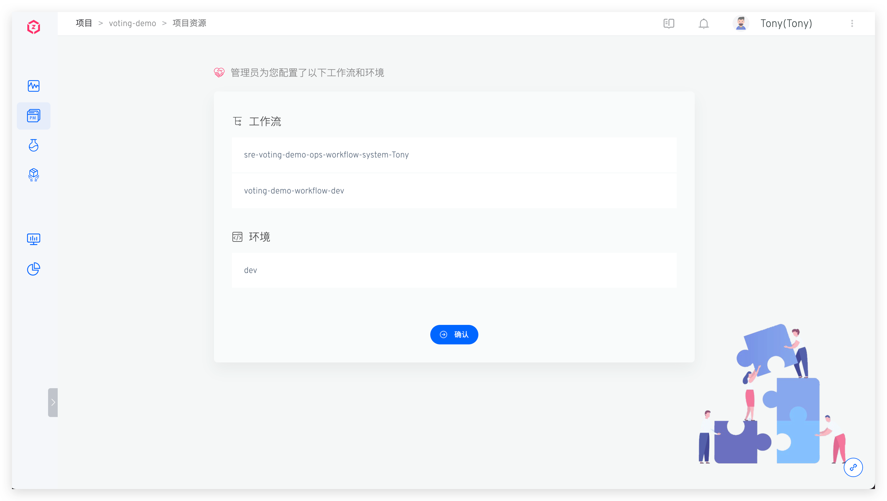

::: tip 前提
仅系统管理员及项目管理员，可以操作项目配置。
:::

## 修改项目信息

在项目详情页点击`配置`->`修改`，对项目的基本信息进行修改。

参数说明：
- `项目名称`：该项目的名称，项目创建后可修改。
- `项目标识`：创建项目时可指定，默认值为项目名称。项目创建后，其标识不可再更改。
- `描述信息`：对该项目的简要描述，非必填。
- `访问权限`：可选`公开`或`私有`，定义该项目的默认权限。
    - 公开项目：用户默认享有 `read-only` 角色中的权限，可查看项目中的资源。该角色的细节请阅[权限配置](/v1.10.0/project/config/#权限配置)。
    - 私有项目：用户默认无权限查看项目中的资源，项目管理员可以在权限和协作模式中对用户进行细粒度的权限控制。

## 权限配置

在项目详情页点击`配置`->`权限`，对项目成员及成员权限进行配置。

### 成员管理

在`成员管理`中，查看该项目的用户成员列表及对应角色和策略，可按需对用户角色进行配置。

- 角色：一系列权限的集合，在[角色管理](/v1.10.0/project/config/#角色管理)中可查看角色中的权限细节。
- 策略：工作流/环境资源粒度的权限集合，对私有项目适用。在[策略管理](/v1.10.0/project/config/#策略管理)中可查看该策略的权资源和限细节。

### 角色管理
包括系统内置角色和项目管理员自定义角色。

#### 内置角色
- `project-admin`：项目管理员，可操作所辖项目中的所有资源，可对项目配置进行修改。
- `read-project-only`：拥有此角色的成员可在项目列表中看到对应的项目，但没有权限操作项目中的资源。使用协作模式**必须**选择该角色。
- `read-only`：只读角色，在公开项目中，所有用户默认拥有此角色。对应的权限项组合如下：

#### 自定义角色

在`角色管理`中，可自定义角色并赋予权限。

### 策略管理
项目管理员为项目配置协作模式，在协作成员对资源进行确认后，系统会为该成员生成对应的策略。在`策略管理`中可查看其关联资源和权限细节。

### 权限清单
部分权限项包含多个功能，以下简单陈述其对应关系。

#### 工作流
- 查看：查看工作流基本信息、工作流任务列表、工作流任务中的构建日志及测试日志
- 编辑：修改工作流基本信息、工作流包含步骤、快速打开/关闭工作流中的定时器
- 新建：包括新建工作流和复制工作流
- 执行：运行工作流、克隆工作流任务、重试失败的工作流、取消运行中的工作流

#### 环境
- 查看：查看环境基本信息、环境列表以及环境中的服务信息
- 配置：设置环境定时回收、更新环境和环境变量、对托管项目中的环境进行托管配置
- 管理服务实例：重启服务实例、更新服务实例的镜像、调整服务实例副本数量、进入服务实例容器中调试

## 协作模式
> 对私有 K8s YAML 项目和私有 K8s Helm Chart 项目适用。

### 配置协作模式
在项目详情页点击`配置`->`协作模式`，配置项目的各个成员在协作过程中使用的功能模块和权限。

配置说明：

- 填写协作模式名称，比如 `developer`。
- 选择参与成员，若需要添加的用户不在成员列表中，可在[成员管理](dev/project/config/#成员管理)中添加，并选择 `read-project-only` 角色。
- 配置协作规则，根据需要为协作成员配置工作流和环境资源，并配置操作权限及回收规则，其中：
    - 独享：基于基准工作流/基准环境，为每一个协作成员创建一份新的工作流/环境供其独享使用，新资源的名称规则为 `协作模式名称-基准资源名称-用户来源-用户名称`
    - 共享：协作成员共享使用基准工作流/基准环境资源，不为其新建资源。
    - 资源回收策略：如果成员在配置的时间内没有访问项目，那么该成员的资源将会被回收。当成员重新访问项目时，会再次获得资源。

### 如何协作使用
当协作模式中的成员登录 Zadig 系统进入指定项目后，对协作模式中分配的工作流和环境资源进行确认。

稍等片刻待系统将资源准备就绪，该成员即可获得对应资源的操作权限，在日常工作中使用。

