Zadig 的服务可以是一组 Kubernetes 资源集合（下面简称 K8s YAML）、一个完整的 Helm Chart 或者是主机服务。下面分别介绍这几种类型的服务操作。

## K8s YAML 服务

### 新建服务

进入项目的服务管理页面。

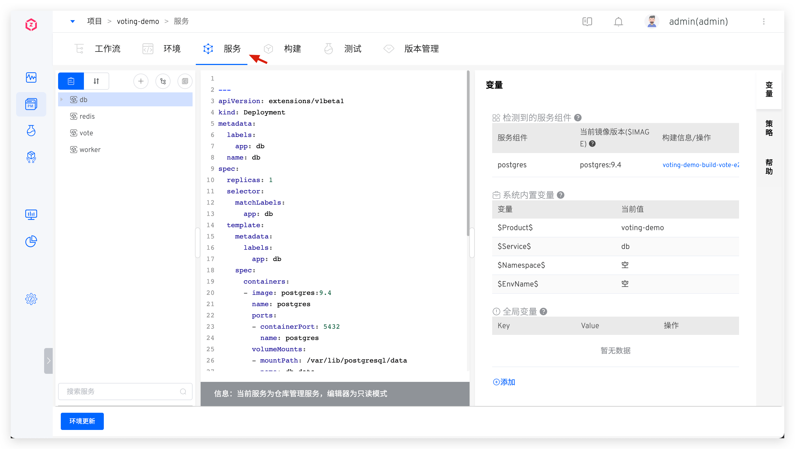

系统支持以下三种方式创建 K8s YAML 服务：
- `手动输入`：在创建服务时手动输入服务的 K8s YAML 配置文件，内容存储在 Zadig 系统中。
- `从代码库同步`：服务的 K8s YAML 配置文件在代码仓库中，从代码库中同步服务配置。当代码库中的服务配置有变更时，会通过 Webhook 自动更新 Zadig 平台中的服务配置。
- `使用模板新建`：在 Zadig 平台中创建服务 K8s YAML 模板，创建服务时，在模板的基础上对服务进行重新定义。

#### 手动输入

点击手工输入按钮 -> 填写服务名称 -> 将服务 K8s YAML 填入编辑器 -> 点击保存按钮，即可新建服务。


添加服务成功后即可对环境进行更新：点击`环境更新`，选择要更新的环境，将服务加入到环境中。


#### 从代码库同步

::: tip 前提
需要在系统中集成代码源，可参考：[代码源集成](/v1.10.0/settings/codehost/gitlab/)。
:::

点击从代码库同步按钮 -> 选择具体的代码库和目录 -> 点击同步，即可从代码库同步新建服务。

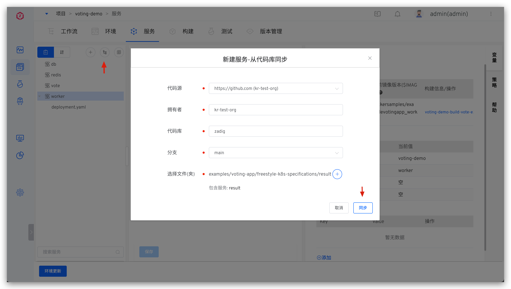

#### 使用模板新建

::: tip 前提
需要先在系统模板库里创建 K8s YAML 模板，请参考 [K8s YAML 模板管理](/v1.10.0/template/k8s_yaml/)。
:::

点击使用模板新建按钮 -> 填写服务名称，选择模板，按需对模板中的变量进行赋值 -> 点击新建，即可使用此模板和新的变量赋值新建服务。

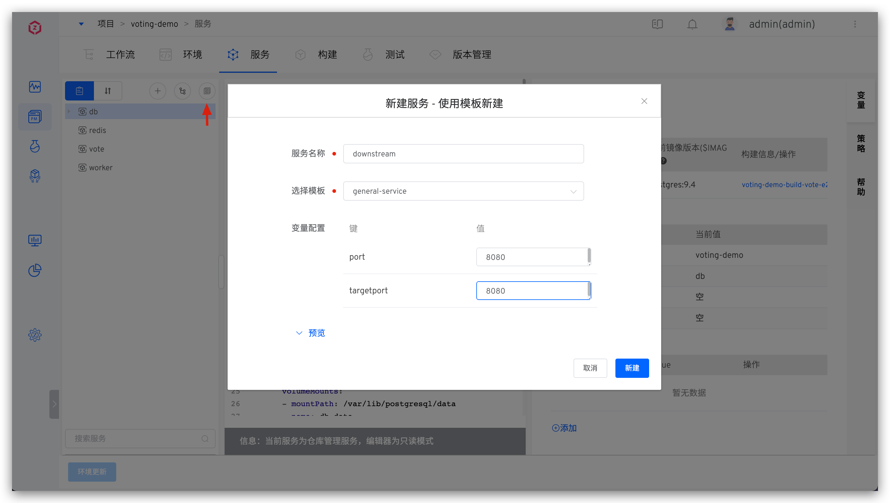

### 更新服务
下面分别介绍如何更新使用不同方式新建的服务。

#### 更新手动输入的服务

修改服务的 K8s YAML  内容并保存即可。


服务修改成功后即可对环境进行更新：点击环境更新，选择要更新的环境对环境中的服务进行更新。


#### 更新从代码库同步的服务

* 提交服务配置变更到代码仓库。


* 变更合并后，通过 Webhook 的能力自动同步最新配置到 Zadig 系统。也可以在界面上手动同步服务配置，如下图所示。


* 在 环境中，查看服务配置的变更，点击更新服务钮执行更新操作。


#### 更新使用模板新建的服务
点击使用模板新建的服务 -> 点击预览/编辑，即可预览/编辑该服务的 K8s YAML 配置。


### 删除服务

点击服务右侧的删除按钮即可将服务删除，若需要将服务从环境中移除，点击环境更新并选择要更新的环境即可。

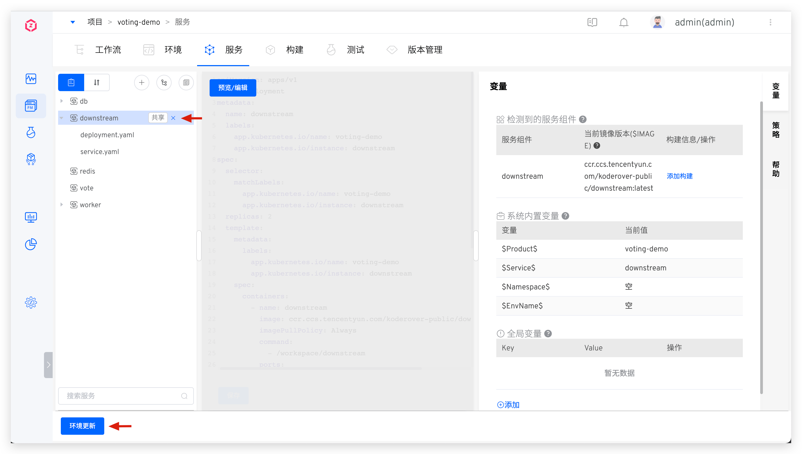

### 服务编排
> Zadig 系统支持对多个服务的部署顺序进行编排管理，同一启动顺序组的服务在部署时会并行执行，不同启动顺序组的服务会按照组顺序执行，适用于多个服务的启动顺序有先后依赖关系的场景。

点击`服务编排`图标，按需对服务启动顺序进行拖拽组合。

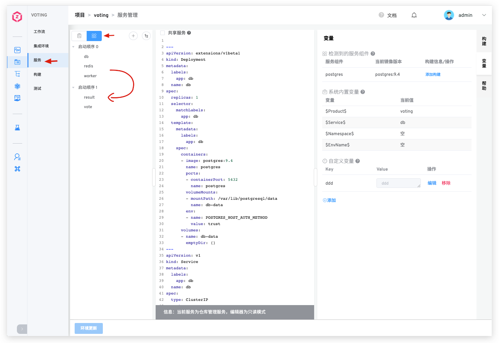


### 共享服务
> 一个 K8s YAML 服务在某个项目中被设置为共享后，可被添加到使用 K8s YAML 部署的其他项目中去，参与该项目的服务编排。

- 设置共享服务：点击服务右侧的`共享`按钮即可设置该服务为共享服务。

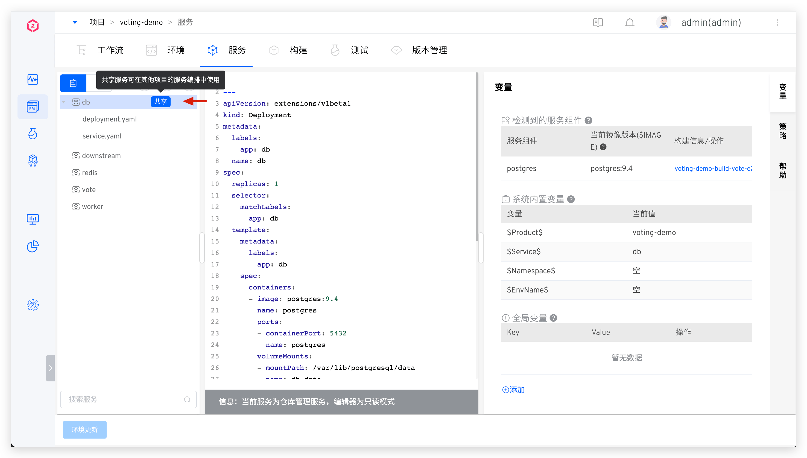

- 使用共享服务：在共享服务列表中，点击服务右侧的`+`即可将该服务添加到当前项目中，且服务右侧会有`共享`字段标识。


::: tip 扩展阅读
- 使用共享服务只是复用服务的定义，并不是共享服务实例。在不同项目的环境中，相同的共享服务也是独立的服务实例。
- 使用其他项目中的共享服务时，构建过程会使用该共享服务对应的构建脚本。
:::

### 变量配置

> 变量主要分为系统内置变量和自定义变量，均可在服务 YAML 中进行引用，其中服务组件名和镜像信息中只能引用使用内置变量 `$Product$` 和 `$Service$`。

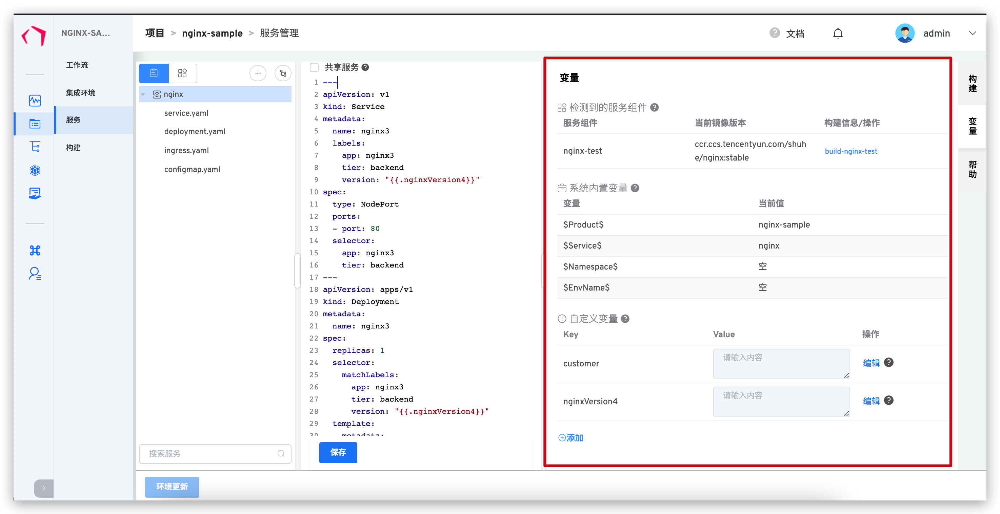

#### 系统内置变量
包括 `$Namespace$`、`$Product$`、`$Service$`、`$EnvName$`，可直接在 YAML 中进行引用，具体说明如下：

  - `$Namespace$`：项目创建的环境所在的 K8s 空间名称，不可用于服务组件名称和镜像信息中
  - `$Product$`：项目名称
  - `$Service$`：服务名称
  - `$EnvName$`：创建的环境名称，不可用于服务组件名称和镜像信息中

#### 自定义变量

通过平台新增 `Key`，可输入默认 `Value`，通过关键字：<span v-pre>`{{.key}}`</span> 引用

例如：在 K8s YAML 中引用配置的变量
```yaml
apiVersion: extensions/v1beta1
kind: Ingress
metadata:
  name: $Product$-index  //引用系统内置变量 $Product$，环境创建时被渲染
spec:
  rules:
  - host: {{.portal_host}} //引用自定义变量 portal_host，环境创建时被渲染
    http:
      paths:
      - backend:
          serviceName: $Product$-index
          servicePort: 80
        path: /
```
#### 变量的使用

##### 创建集成环境时使用

在创建环境时，对项目中所有服务的 YAML 和服务配置文件进行渲染。

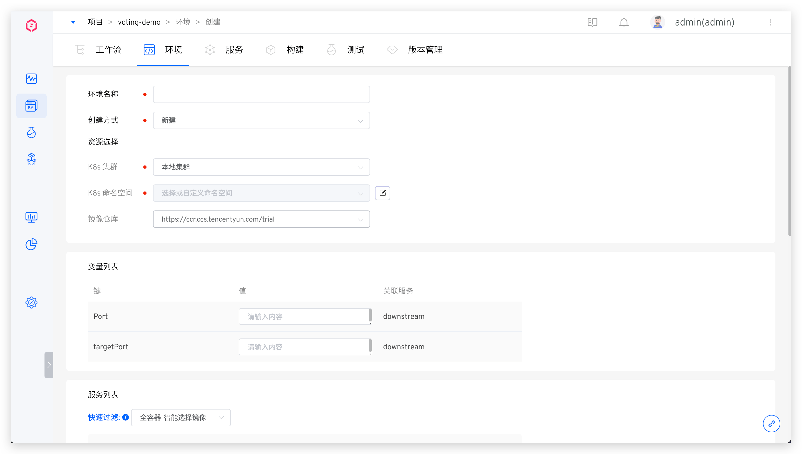

##### 环境变量更新时使用

在环境中，对于正常运行中的服务，可以自行更新变量值，基本操作中点击`更新环境变量`，即可更新对应环境中的环境变量。


### 策略配置
在策略中设置部署服务的超时时间以及服务交付物的命名规则。

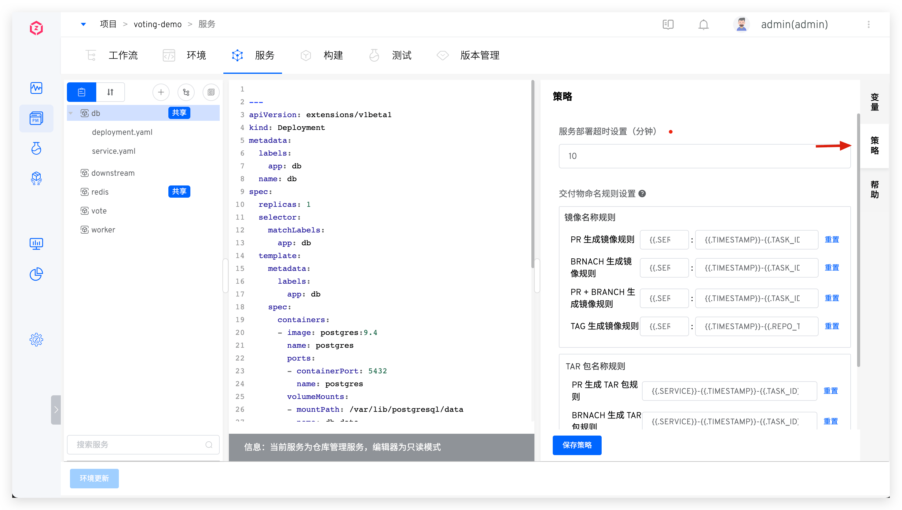

说明如下：
- 服务部署超时设置：将服务部署到环境中的超时时间，默认值为 10 分钟。若超出该阈值服务仍未处于 Running 状态，则视为部署超时。
- 交付物命名规则设置：自定义该项目中工作流构建产物的命名规则，对当前项目的所有服务都生效，可通过以下变量和常量组合的方式设置。

|变量名称|描述|
|-------|---|
|`TIMESTAMP`|工作流任务的执行时间戳，形如 `20211029113304`|
|`TASK_ID`|工作流任务的 ID|
|`REPO_BRANCH`|构建过程中指定代码仓库使用的分支信息|
|`REPO_PR`|构建过程中指定代码仓库使用的 Pull Request 信息|
|`REPO_TAG`|构建过程中指定代码仓库使用的 Tag 信息|
|`REPO_COMMIT_ID`|构建过程中指定代码仓库使用的 Commit ID 信息|
|`PROJECT`|构建所属的 Zadig 项目名称|
|`SERVICE`|构建编译的服务名称|
|`ENV_NAME`|构建部署的环境名称|
|`字符常量`|大小写字母、数字、中划线、下划线及点组合生成的 127 个字符以内的常量|

### 服务 YAML 样例
#### 无状态服务

概念：服务运行的实例不会在本地存储需要持久化的数据，并且多个实例对于同一个请求响应的结果是完全一致的。可以参考[这篇文章](https://kubernetes.io/zh/docs/tasks/run-application/run-stateless-application-deployment/)了解无状态服务的更多细节。
::: details
```yaml
apiVersion: apps/v1
kind: Deployment
metadata:
  name: nginx-deployment
spec:
  selector:
    matchLabels:
      app: nginx
  replicas: 2 # 2 个 Pod 实例
  template:
    metadata:
      labels:
        app: nginx
    spec:
      containers:
      - name: nginx
        image: nginx:1.14.2
        ports:
        - containerPort: 80
```
:::
#### 有状态服务

概念：服务的实例可以将一部分数据随时进行备份，并且在创建一个新的有状态服务时，可以通过备份恢复这些数据，以达到数据持久化的目的。可以参考[这篇文章](https://kubernetes.io/zh/docs/tasks/run-application/run-replicated-stateful-application/)了解有状态服务的更多细节。
::: details
```yaml
apiVersion: v1
kind: ConfigMap
metadata:
  name: mysql
  labels:
    app: mysql
data:
  master.cnf: |
    # Apply this config only on the master.
    [mysqld]
    log-bin
  slave.cnf: |
    # Apply this config only on slaves.
    [mysqld]
    super-read-only
---
# Headless service for stable DNS entries of StatefulSet members.
apiVersion: v1
kind: Service
metadata:
  name: mysql
  labels:
    app: mysql
spec:
  ports:
  - name: mysql
    port: 3306
  clusterIP: None
  selector:
    app: mysql
---
# Client service for connecting to any MySQL instance for reads.
# For writes, you must instead connect to the master: mysql-0.mysql.
apiVersion: v1
kind: Service
metadata:
  name: mysql-read
  labels:
    app: mysql
spec:
  ports:
  - name: mysql
    port: 3306
  selector:
    app: mysql
---
apiVersion: apps/v1beta1
kind: StatefulSet
metadata:
  name: mysql
spec:
  selector:
    matchLabels:
      app: mysql
  serviceName: mysql
  # 1 master and 2 slave
  replicas: 3
  template:
    metadata:
      labels:
        app: mysql
    spec:
      initContainers:
      - name: init-mysql
        image: mysql:5.7
        command:
        - bash
        - "-c"
        - |
          set -ex
          # Generate mysql server-id from pod ordinal index.
          [[ `hostname` =~ -([0-9]+)$ ]] || exit 1
          ordinal=${BASH_REMATCH[1]}
          echo [mysqld] > /mnt/conf.d/server-id.cnf
          # Add an offset to avoid reserved server-id=0 value.
          echo server-id=$((100 + $ordinal)) >> /mnt/conf.d/server-id.cnf
          # Copy appropriate conf.d files from config-map to emptyDir.
          if [[ $ordinal -eq 0 ]]; then
            cp /mnt/config-map/master.cnf /mnt/conf.d/
          else
            cp /mnt/config-map/slave.cnf /mnt/conf.d/
          fi
        volumeMounts:
        - name: conf
          mountPath: /mnt/conf.d
        - name: config-map
          mountPath: /mnt/config-map
      - name: clone-mysql
        image: gcr.azk8s.cn/google-samples/xtrabackup:1.0
        command:
        - bash
        - "-c"
        - |
          set -ex
          # Skip the clone if data already exists.
          [[ -d /var/lib/mysql/mysql ]] && exit 0
          # Skip the clone on master (ordinal index 0).
          [[ `hostname` =~ -([0-9]+)$ ]] || exit 1
          ordinal=${BASH_REMATCH[1]}
          [[ $ordinal -eq 0 ]] && exit 0
          # Clone data from previous peer.
          ncat --recv-only mysql-$(($ordinal-1)).mysql 3307 | xbstream -x -C /var/lib/mysql
          # Prepare the backup.
          xtrabackup --prepare --target-dir=/var/lib/mysql
        volumeMounts:
        - name: data
          mountPath: /var/lib/mysql
          subPath: mysql
        - name: conf
          mountPath: /etc/mysql/conf.d
      containers:
      - name: mysql
        image: mysql:5.7
        env:
        - name: MYSQL_ALLOW_EMPTY_PASSWORD
          value: "1"
        ports:
        - name: mysql
          containerPort: 3306
        volumeMounts:
        - name: data
          mountPath: /var/lib/mysql
          subPath: mysql
        - name: conf
          mountPath: /etc/mysql/conf.d
        resources:
          requests:
            cpu: 500m
            memory: 1Gi
          limits:
            cpu: 500m
            memory: 1Gi
        livenessProbe:
          exec:
            command: ["mysqladmin", "ping"]
          initialDelaySeconds: 30
          periodSeconds: 10
          timeoutSeconds: 5
        readinessProbe:
          exec:
            # Check we can execute queries over TCP (skip-networking is off).
            command: ["mysql", "-h", "127.0.0.1", "-e", "SELECT 1"]
          initialDelaySeconds: 5
          periodSeconds: 2
          timeoutSeconds: 1
      - name: xtrabackup
        image: gcr.azk8s.cn/google-samples/xtrabackup:1.0
        ports:
        - name: xtrabackup
          containerPort: 3307
        command:
        - bash
        - "-c"
        - |
          set -ex
          cd /var/lib/mysql

          # Determine binlog position of cloned data, if any.
          if [[ -f xtrabackup_slave_info && "x$(<xtrabackup_slave_info)" != "x" ]]; then
            # XtraBackup already generated a partial "CHANGE MASTER TO" query
            # because we're cloning from an existing slave. (Need to remove the tailing semicolon!)
            cat xtrabackup_slave_info | sed -E 's/;$//g' > change_master_to.sql.in
            # Ignore xtrabackup_binlog_info in this case (it's useless).
            rm -f xtrabackup_slave_info xtrabackup_binlog_info
          elif [[ -f xtrabackup_binlog_info ]]; then
            # We're cloning directly from master. Parse binlog position.
            [[ `cat xtrabackup_binlog_info` =~ ^(.*?)[[:space:]]+(.*?)$ ]] || exit 1
            rm -f xtrabackup_binlog_info xtrabackup_slave_info
            echo "CHANGE MASTER TO MASTER_LOG_FILE='${BASH_REMATCH[1]}',\
                  MASTER_LOG_POS=${BASH_REMATCH[2]}" > change_master_to.sql.in
          fi

          # Check if we need to complete a clone by starting replication.
          if [[ -f change_master_to.sql.in ]]; then
            echo "Waiting for mysqld to be ready (accepting connections)"
            until mysql -h 127.0.0.1 -e "SELECT 1"; do sleep 1; done

            echo "Initializing replication from clone position"
            mysql -h 127.0.0.1 \
                  -e "$(<change_master_to.sql.in), \
                          MASTER_HOST='mysql-0.mysql', \
                          MASTER_USER='root', \
                          MASTER_PASSWORD='', \
                          MASTER_CONNECT_RETRY=10; \
                        START SLAVE;" || exit 1
            # In case of container restart, attempt this at-most-once.
            mv change_master_to.sql.in change_master_to.sql.orig
          fi

          # Start a server to send backups when requested by peers.
          exec ncat --listen --keep-open --send-only --max-conns=1 3307 -c \
            "xtrabackup --backup --slave-info --stream=xbstream --host=127.0.0.1 --user=root"
        volumeMounts:
        - name: data
          mountPath: /var/lib/mysql
          subPath: mysql
        - name: conf
          mountPath: /etc/mysql/conf.d
        resources:
          requests:
            cpu: 100m
            memory: 100Mi
      volumes:
      - name: conf
        emptyDir: {}
      - name: config-map
        configMap:
          name: mysql
  volumeClaimTemplates:
  - metadata:
      name: data
    spec:
      accessModes: ["ReadWriteOnce"]
      resources:
        requests:
          storage: 10Gi
```
:::

## K8s Helm Chart 服务

> [Helm](https://helm.sh/) 是 Kubernetes 应用的包管理工具， Helm Chart 定义、安装和升级复杂的 Kubernetes 应用。

### 新建服务

支持从代码库同步、从 Chart 仓库同步、使用模板新建三种方式创建 K8s Helm Chart 服务。

#### 从代码库同步
> 服务的 Helm Chart 配置文件在代码库中，从代码库中同步服务配置，支持 GitHub/GitLab/Gerrit 代码仓库。

点击从代码库同步 -> 填写代码库及服务配置在代码库中的目录 -> 点击加载，即可从代码库同步服务。同步成功后，当代码库中对应目录的文件有变更时，会通过 Webhook 的方式自动更新此处的服务配置。

::: tip 前提
需要先集成代码源，参考 [GitLab](/v1.10.0/settings/codehost/gitlab/)/[GitHub](/v1.10.0/settings/codehost/github/)/[Gerrit](dev/settings/codehost/gerrit/) 集成。
:::

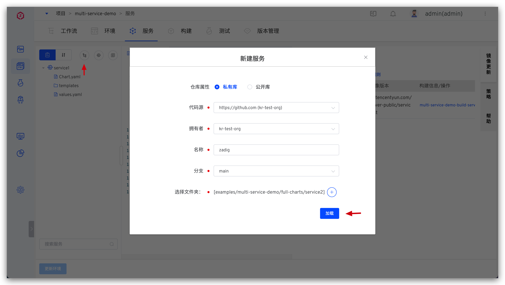

#### 从 Chart 仓库同步
> 服务的 Helm Chart 配置文件在 Chart 仓库中，从 Chart 仓库中同步服务配置。
::: tip 前提
需要先集成 Helm Chart 仓库，参考：[集成 Helm Chart 仓库](/v1.10.0/settings/helm/)。
:::

点击从 Chart 仓库同步，选择 Chart 仓库及 Chart，新建即可。
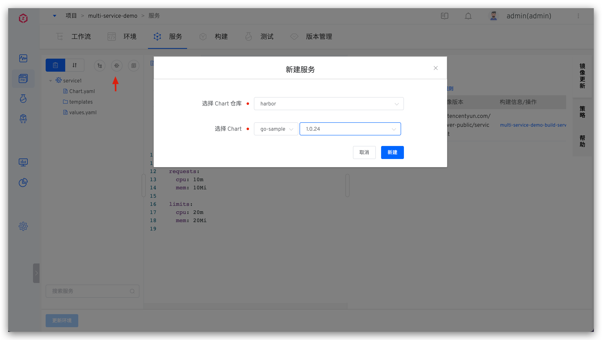

#### 使用模板新建
> 在 Zadig 平台中创建服务 Helm Chart 模板，创建服务时，在模板的基础上对服务进行重新定义。支持一次创建一个服务，也支持基于模板批量创建服务。

::: tip 前提
需要先在系统模板库里创建 Helm Chart 模板，请参考 [Helm Chart 模板管理](/v1.10.0/template/helm_chart/)
:::

##### 创建单个服务

- 点击使用模板新建 -> 填写服务名称并选择模板 -> 按需对模板中的变量进行覆盖赋值后，导入即可。


- 在`高级设置`中，系统还支持用新的 values.yaml 覆盖模板中的 values.yaml 内容，包括手动输入和从指定代码库导入两种途径来覆盖。


##### 批量创建服务
::: tip
Helm Chart 模板的 values.yaml 文件中不能使用自定义变量
:::

使用 [multi-service-demo](https://github.com/koderover/zadig/tree/main/examples/multi-service-demo) 案例来说明如何使用模板批量新建服务，必要目录说明如下：

``` shell
zadig/examples/multi-service-demo
├── base-chart # Helm Chart 模板
│   ├── Chart.yaml
│   ├── templates
│   │   ├── _helpers.tpl
│   │   ├── deployment.yaml
│   │   └── service.yaml
│   └── values.yaml # 不支持使用自定义变量
└── values # 分别对应 3 个服务的 values 文件
    ├── service1.yaml
    ├── service2.yaml
    └── service3.yaml
```

- 点击使用模板新建 -> 点击`批量创建` -> 选择 Helm Chart 模板 -> 选择要导入服务的 values 文件，导入即可。


- 导入后，效果如下图所示。一份 values 文件会被定义成一个服务，values 文件名即为服务名。服务批量创建完毕后，点击`更新环境`即可将服务快速应用于环境中。

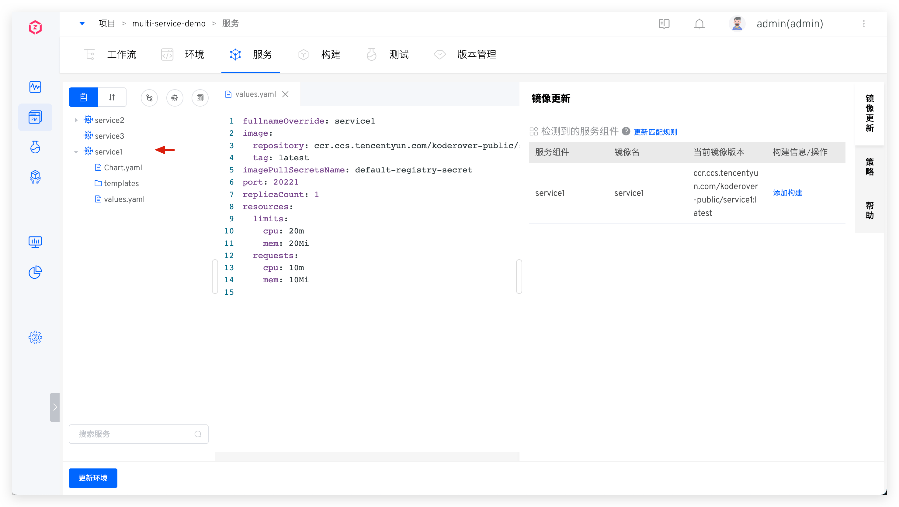

#### 服务组件镜像信息自定义

导入 Helm Chart 配置文件后，系统会按照内置规则解析 vaues.yaml 文件中的镜像内容。当默认规则不满足需求时，用户可自定义镜像解析规则。

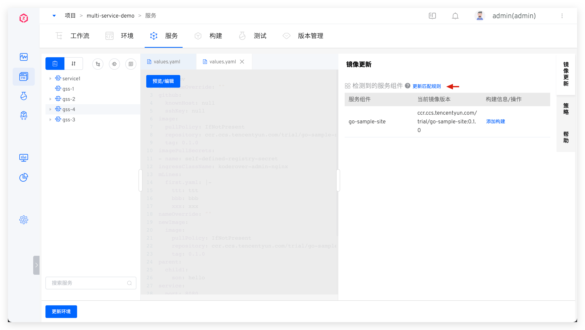


Zadig 系统会解析镜像名为可被部署和更新的服务组件，系统关于 values.yaml 中服务组件内置的解析规则如下：
1. values.yaml 中有如下代码段结构，拼接 `image.repository:image.tag` 作为该组件的镜像版本，服务的部署版本和更新均围绕 `image.repository` 和 `image.tag`。该例中即为：`ccr.ccs.tencentyun.com/koderover-public/backend:latest`。

::: details
```yaml
# Helm Chart values.yaml Demo
key1: value1
key2: value2
key3:
  key4: value4
  key5:
    image:
      repository: "ccr.ccs.tencentyun.com/koderover-public/backend"
      tag: "latest"
  key6:
    ...
...
```
:::
2. values.yaml 中的 `image` 字段的值为镜像信息，服务的部署版本和更新均围绕 `image`。该例中即为 `ccr.ccs.tencentyun.com/koderover-public/backend:latest`。

::: details
```yaml
# Helm Chart values.yaml Demo
key1: value1
key2: value2
key3:
  key4: value4
  key5:
    image: "ccr.ccs.tencentyun.com/koderover-public/backend:latest"
  key6:
    ...
...
```
:::

3. 用户也可自定义解析规则，提供关于镜像的明确信息。说明如下：
- 使用 key 的绝对路径来解析组件的镜像信息，下例中，自定义规则中填入 `deploy.image.repo`/`deploy.image.name`:`deploy.image.tag` 即可。
::: details
```yaml
key1: value1
key2: value2
...
deploy:
  image:
    repo: library
    name: ubuntu
    tag: 20.04
```
:::
- 使用 key 的相对路径来解析服务组件的镜像信息，下例中，自定义规则中填入 `repo`/`name`:`tag` 即可。
::: details
```yaml
key1: value1
key2: value2
...
deploy:
  image:
    repo: library
    name: ubuntu
    tag: 20.04
```
:::
- 支持使用一份解析规则来解析多个服务组件，下例中，自定义规则中填入 `repo`/`name`:`tag` 即可解析出 `service1` 和 `service2` 的镜像分别为 `library/service1:v1` 和 `library/service2:v2`。
::: details
```yaml
key1: value1
key2: value2
...
deploy:
  service1:
    repo: library
    name: service1
    tag: v1
  service2:
    repo: library
    name: service2
    tag: v2
```
:::
- values.yaml 文件中可复用部分 key，下例中，自定义规则中填入 `public.repoInfo`/`name`:`tag` 即可解析出 `service1` 和 `service2` 的镜像分别为 `library/service1:v1` 和 `library/service2:v2`。
::: details
```yaml
key1: value1
key2: value2
...
public:
  repoInfo: library
deploy:
  service1:
    name: service1
    tag: v1
  service2:
    name: service2
    tag: v2
```
:::

- 自定义规则中的 `仓库地址/命名空间` 和 `标签名` 非必填，下例中，在自定义规则的`镜像名`中填入 `deploy.image.name` 即可

::: details
```yaml
deploy:
  image:
    name: library/ubuntu:12.04
```
:::

### 更新服务

#### 更新从代码库同步的服务

- 从代码库导入服务的 Chart 配置后，会自动创建 Webhook。当对应代码库中有变更时，会自动同步服务的 Chart 配置到 Zadig 中。也可以点击服务右侧的同步按钮，点击`加载`主动同步更新。

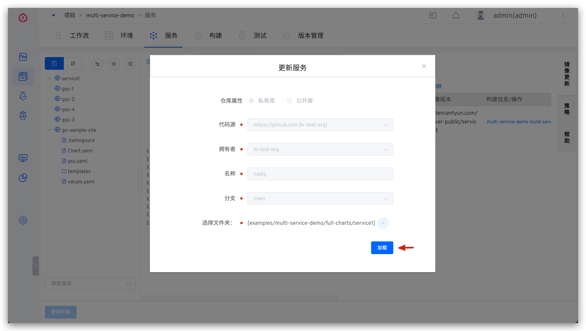

#### 更新从 Chart 仓库同步的服务

- 点击服务右侧的同步按钮，按需修改 Chart 版本号，点击`更新`即可。

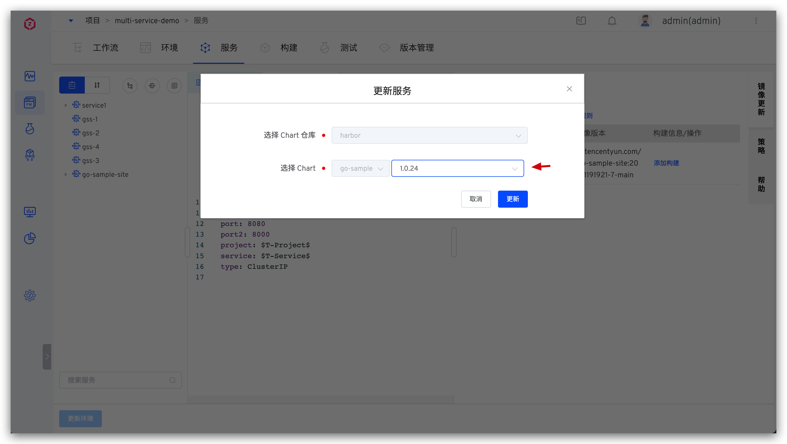

#### 更新使用模板新建的服务

- 点击服务右侧的同步按钮，按需修改 Helm values 文件后点击`导入`即可。

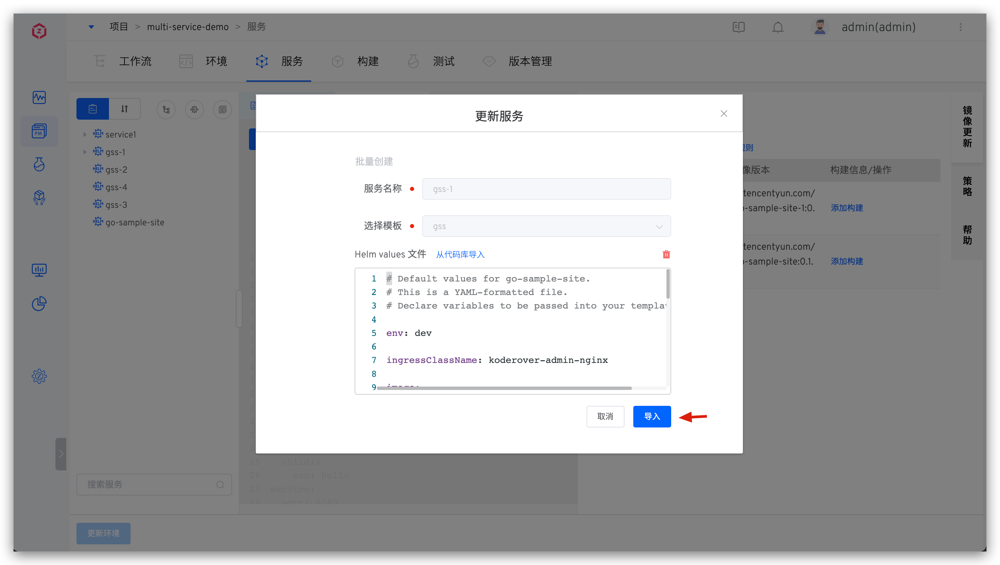

### 删除服务

- 点击服务右侧的删除按钮即可将服务配置删除。若需要将服务从环境中也删除，点击`更新环境`并选择要更新的环境即可。


### 服务编排
> Zadig 系统支持对多个服务的部署顺序进行编排管理，同一启动顺序组的服务在部署时会并行执行，不同启动顺序组的服务会按照组顺序执行，适用于多个服务的启动顺序有先后依赖关系的场景。

点击`服务编排`图标，按需对服务启动顺序进行拖拽组合。


### 策略配置
在策略中设置部署服务的超时时间以及服务交付物的命名规则。细节可阅读：[策略配置](#策略配置)。

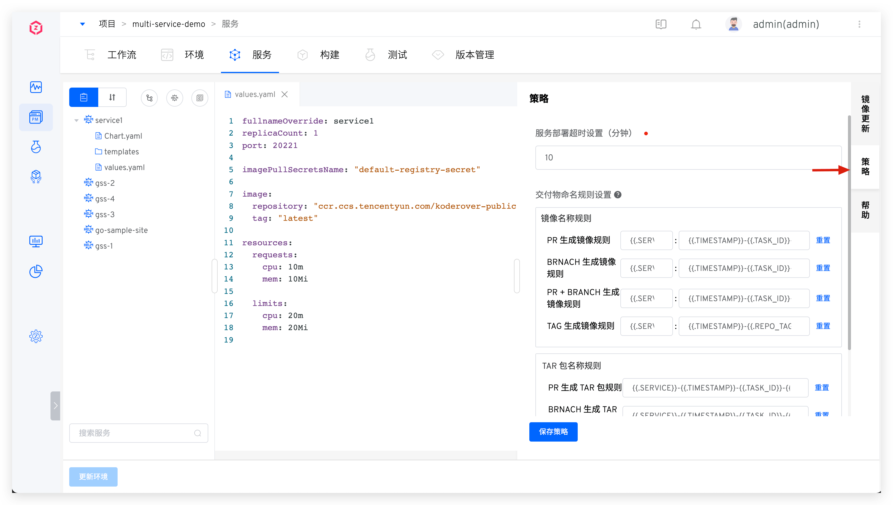

### Helm Chart 样例

[koderover/zadig](https://github.com/koderover/zadig/tree/main) 库中提供了 Helm Chart 样例，点击[链接](https://github.com/koderover/zadig/tree/main/examples/multi-service-demo/full-charts/service1)查看详情。

## 托管项目服务

### 配置托管服务

- 点击环境下的`配置托管`。

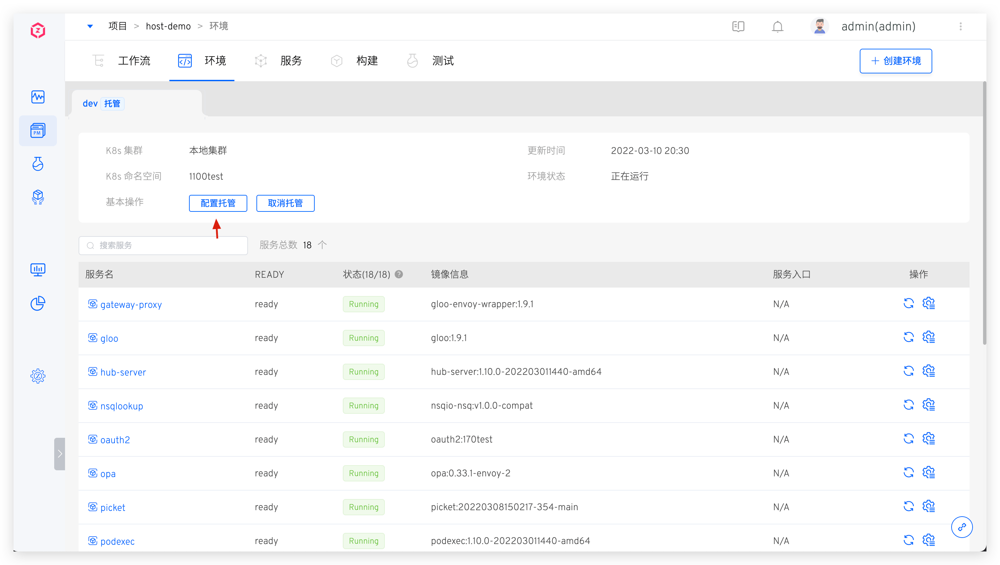

- 按需选择左侧列表中的服务拖至右侧，点击`下一步`，新增对该服务的托管管理；或者将右侧已托管服务拖至左侧，取消对该服务的托管。


## 主机服务
在 Zadig 系统上主机服务的配置中包括服务的基本信息、构建配置、部署配置和探活配置。

点击添加服务按钮 -> 输入服务名称 -> 填写基本信息、构建配置、部署配置及探活配置即可新建服务。

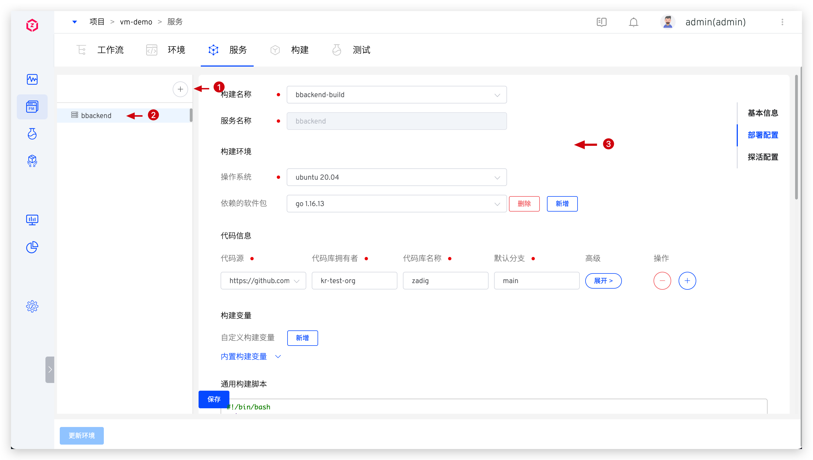

### 构建环境

配置构建过程运行时的环境，细节请阅读[构建环境](/v1.10.0/project/build/#构建环境)。

### 构建变量

包括系统内置构建变量和用户自定义构建变量，可在构建脚本中直接使用，细节请阅读[构建变量](/v1.10.0/project/build/#构建变量)。

### 通用构建脚本

在通用构建脚本中声明代码的构建过程和实现，细节请阅读[通用构建脚本](/v1.10.0/project/build/#通用构建脚本)。

### 高级配置

包括构建超时配置、缓存配置和资源配置，细节请阅读[高级配置](/v1.10.0/project/build/#高级配置)。

### 更多构建步骤

包括镜像构建和二进制包存储，细节请阅读[更多构建步骤](/v1.10.0/project/build/#更多构建步骤)。

### 部署配置

配置服务的部署方式、部署脚本，定义服务的部署过程。


**本地直连部署**

在 Zadig 中执行部署脚本，利用部署工具（比如：Ansible）将服务部署到目标主机上。需要确保部署工具就绪，Zadig 系统和目标部署主机的网络连通。

**SSH Agent 远程部署**

安全登录到目标机器上执行部署操作。需要提前在系统中配置好主机资源，可参考[主机管理](/v1.10.0/settings/vm-management/)。

**内置部署变量**

除了可使用[构建变量](#构建变量)中的变量，还包括以下变量：

- `<AGENT_NAME>_PK`：通过 SSH Agent 远程登录主机使用的私钥信息，其中 AGENT_NAME 为 SSH Agent 名称。使用下图例中的主机作为 SSH Agent，则部署脚本中使用 $zadig_PK 即可获得该主机服务器的私钥信息。
- `<AGENT_NAME>_USERNAME`：通过 SSH Agent 远程登录到主机的用户名称，下图例中即为 $zadig_USERNAME。
- `<AGENT_NAME>_IP`：SSH Agent 目标服务器的 IP 地址，下图例中即为 $zadig_IP。

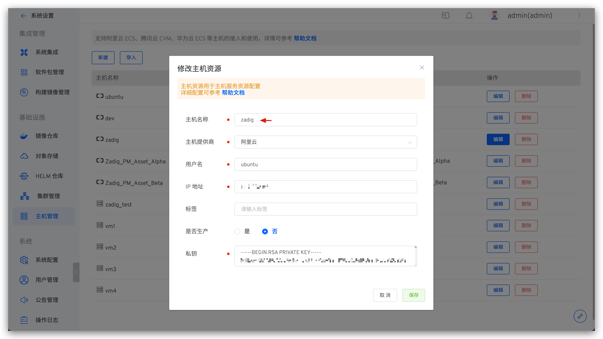

- `ARTIFACT`：部署的交付物包，通过该变量可获取交付物包。
    - 使用构建部署工作流部署服务时，交付物包的实体为[更多构建步骤](#更多构建步骤)中增加的二进制包存储，即 $PKG_FILE 文件。
    - 使用交付物部署工作流部署服务时，交付物包的实体为运行工作流时从对象存储中选择的资源。

**部署脚本**

部署脚本和[通用构建脚本](#通用构建脚本)共享存储卷，在构建脚本中生成的包可直接在部署脚本中使用。可在部署脚本中使用[构建变量](#构建变量)和[内置部署变量](#内置部署变量)。

### 探活配置

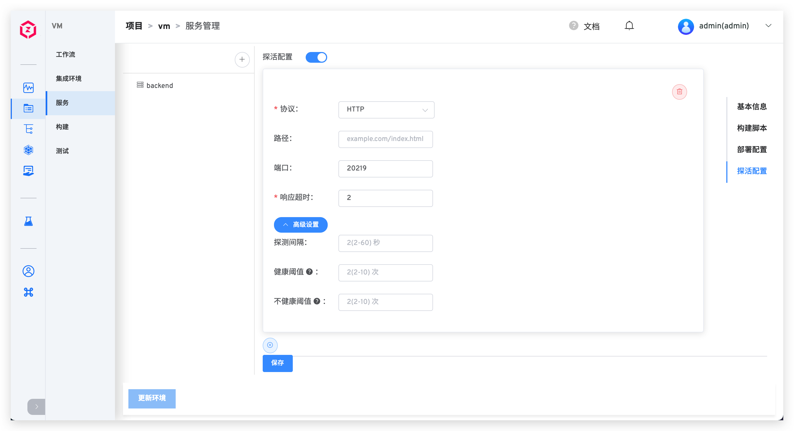

字段说明：
- `协议`：支持 HTTP、HTTPS 和 TCP。
- `路径`：HTTP/HTTPS 请求的健康检查路径。
- `端口`：支持 1 - 65535 端口。
- `响应超时`：超出设定时间，判断为不健康。
- `高级设置`：
    - `探测间隔`：两次探活请求的间隔时间，默认 2s。
    - `健康阈值`：从不健康变为健康的连续探测次数。
    - `不健康阈值`：从健康变为不健康的连续探测次数。

### 更新服务

选择需要修改的服务，修改服务配置，点击`保存` -> 点击`更新环境` -> 在弹框中选择需要更新的环境。

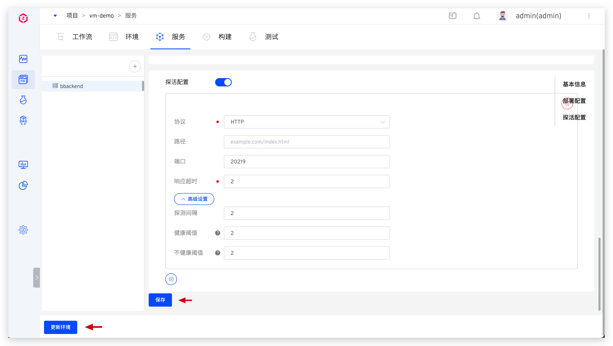

### 删除服务

点击服务右侧的删除按钮将服务删除。删除服务后，若需将服务从环境中也删除，点击`更新环境`即可。


