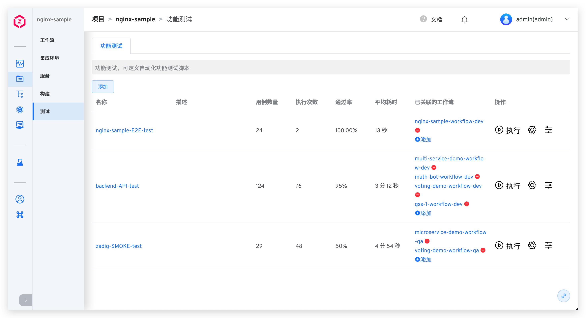

测试模块主要用于执行自动化测试，支持功能测试，支持标准 Junit 测试报告输出。

## 测试管理

- `测试管理`：跨项目用例可共享。
- `测试执行`：支持 CI/CD 并发执行、单独执行、跨环境执行。
- `测试分析`：单场景耗时、通过率分析，跨团队测试效益、健康度分析。

## 测试配置

### 测试执行环境
配置测试任务运行时的环境。

- `操作系统`：目前平台提供 Ubuntu 16.04 / Ubuntu 18.04 / Ubuntu 20.04 供选择，也可以自定义测试执行环境，详情请参考：[构建镜像管理](/v1.10.0/settings/custom-image/#步骤-1-生成构建镜像)。
- `依赖的软件包`：编译过程中需要用到的各类工具，比如不同版本的 Java、Go、Govendor、Node、Bower、Yarn、Phantomjs 等等。目前系统内置 Jmeter、Ginkgo、Selenium 等常见测试框架和工具。
::: tip
1. 选择软件包的过程中需要注意多个软件包之间的依赖关系，按照顺序进行安装。例如：Govendor 依赖 Go，那么必须先选 Go，再选择 Govendor。
2. 如果有其他软件包或者版本需求，系统管理员可以在[软件包管理](/v1.10.0/settings/app/)中配置其安装脚本。
:::

### 代码信息

说明：
- `代码源`：代码库所在的平台，目前支持 GitHub、GitLab、Gerrit、CodeHub。
- `代码库拥有者`：支持开源库，以及所配置的代码源下的代码库拥有者。
- `代码库名称`：代码库的名称。
- `默认分支`：执行测试任务时，默认选取的分支。
- `Remote name`：指定远程代码仓库的名称，默认 `origin`。
- `克隆目录名`：定义代码库被克隆后的目录名称，默认为代码库的名称。
- `子模块`：同步 `submodule` 中配置的代码库。

### 测试变量
包括系统内置变量和自定义变量，可在测试脚本中直接使用。

**内置测试变量**
内置测试变量及其描述说明如下：

|变量名称|描述|
|-------|---|
|`WORKSPACE`|当前测试任务的工作目录|
|`LINKED_ENV`|被测环境的命名空间|
|`ENV_NAME`|被测环境的名称|
|`TEST_URL`|测试任务的 URL|
|`SERVICES`|将测试任务挂接在工作流中后，通过工作流任务更新的服务组。服务名以 “,” 分隔，形如 service1,service2,service3。|
|`CI`|值恒等于 true，可视需要使用，比如用于判断是 CI 脚本，还是其他脚本|
|`ZADIG`|值恒等于 true，可视需要使用，比如用于判断是否在 Zadig 系统中执行|

**自定义测试变量**

说明：
- 支持使用字符串类型或者枚举类型的测试变量。
- 可以设置字符串类型的变量为敏感信息，如 Access Key Id、Secret Access Key 等信息。设置为敏感信息后，测试任务的运行日志中将不会再输出其明文信息。

### 测试脚本
声明测试的具体执行过程，可在测试脚本中使用测试变量。

### 测试报告配置
配置测试报告所在的目录或测试文件的具体路径。

说明：
  - 支持标准 Junit xml 格式和 Html 格式的测试报告。
  - 对于 Junit 测试报告，需要配置其所在的目录，比如 `$WORKSPACE/path/to/junit_report/`，若目录下有多个测试报告，Zadig 会将所有测试报告合并视为最终报告。
  - 对于 Html 测试报告，需要配置其具体的文件路径，比如 `$WORKSPACE/path/to/html_report/result.html`，Html 测试报告文件将包含在测试任务发送的 IM 通知内容中。

## 高级配置

### 测试结果导出

设置一个或者多个文件目录，测试完成后可以在工作流任务详情页面进行下载，如下图所示：

### 策略配置

- `超时时间`：配置测试任务执行的超时时间，若超过设置的时间阈值后测试任务仍未成功，则视为超时失败。
- `缓存配置`：开启缓存后，在测试任务执行时会使用此处配置的缓存目录。

### 资源配置
- `集群选择`：选择测试任务运行时所使用的集群资源，其中本地集群指 Zadig 系统所在的集群，关于集群的集成可参考[集群管理](/v1.10.0/pages/cluster_manage/)。
- `操作系统规格`：配置资源规格用于执行测试任务。平台提供 高/中/低/最低 四种配置供选择，可以根据实际需要自定义规格，参考[自定义镜像管理](/v1.10.0//settings/custom-image/)。

### Webhook 触发器
添加触发器配置，对指定的事件进行 Webhook 自动触发。目前支持 GitLab 和 GitHub 代码源。代码库、目标分支、触发事件、自动取消及文件目录参数可参考[工作流 Webhook 配置](/v1.10.0/project/workflow/#gui-方式)中的说明，此处不再赘述。

### 定时配置
通过配置定时器，可以实现周期性的运行测试任务，配置细节描述可参考[工作流定时器配置](/v1.10.0/project/workflow/#定时器)，此处不再赘述。

### 通知配置
目前支持配置测试任务最终执行状态通知到企业微信、钉钉、飞书，配置细节描述可参考[工作流通知配置](/v1.10.0/project/workflow/#企业微信/)，此处不再赘述。
