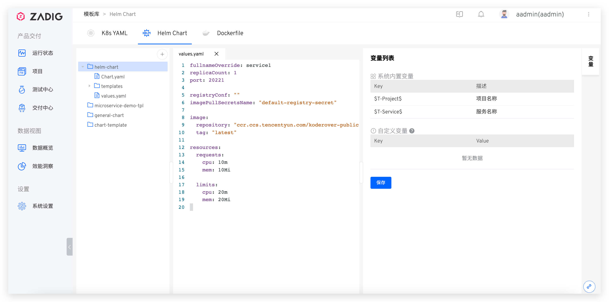

::: tip 背景
</img> Helm Chart 模板适用于使用 Helm Chart 部署的项目，支持用户更加灵活高效地部署 K8s 应用。
:::

## 新建模板

依次访问`项目`-`模板库`-`Helm Chart`，点击`+`按钮，在弹出的模态框里输入 Helm Chart 模板名称并从 Git 仓库导入模板内容。

::: tip 前提
支持从 GitHub/GitLab/Gerrit 代码仓库导入创建 Helm Chart 模板，关于代码仓库的集成可参考：[代码仓库集成](/v1.10.0/settings/codehost/github/)
:::




### 变量列表

模板内容保存成功后，系统会自动解析出模板的 values.yaml 中所使用变量。

- `系统内置变量`：包括 `$T-Project$` 和 `$T-Service$`，可直接在 Helm Chart 模板中使用。在项目中基于模板创建服务后，二者会自动被替换为对应的项目名称和服务名称。
- `自定义变量`：通过形如 <span v-pre>`{{.key}}`</span> 的方式在模板中定义使用，可赋予默认值。在项目中基于模板创建服务时，可修改自定义变量的值重新对服务进行定义。


<!---暂时未实现-->
<!---## 查看 Helm Chart 模板引用列表-->

## 使用模板
在 [K8s Helm Chart 项目](/v1.10.0/project/helm-chart/)中创建服务时可选择从模板导入服务，参考[使用模板新建服务](/v1.10.0/project/service/helm/chart/#使用模板新建单个服务)。

## Helm Chart 模板示例

Helm Chart 模板在组织形态上也是一个完整的 Helm Chart，如下所示：

``` shell
path/to/your/helm-chart
├── Chart.yaml # chart 所必须的 Chart.yaml 文件
├── templates # chart 中的模板目录，一系列 Kubernetes YAML 文件
│   ├── deployment.yaml
│   ├── service.yaml
│   └── .....
└── values.yaml # chart 默认的配置值

```

也可以访问 multi-service-demo 案例中的 [general-chart](https://github.com/koderover/zadig/tree/main/examples/multi-service-demo/general-chart) 模板来了解更多信息。
