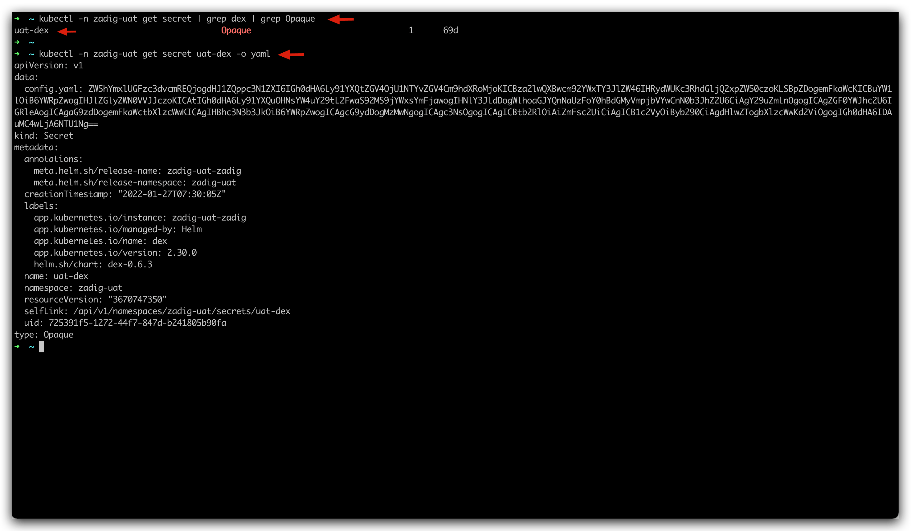

## 系统账号无法登录

如果集成了 AD/LDAP/SSO，请确认集群内的网络是否可以正常连接 AD/LDAP/SSO 系统。

## 在集成第三方账号登录后，如何快速访问第三方账号登录界面

以 LDAP 为例进行说明：打开浏览器调试模式，点击 LDAP 后复制第一个请求地址，访问这个地址即可直达第三方账号登录界面。


## 升级 v1.10.0 版本后，会报错 Unknown column api_token in field list

这是因为升级到 v1.10.0 版本时没有执行 ua 脚本，或者 ua 脚本执行异常导致 api_token 字段没有被新增成功。可以通过重新执行 ua 脚本或者直接操作 MySQL 数据库执行以下命令来解决：

```bash
ALTER TABLE user ADD api_token varchar(1024) NOT NULL DEFAULT '' COMMENT 'openAPIToken';
```

## 即使密码正确，登录时也报错 401

user 和 opa 都依赖 secret:zadig-aes-key 作为加解密的密钥。如果 secret 被更新后只重启了 user 或者 opa，会导致加密和解密密钥不一致，从而一直认证失败。解决办法为将 user 和 opa 均重启。

## 对 Zadig 自定义开发新增 API 后，被系统拦截鉴权失败

在 [exemption_urls.go](https://github.com/koderover/zadig/blob/main/pkg/microservice/policy/core/service/bundle/exemption_urls.go) 的 publicURLs 处配上新增的 API 后重新编译 policy 的镜像并替换即可。

## 使用外置高可用的 MySQL，dex 组件报错 Unknown database dex 或者 table dex.xx doesn't exist

使用外置高可用的 MySQL 安装 Zadig 时，需要在 MySQL 中手动创建名为 dex 的库，否则即会出现 Unknown database dex 的错误。删除 dex 库中的所有表后重启 dex 组件即可解决 table dex.xx doesn't exist 的问题。

## dex 组件报错 Unregistered returned_uri("xxxx")

通常原因为 dex 的配置错误，可以通过以下方式诊断：

1. 使用 `kubectl -n {Zadig 所在的 Namespace} get secret | grep dex | grep Opaque` 查找环境中 dex 相关的 secret 配置，并使用 `kubectl -n {Zadig 所在的 Namespace} get secret {查阅到的 secret 名称} -o yaml` 查看其内容。



2. 复制配置中 config.yaml 的内容，并执行 `echo "{config.yaml 的内容}" | base64 -d` 对其进行解密，检查 redirectURLs 是否正确。


## OAuth 登录报错 Internal Server Error, Failed to authenicate:Oauth Connector:not found xx claim

通常原因为 OAuth 配置错误，可以查阅 [OAuth 配置](/v1.10.0/settings/account/oauth2/) 进行检查。以下图中的错误配置为例示范：


需注意在用户名属性和用户昵称属性中，正确配置应该是属性名而不是属性实例。 例如用于登录的用户名属性为 account，其中一个实例叫 admin，则此处应该配置 account 而非 admin。

## 如何集成 cas 单点登录系统
cas 可以集成 OAuth2 协议。在 Zadig 的系统设置-系统集成-账号系统管理中，添加 OAuth 配置后即可集成。


