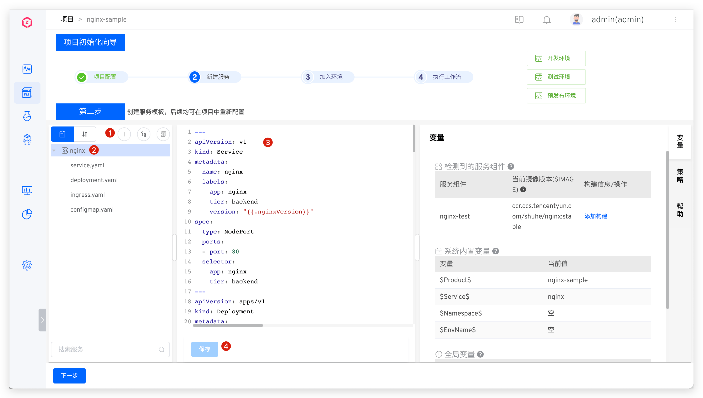
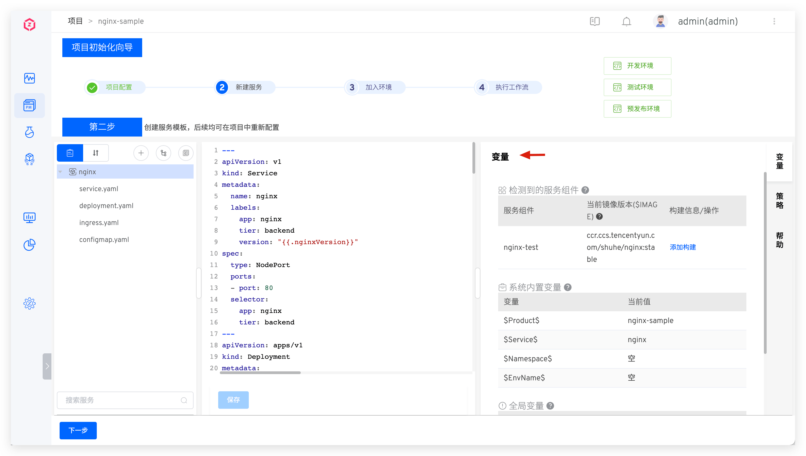
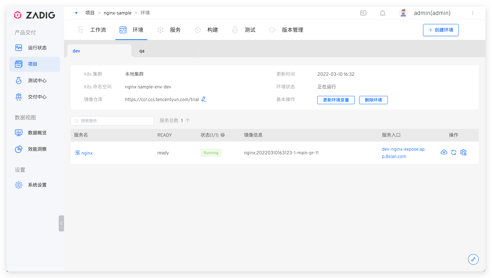
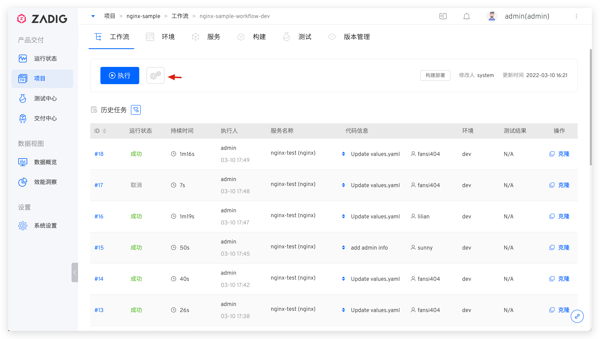
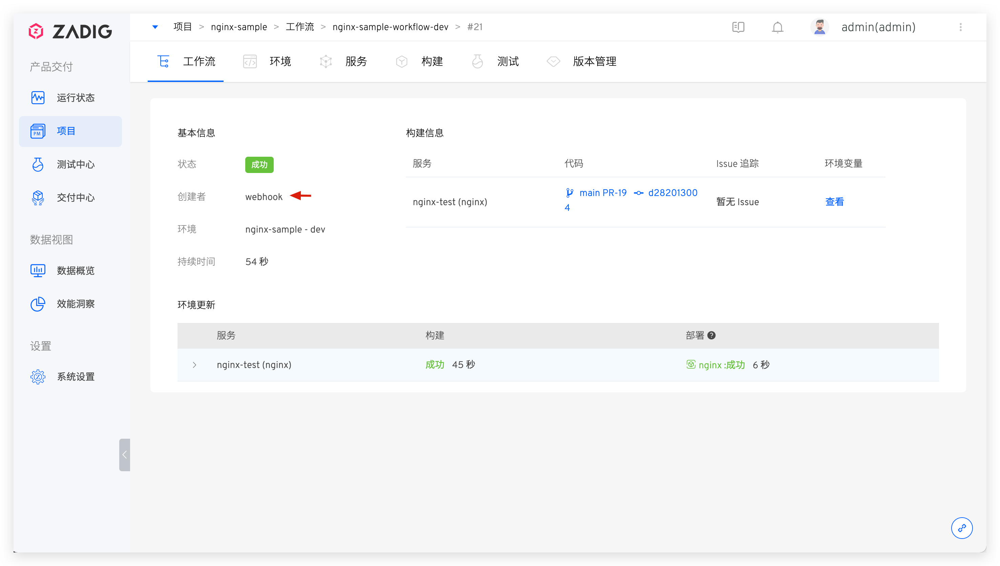
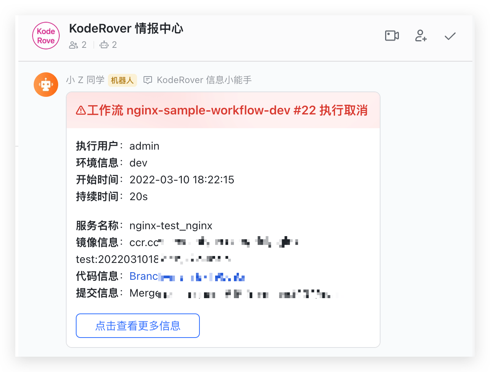

本文以容器化项目 Nginx 为例，旨在帮助新用户快速入手熟悉使用 Zadig 系统基本能力，包含从 Code 到 Ship 的完整过程。

## 准备工作

- 安装 Zadig，参考 [快速安装](/v1.11.0/quick-start/try-out-install)
- 项目案例源码： [Nginx](https://github.com/koderover/Zadig/tree/main/examples/nginx)，Fork 至个人 GitHub 仓库并集成代码源
- 服务 YAML 文件：[YAML](https://github.com/koderover/Zadig/tree/main/examples/nginx/yaml/nginx.yaml)

::: tip
代码源集成请参考 [GitHub 集成](/v1.11.0/settings/codehost/github/)
:::

## 第 1 步：项目配置

- 访问 Zadig 系统，点击项目 -> 新建项目按钮，创建项目，具体内容如下图所示：


点击立即新建按钮，进入项目初始化向导，点击下一步开始创建服务：


## 第 2 步：新建服务
包括新建服务以及为服务配置构建，后者用于后续使用工作流对服务进行部署更新。

### 新建服务
::: tip
新建服务有 3 种方式：<br>
- 手工输入：直接把服务的 K8s YAML 配置粘到系统中 <br>
- 从代码库导入：选择从代码仓库同步服务的 K8s YAML 文件内容 <br>
- 使用模板新建：基于 K8s YAML 模板，新建服务 <br>
本示例中采用手工输入方式
:::

新建服务步骤：点击手工输入 -> 输入服务名 -> 输入服务的 K8s YAML 配置 -> 保存，如下图所示：



输入服务的 YAML 配置后，系统会对 YAML 格式做合法性检查，并在保存后自动加载出系统变量、YAML 中的自定义变量(可视需求自助添加)以及服务组件。



### 配置构建

::: warning
请提前配置好代码源和镜像仓库集成，具体配置请参照[`代码源集成`](/v1.11.0/settings/codehost/gitlab/) 和 [`镜像仓库集成`](/v1.11.0/settings/image-registry/)。
:::

点击`添加构建`为服务配置构建。


根据构建需要的实际环境安装依赖的软件包，同时依次选择代码托管平台、代码库以及分支。


编写通用构建脚本，并点击保存构建。

``` bash
cd $WORKSPACE/zadig/examples/nginx
docker build -t $IMAGE -f Dockerfile .
docker push $IMAGE
```


可以看到对应的服务组件已经关联了构建，点击构建名称也可以继续进行编辑


继续下一步，进入环境准备环节。

## 第 3 步：加入环境

在这一步中，系统会自动创建 2 套环境和 3 条工作流。2 套环境可分别用于日常开发环节和测试验收环节，3 条工作流也会自动绑定对应的环境以达到对不同环境进行持续交付的目的。具体如下图所示：
::: tip
创建环境所需的时间会因为服务的配置和数量而有所不同，请耐心等待创建完成。
:::


点击下一步进入工作流交付。

## 第 4 步：工作流交付

点击运行 nginx-sample-workflow-dev 工作流，来完成 dev 环境的持续交付：


根据实际需求选择要部署的服务、以及对应的构建分支或者 pull request，点击启动任务：


待工作流运行完毕，环境中的服务版本被自动更新：



其他环境的服务交付和 dev 环境的类似，此处不再赘述。

到此，Zadig 的基本功能已经演示完毕，下面将展示如何配置自动触发工作流和版本交付。

### 配置自动触发工作流（可选）

点击配置 dev 工作流：



添加触发器，打开 Webhook 开关，填写配置并点击确定，保存触发器配置：


保存工作流的修改：


在 GitHub 中提交 pull request 后，在 check list 中会展示对应的系统工作流状态：


- 点击任务链接可以链接到系统里查看具体的工作流信息：



待工作流运行完成后，可以看到环境里面的服务镜像已经被更新：


### 配置工作流 IM 状态通知（可选）

工作流提供接入第三方 Webhook 能力，可以为工作流配置状态通知，以便及时得到工作流任务状态反馈，目前支持：
- 钉钉
- 飞书
- 企业微信

以飞书为例操作如下：

第 1 步：在飞书上添加一个 Bot，获得 Webhook 地址：


第 2 步：点击配置工作流，添加通知模块，正确填写飞书 Bot 的 Webhook 地址，并选择需要通知的事件：


通知效果图示：



更多实战项目和场景案例，请参考[最佳实践](https://www.koderover.com/tutorials/)。
