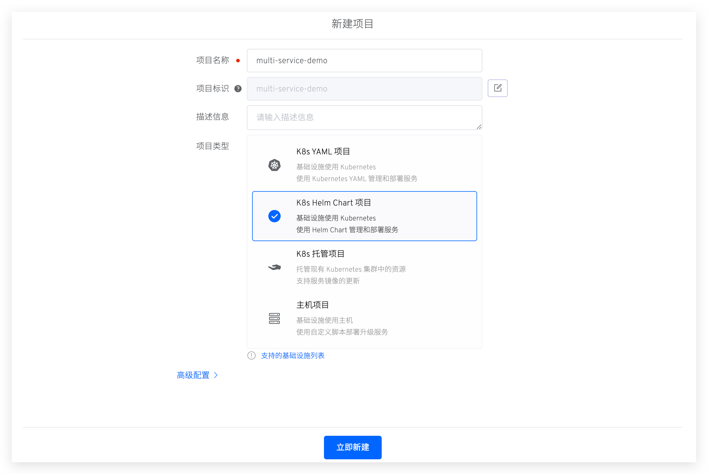
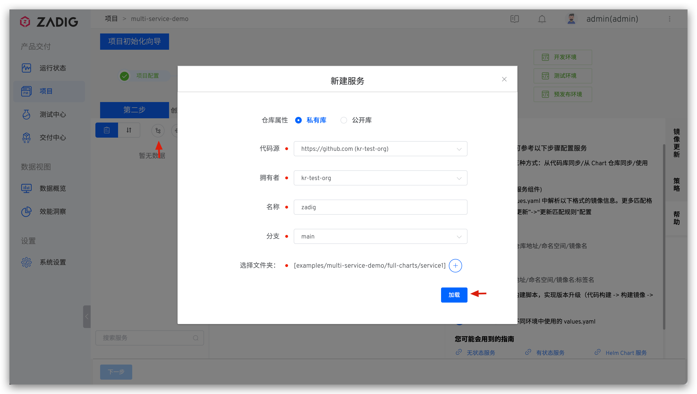
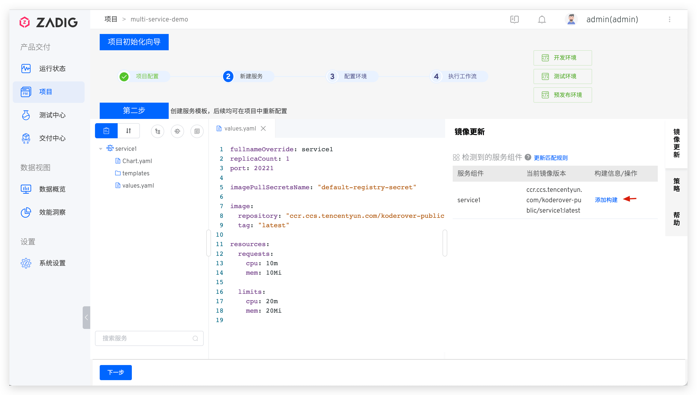

## 新建项目

进入 Zadig 系统，点击「项目」-「新建项目」，填写项目名称，选择`K8s Helm Chart 项目`的项目类型新建项目。



## 服务配置

点击`下一步`，创建服务并为服务配置构建。


- 选择从代码仓库导入 Helm Chart 相关配置，本例中使用 [koderover/zadig](https://github.com/koderover/zadig) 仓库的 [multi-service-demo](https://github.com/koderover/zadig/tree/main/examples/multi-service-demo/full-charts/service1) 案例。
> 更细节的信息可参考 [Helm Chart 服务](/v1.11.0/project/service/#helm-chart-服务)。



- 导入完毕后，系统会自动解析 values 文件中定义的服务组件。


- 为 `service1` 服务配置构建：点击`添加构建`，填写构建所需基本信息和通用构建脚本后保存构建。
>  更细节的信息请参阅 [构建配置](/v1.11.0/project/build/)。




本例中通用构建脚本如下：

```bash
#!/bin/bash
set -e

cd zadig/examples/multi-service-demo/
make build-service1
docker build --build-arg service=service1 -t $IMAGE -f Dockerfile .
docker push $IMAGE
```

## 配置环境

服务配置完毕后点击`下一步`, 可对系统默认创建的环境进行调整，可按需对 values 文件中的内容进行覆盖。


点击`创建环境`，待环境创建完毕，点击`下一步`，进入到工作流交付环节。

## 工作流交付

- 执行 `multi-service-demo-workflow-dev` 工作流，对 `dev` 环境的服务进行更新升级。


- 在工作流执行详情页面可实时跟踪构建日志。


- 待工作流成功运行完毕，服务会被自动更新部署。


