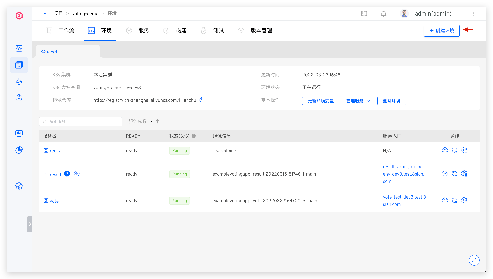
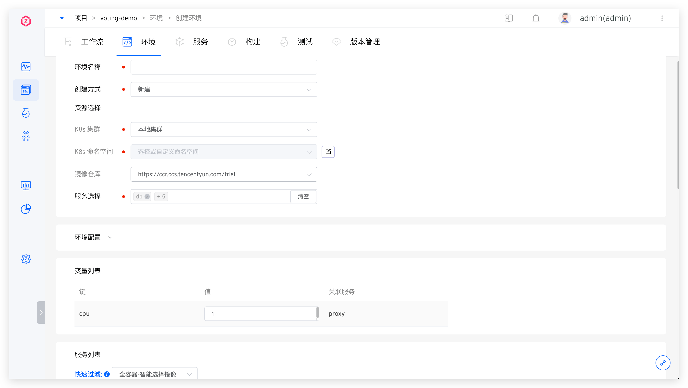
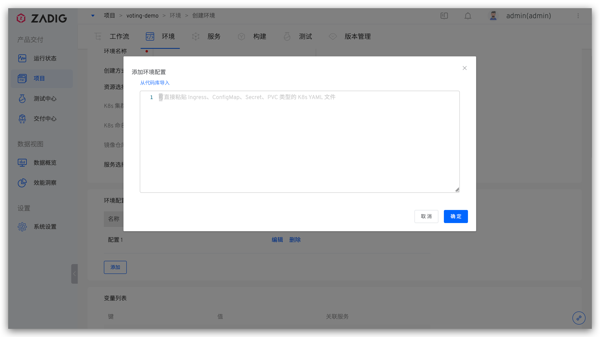
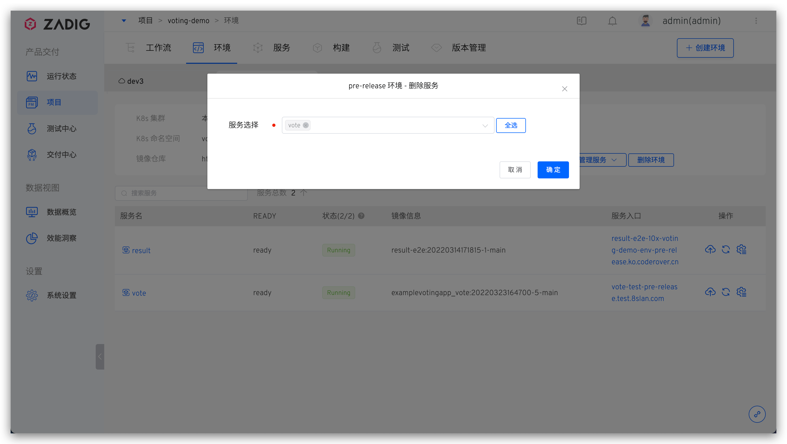
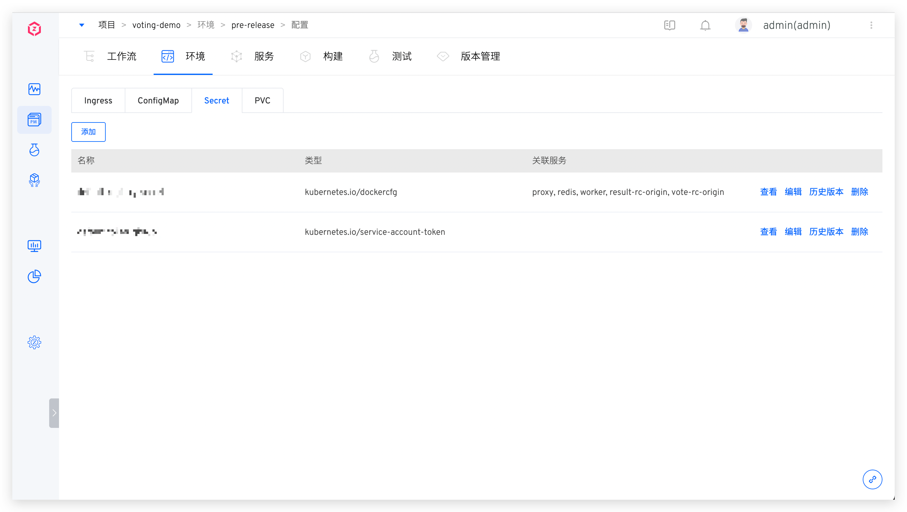
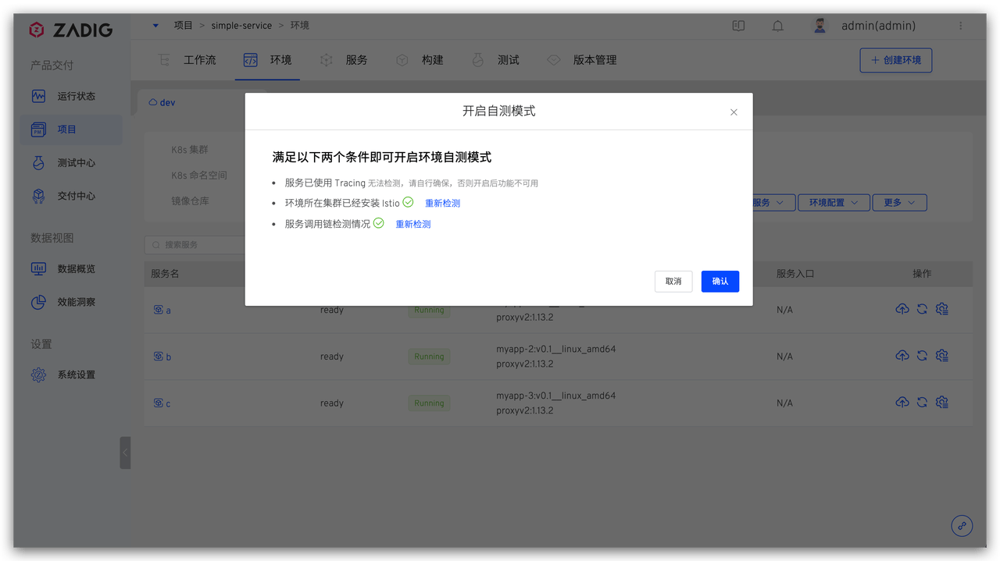
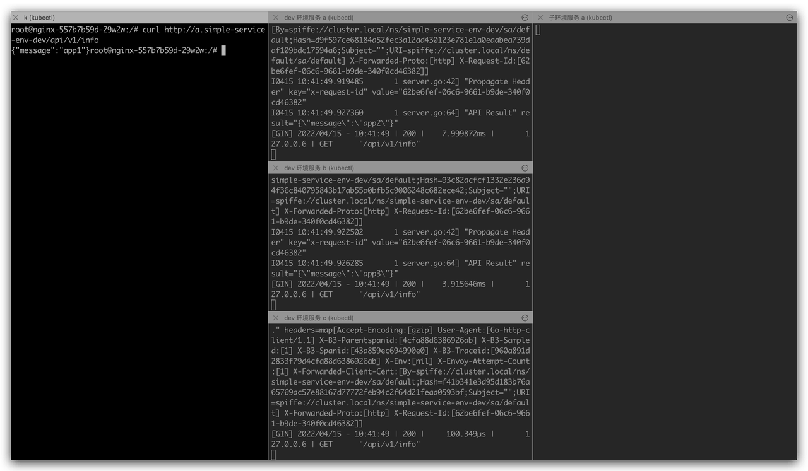
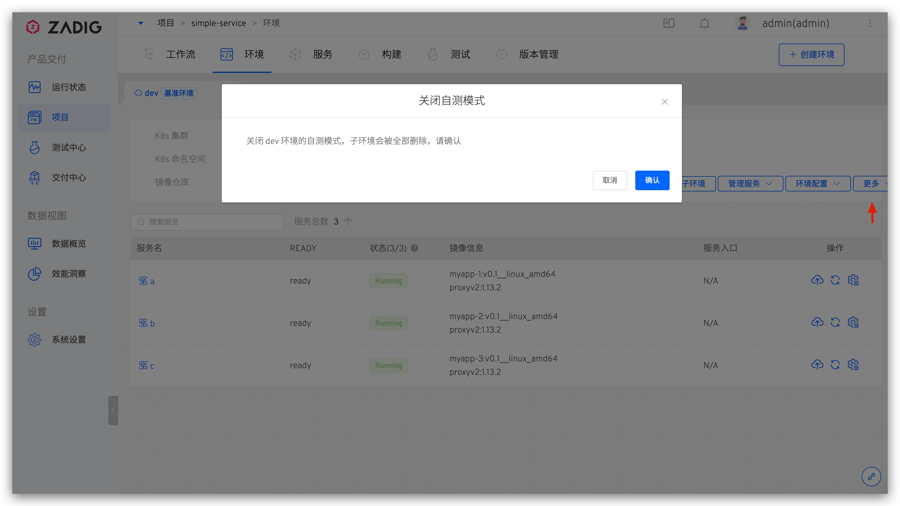
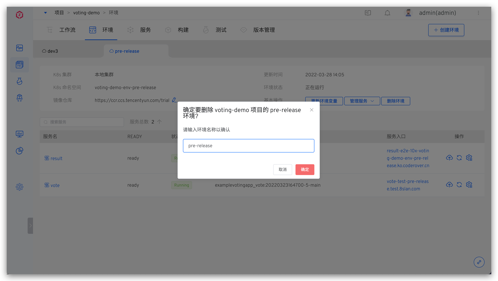

本文主要介绍 K8s YAML 项目中的环境相关操作。

## 创建环境
在项目中，点击`创建环境`按钮进入创建环境页面。

### 基本信息

- `环境名称`：要创建的环境的名称，比如：`dev`、`pre-release`。
- `创建方式`：包括`新建`和`回溯`，通过回溯方式创建环境可参考[版本回溯](/v1.11.0/project/version/#版本回溯)。
- `资源选择`：
	- `K8s 集群`：选择创建环境时所使用的集群资源，其中`本地集群`指 Zadig 系统所在的集群。关于集群的集成可参考[集群管理](/v1.11.0/pages/cluster_manage/)。
	- `K8s 命名空间`：不同的环境会使用独立的 Kubernetes 命名空间实现隔离。Zadig 系统创建命名空间的默认规则为 `项目名-env-环境名`，用户也可以自定义或者选择已有命名空间。
	- `镜像仓库`：指定环境创建后所使用的镜像仓库，使用工作流构建部署服务，以及修改服务镜像，均会使用此处指定的镜像仓库。关于镜像仓库的集成可参考[镜像仓库管理](/v1.11.0/settings/image-registry/#添加镜像仓库)。
- `服务选择`：选择创建环境所包含的服务，默认为当前项目下的所有服务。

### 环境配置
在创建环境时为环境创建配置，说明如下：

- 可创建多个 Ingress、ConfigMap、Secret、PVC 类型的配置
- 支持直接粘贴 Ingress、ConfigMap、Secret、PVC 类型的 K8s YAML 文件内容
- 支持从代码库导入 Ingress、ConfigMap、Secret、PVC 类型的 K8s YAML 文件
- 环境创建成功后，此处新建的配置即会在环境/集群中生效

### 变量列表

> 此处的变量列表包括服务配置中的[自定义变量](/v1.11.0/project/service/#变量配置)，创建服务时可以按需设置其默认值。

在创建环境时可以按需对默认值做覆盖，实现对不同环境的服务进行差异化配置。

### 服务列表

该部分可以让用户自定义服务所使用的镜像，与此同时，平台提供 2 个快捷选项：

- `全容器-智能选择镜像`：给每个容器自动选择镜像仓库中最新的镜像版本。
- `全容器-全部默认镜像`：给每个容器选择服务 YAML 中配置的镜像版本。

### 开始创建
输入环境名称等必要信息后，点击`立即创建`按钮即可开始创建环境。

::: tip
服务数量以及启动服务所需的资源会影响环境的创建时间，请耐心等待。
:::

## 查看环境

环境创建完成后，点击不同的环境 Tab 即可切换到该环境的详情页面。

### 基本信息
基本信息包括 K8s 集群，K8s 命名空间，更新时间，环境状态，镜像仓库。环境状态有以下几种情况：
- `创建中`：正在创建。
- `更新中`：正在更新。
- `删除中`：正在删除。
- `正在运行`：环境中所有服务都是正常的 Running 状态。
- `运行不稳定`：环境中一部分服务处于 Unstable 状态，可能的情况有两种：
	- 容器服务出现了问题。
	- 容器服务正在进行更新操作，例如更新镜像，会出现短时间的服务 Unstable，当更新过程完成之后，服务状态会恢复为 Running。

### 基本操作

环境操作包括：

- `更新环境变量`：对环境中的引用变量进行更新，细节描述请阅读[更新环境变量](#更新环境变量)
- `管理服务`：包括[添加服务](#添加服务)、[更新服务](#更新服务)、[删除服务](#删除服务)
- `环境配置`：为环境配置 Ingress、ConfigMap、Secret、PVC 资源，细节描述请阅读[环境配置管理](#环境配置管理)
- `开启自测模式`：开启自测模式，创建子环境实现日常自测联调，细节描述请阅读[自测模式](#自测模式)
- `删除环境`：删除当前环境，环境删除后不可恢复。

#### 更新环境变量

更新服务中环境变量的值。

参数说明：

- `Key`：环境变量名称，在服务配置的[变量配置](/v1.11.0/project/service/k8s/#变量配置)中定义。
- `Value`：环境变量的值。
- `关联服务`：服务配置中有使用到该环境变量的服务。

#### 添加服务

选择要添加的服务，填写服务配置中的自定义环境变量后点击确定即可将服务添加进当前环境中。

#### 更新服务

选择当前环境中已有的服务，对其进行更新：包括修改服务配置中的环境变量值以及同步更新最新服务配置。

#### 删除服务

将环境中的服务从当前环境中删除。

#### 环境配置管理

可对环境中的 Ingress、ConfigMap、Secret、PVC 配置进行操作，以 Secret 配置为例说明如下。 

**查看 Secret 配置**

点击基本操作中的`环境配置` -> `Secret`，可查看当前环境中的 Secret 配置列表，以及有使用到 Secret 配置的服务集合。

**基本操作**

- 添加配置：点击`添加`按钮，添加新的 Secret 配置。可手动输入 K8s YAML 文件内容，也可以选择从代码库导入 K8s YAML 文件。

- 查看配置详情：点击`查看`按钮可查看 Secret 配置的具体内容。

- 编辑配置：点击`编辑`按钮修改 Secret 配置，可按需选择修改 Secret 配置后是否重启与之有关联的服务。

- 版本比较与回滚：点击`历史版本`按钮，选择两个版本后可对比版本之间的差异，点击`回滚`按钮可快速回滚当前环境中的 Secret 配置。

- 删除配置：点击`删除`按钮可删除环境中的 Secret 配置。需要注意删除配置后可能会造成关联服务无法正常运行，请确认无不良影响后再操作。

### 服务详情

在服务列表中点击具体的服务可查看该服务的更多信息，可以对服务进行服务重启、服务伸缩、配置管理、更新镜像等操作。具体请阅读[服务详情](/v1.11.0/project/env/service/)。

## 自测模式

下面以 simple-service 项目为例来说明如何使用环境的自测模式。项目中环境和服务背景，以及自测联调需求说明如下：
1. 项目中共包括 3 个微服务 a、b、c，服务调用链路：a -> b -> c
2. dev 环境为日常稳定测试环境，其中包括全部微服务 a、b、c。
3. 日常会对 a 服务进行高频改动，希望能对 a 服务进行充分自测，确定其变更可交付

### 开启自测模式

在 `dev` 环境，开启自测模式：

系统对自测模式的依赖条件做检查：

1. 系统无法自动检查 Tracing 组件，需要管理员自行确保
2. 系统会对 Istio 是否安装做自动检查，如果没有请在环境所在集群进行安装
3. 服务调用链自动检查，主要依据是有 K8s Service 类型的资源和服务对应

开启自测模式后，`dev` 环境中的服务会重启，稍等片刻待服务重启完毕后，该环境即成为基准环境。

### 创建子环境

::: tip
创建子环境时可选服务列表来源于基准环境
:::

在 `dev` 基准环境中点击`创建子环境`，选择 a 服务可创建包含 a 服务的子环境 `dev-test-env1`：

### 自测联调

当需要请求服务 a 时，在请求的 Header 头中加入 `x-env:dev-test-env1` 即可将请求流量转发到子环境 `dev-test-env1` 中，实现子环境和 `dev` 环境的自测联调。效果如下所示：

1. 未加 x-env 请求头，直接请求服务 a，`dev` 环境中的服务 a/b/c 会处理请求，子环境中无请求流量输入。

2. 增加 `x-env: dev-test-env1` 请求头访问服务 a，子环境中的服务 a 会接收到请求并给出响应，对于请求链路上的 b/c 服务，`dev` 环境中的服务会给出正常响应。

### 关闭自测模式

当自测联调诉求结束后，在基准环境中点击`更多` -> `关闭自测模式`即可关闭自测模式。

- 关闭自测模式操作会同时删除该基准环境下创建的所有子环境
- 关闭自测模式后，环境中的服务会重启，稍等片刻待服务重启完毕后，该环境即恢复正常可用

## 删除环境

点击基本操作中的`删除环境`按钮并输入环境名即可删除环境。

- 如果环境是基于新的 Namespace 创建的，则删除环境操作会删除对应的 Namespace 及其中的资源。
- 如果环境是基于已有 Namespace 创建的，则删除环境操作会清理环境中的服务资源，但不会删除 Namespace。

