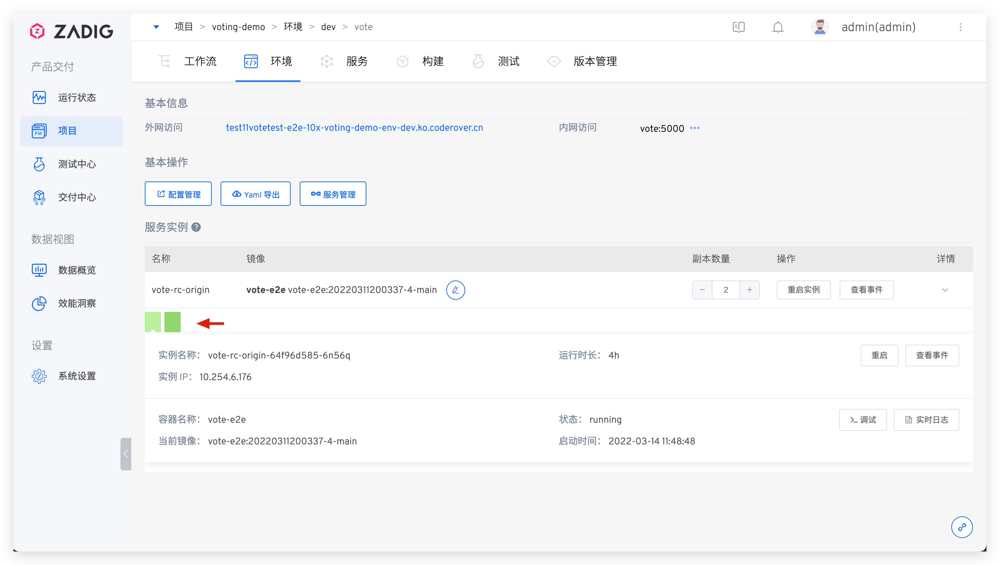

本文主要介绍基础设施使用 Kubernetes 的项目中（即：K8s YAML 项目/K8s Helm Chart 项目/K8s 托管项目)，环境里的服务相关操作。

在服务列表中点击服务名即可进入服务详情页面。服务详情页面展示了服务的详细信息，用户可以对服务进行服务重启、服务伸缩、配置管理、更新镜像等操作。

	
## 基本信息
服务基本信息展示了服务的外网访问信息，以及内网 Service 访问信息。

- `外网访问`：服务的 Ingress 配置信息
- `内网访问`：服务的 Service 配置信息

## 基本操作
> K8s YAML 项目和 K8s Helm Chart 项目中有此功能。

- `配置管理`: 查看和编辑该服务的相关配置
- `YAML 导出`: 将服务信息导出为 K8s YAML 形式
- `服务管理`: 链接到该服务的模板详情

## 服务实例操作
- `镜像更新`：点击镜像右侧的编辑按钮，可更新该服务使用的镜像，选择新的镜像后容器会自动拉取并更新镜像，同时进行重启
- `重启实例`：点击按钮重启该服务
- `查看事件`：查看 Pod Event
- `副本数量`：动态调整服务的副本数量

## 服务实例详情

服务实例详情列表显示了容器服务所有的实例，切换实例后可查看每个服务实例（Pod）下的容器（Container）详细信息。

用户可对单个服务实例进行操作：

- `重启实例`：重启单个实例
- `实时日志`：查看当前服务实例的实时日志

- `查看事件`：查看当前服务实例 Pod Event 事件

