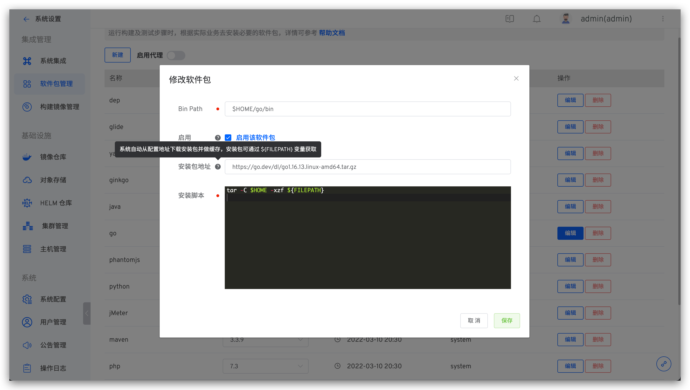
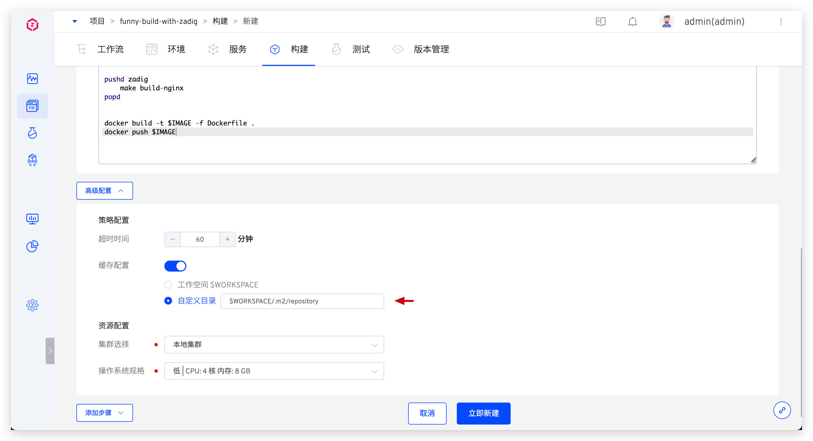

本文主要介绍工作流中构建步骤的缓存机制。Zadig 构建支持工作空间缓存、自定义目录缓存、软件包缓存和镜像缓存。Zadig 的缓存无需配置，完全自动化。使用缓存可以提升工作流构建效率。

系统目前支持对象存储缓存和 PVC 缓存，关于系统缓存配置请参考[缓存资源配置](/v1.11.0/pages/cluster_manage/#缓存资源配置)。

## 工作空间缓存


开启构建高级配置中的缓存配置，选中`工作空间$WORKSPACE`，工作流执行构建任务、测试工作流执行测试任务时会将本次任务的工作空间（WORKSPACE）缓存到对应的存储介质中。

使用对象存储作为缓存介质时，工作空间的缓存机制：
1. 同一工作流，不同服务都有独立的工作空间缓存，互不影响。
2. 不同工作流，相同服务都有独立的工作空间缓存，互不影响。


使用集群存储作为缓存介质时，可根据在系统设置中不同的缓存资源配置来实现共享缓存或独享缓存，配置参考[缓存目录规则](/v1.11.0/pages/cluster_manage/#使用集群存储)。

工作空间可能包含以下内容：
1. 构建时拉取的代码和依赖
2. 构建过程产生的一些临时文件
3. 构建产物

某些业务场景下可能不希望使用缓存，或者临时不使用历史缓存进行构建，那么可以通过调整缓存配置达到不使用缓存的目的。

* 如果在构建中长期不使用缓存，可以在`项目` -> `构建`，选择对应构建脚本，关闭 `缓存配置`，如下图所示。


* 如果临时不使用历史缓存，可以在启动工作流时，在`高级设置`中，选择`不使用工作空间缓存`，如下图所示。


## 自定义目录缓存
可以按需使用`缓存自定义目录`功能，对必要的目录做缓存，如下图所示。


## 软件包缓存

在 Zadig 系统上执行服务构建以及测试时，一般都需要根据实际业务去安装必要的软件包环境。比如编译后端相关代码就需要 Go 环境、Java 环境等，编译前端代码可能需要 NodeJS 等软件包，具体配置请参阅[软件包管理](/v1.11.0/settings/app/)。这些软件包会被缓存在系统内置的对象存储中。



## 不同技术栈的最佳实践

下面以 Java/Golang/NodeJS 项目为例，提供配置构建缓存目录的最佳实践，以供参考。

### Java

以 Maven 构建工具为例，缓存路径可通过 `$M2_HOME` 环境变量控制，可在构建脚本中显式修改。对于 Zadig 自带的 Maven 构建工具，其构建缓存路径是 `$WORKSPACE/.m2/` 。
在构建缓存配置的自定义目录中，可以填写 `$WORKSPACE/.m2/` ，或依据构建环境指定 Maven 的缓存路径。



### Golang

Golang 缓存路径通过 `$GOCACHE` 环境变量控制，可在构建脚本中显式修改。
在应用构建缓存配置的自定义目录中，可以填写上述配置的 `$GOCACHE` 路径。


### NodeJS

NodeJS 缓存路径通常是在代码库的 `node_modules/` 目录下，可以参考如下做法使用构建缓存：
1. 在应用构建缓存配置的自定义目录中，填写一个非代码仓库所在的路径，如 `$WORKSPACE/.cache`
2. 构建脚本中，将 package.json 拷贝到缓存目录 (如上述 `$WORKSPACE/.cache`)，执行 npm install，然后再将缓存目录中的 node_modules/ 目录拷贝到代码库下，如下：

```bash
cp $WORKSPACE/<代码仓库>/package.json /<缓存目录>/
cd /<缓存目录>/ && npm install
cp -r /<缓存目录>/node_modules/ $WORKSAPCE/<代码仓库>/
```
