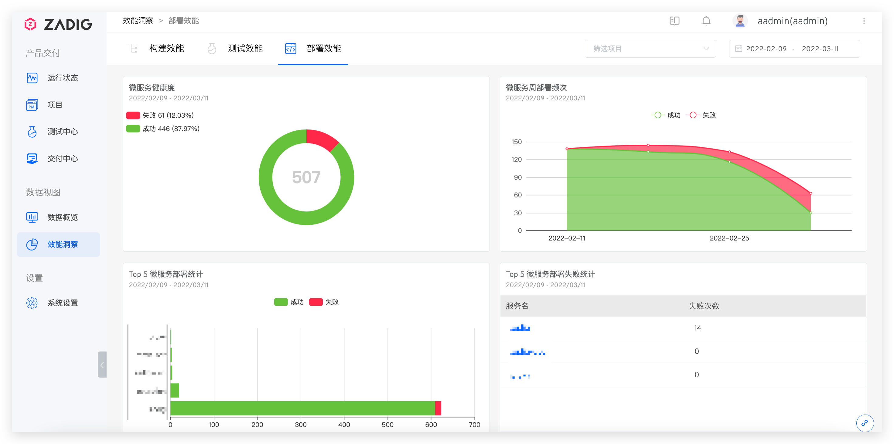

效能洞察主要用于洞察展示服务的构建、测试、部署数据，帮助分析各个环节的变化过程以及效能短板。

## 构建效能

展示可选时间可选项目的构建数据，包括周构建趋势、构建健康度、日构建频次、平均构建时长、最近 10 次构建以及 Top 10 耗时较长的构建。

## 测试效能

关于测试的趋势、健康度、平均测试时长、周交付部署次数以及周测试收益。

## 部署效能

关于微服务的健康度、周部署频次、部署统计以及微服务部署失败统计。

