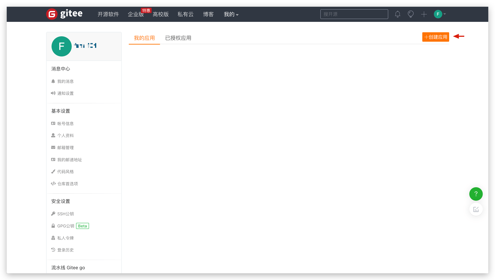
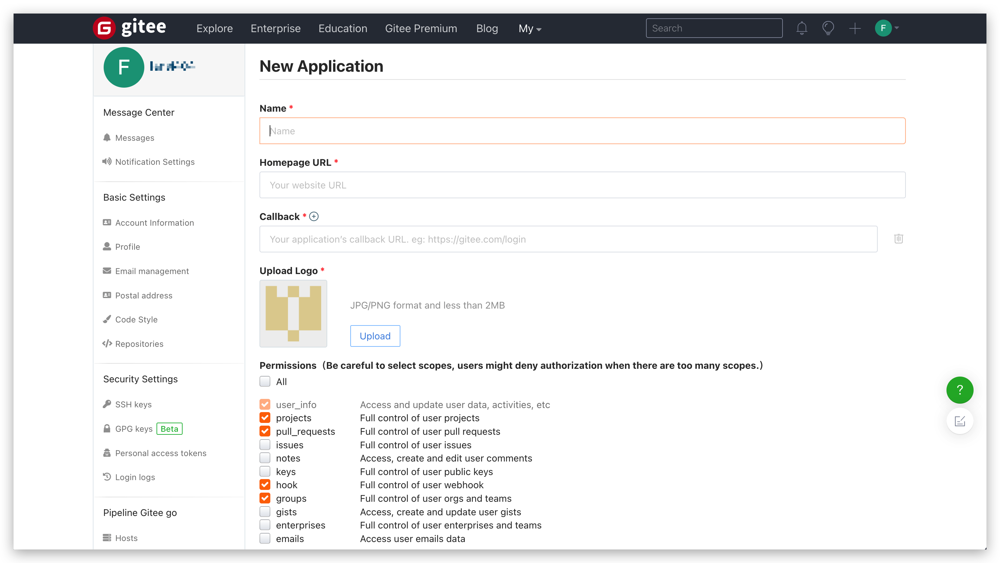
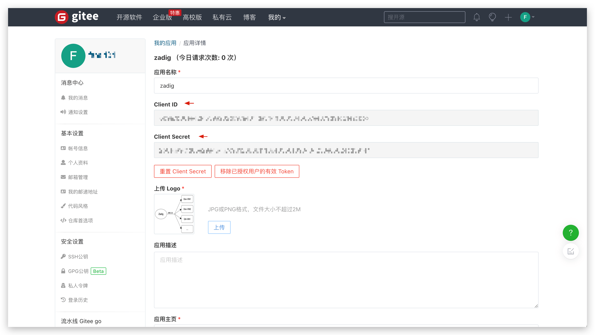
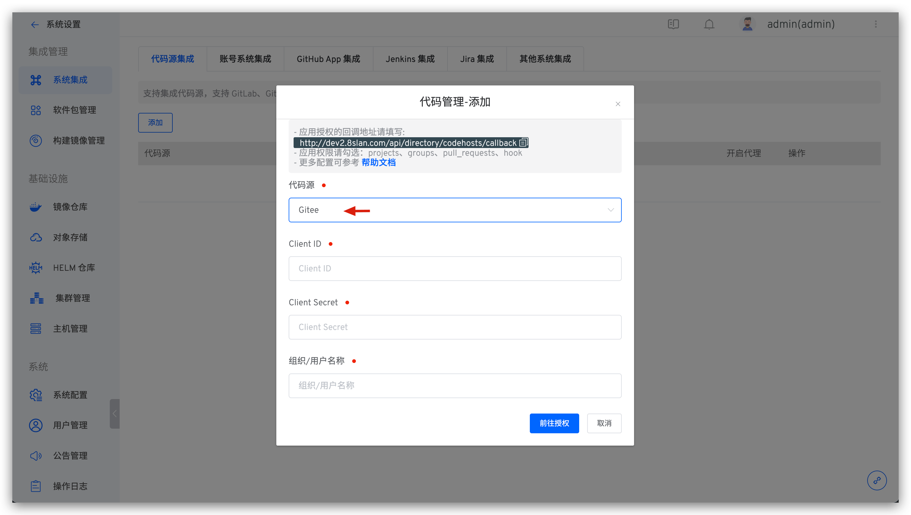
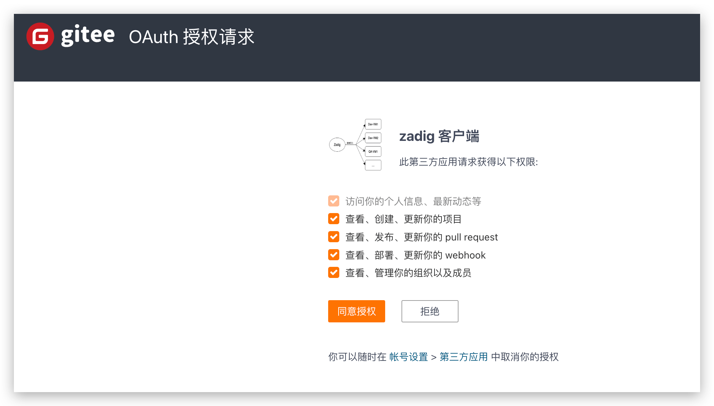

本文主要介绍在 Zadig 上如何集成 Gitee 代码源。

> 目前系统采用 OAuth2 的方式与 Gitee 进行代码的授权认证

如需集成 Gitee，可以按照以下流程配置：

- Gitee 管理员新建 OAuth 应用程序
- 配置 OAuth 应用程序，填写基本信息以及回调地址
- 获取 OAuth 应用程序的 `Client ID`、`Client Secret` 信息
- 配置 Gitee 集成，将获取到的 `Client ID`、`Client Secret` 信息填写到 Zadig 系统
- 跳转到 Gitee 进行认证授权

### 步骤 1：新建 Gitee OAuth 应用程序

点击 Gitee 账号头像 -> Settings -> Data Management -> OAuth Apps -> Create Application 来新建应用程序。

### 步骤 2：配置 Gitee OAuth 应用程序

填写以下内容后点击创建：

- `Name`：zadig，也可以填写可识别的任一名称。
- `Homepage URL`：http://[koderover.yours.com]
- `CallBack`： `http://[koderover.yours.com]/api/directory/codehosts/callback`
- `Upload LOGO`： 上传符合格式和大小的图片
- `Permissions`： 勾选 `projects`、`pull_requests`、`hook`、`groups`

:::tip 注意
回调地址中 `koderover.yours.com` 需要替换为 Zadig 系统部署的实际地址
:::

### 步骤 3：获取 Client ID、Client Secret 信息

应用创建成功后，可获取该应用对应的 `Client ID` 和 `Client Secret` 信息。

### 步骤 4：将配置填入 Zadig 系统

切换到 Zadig 系统，管理员依次点击`系统设置` -> `集成管理` -> `代码源集成` -> 点击添加按钮。

依次填入如下已知信息：

- `代码源`：此处选择 Gitee
- `Client ID`：步骤 3 应用创建成功返回的 Client ID
- `Client Secret`：步骤 3 生成的 Client Secret
- `组织/用户名称`：推荐填写 Gitee 账号的用户名，方便在 Zadig 系统中标识 Gitee 代码源的出处

信息确认无误后点击 `前往授权`，耐心等待，此时系统会跳转到 Gitee 进行授权。

点击 `Permmit` 同意授权后，Gitee 会跳转到 Zadig 系统，至此 Gitee 集成完毕。
