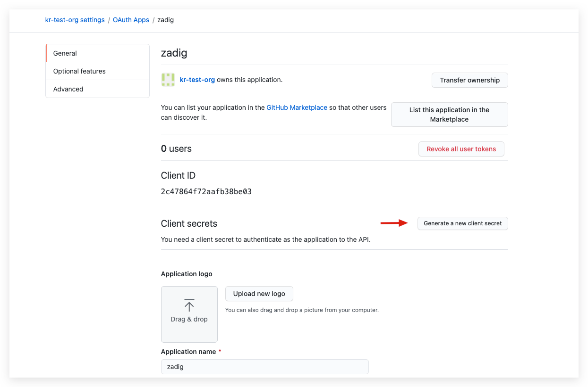

### 步骤 1：创建 GitHub OAuth 应用

前往 [GitHub](https://github.com/settings/applications/new) 注册一个新的 GitHub OAuth application。

在新建应用程序页面，你需要进行如下步骤：

1. Application name：zadig，也可以填写可识别的任一名称。
2. Homepage URL：http://[zadig.yours.com]
3. Authorization CallBack URL： `http://[zadig.yours.com]/dex/callback`
4. 点击创建

### 步骤 2：获取 Client ID、Client Secret 信息

应用创建成功后，GitHub 会返回应用的基本信息，点击 `Generate a new client secret` 生成 `Client Secret`。

此时页面包括完整的 `Client ID` 、`Client Secret`。

### 步骤 3：集成 GitHub OAuth

点击`系统设置` -> `集成管理` -> `账号系统集成`-> 点击添加 -> 选择 `GitHub`。

**参数说明：**
- `Client ID`: 步骤 2 中获得的 Client ID。
- `Client Secret`: 步骤2 中获得的 Client Secret。
