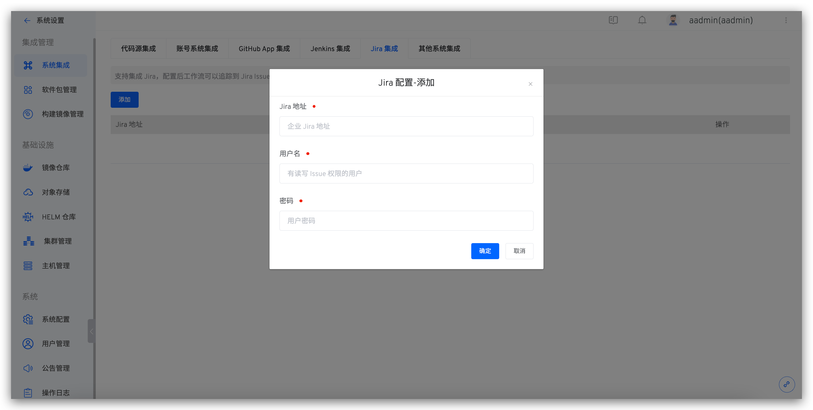

本文介绍如何在 Zadig 系统上集成项目管理系统 Jira。通过在系统中配置 `Jira` 的支持，实现对 `Jira Issue` 的追踪。用户可以通过工作流任务详情查看当前构建的代码关联的具体 `Jira Issue` 信息。

## Zadig 中配置 Jira 集成

点击`系统设置` -> `集成管理`  -> `Jira 集成`-> 点击添加。

参数说明：
- `Jira 地址`：企业 Jira 地址
- `用户名`：可以查看读 Issue 权限的用户
- `密码`：用户名对应的密码

信息确认无误后保存。

## 代码与任务 Issue 进行关联

::: tip
可以通过在 GitLab/GitHub 的代码提交中表明 Jira 的 Issue。共两种方式：

- 在代码 pull request 的标题中填写 Jira Issue 号
- 在代码的 Commit Message 中填写 Jira Issue 号
:::

以 pull request 为例示例如下：#5 号 pull request 的标题中带上 Jira 的 Issue ID，图例中为 `ZAD-3`

运行工作流，选择上述 #5 号 pull request，待工作流运行完毕，构建信息部分会展示 Jira Issue 信息，可链接跳转至 Jira Issue，实现工作流和任务 Issue 的联动。

