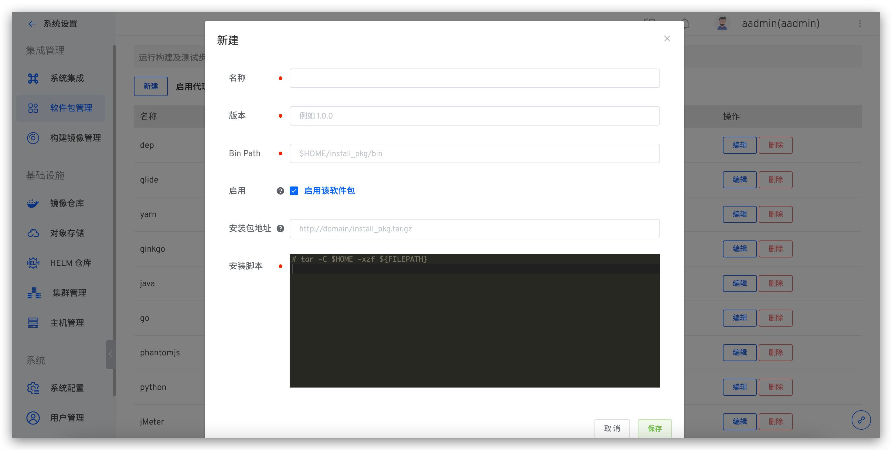

本文介绍如何在 Zadig 系统上配置和使用软件包。在 Zadig 中运行构建以及测试步骤，一般都需要用户根据实际业务去安装必要的软件包环境来进行构建或者编译。比如编译后端相关代码就需要 Go 环境、Java 环境等，前端代码的 NodeJS 环境以及其他环境。

关于在构建以及测试中软件包的使用方式请分别参阅：

- [项目-选择项目 -> 构建 -> 新增构建配置](/v1.11.0/project/build/)
- [测试管理 -> 新建测试配置](/v1.11.0/project/test/#测试配置)

## 新建软件包

点击`系统设置` -> `软件包管理`-> 点击`新建`。



参数说明：
- `名称`：软件包的名称
- `版本`：软件包的版本
- `Bin Path`：软件包安装的二进制 Bin Path ，默认为 `$HOME/软件包名`
- `启用`：控制软件包列表中是否展示，正在使用中的不受影响，启用的软件包可以在 `项目` -> `构建` -> `添加`构建 -> `依赖的软件包` 中展示
- `安装包地址`：系统自动从配置地址下载安装包并做缓存，安装包可通过 `${FILEPATH}` 变量获取
- `安装脚本`：软件包的安装 `shell` 脚本

## 常见软件包安装

> 为了方便快速的对软件包进行配置，我们准备了一些常用软件包的安装方式，管理员可以通过自己的实际业务需求去配置。

::: tip
以下 ${FILEPATH} 为安装包下载完成后存放的文件路径
:::
### Java
Bin Path： `$HOME/jdk/bin` <br>
安装包地址： `http://resource.koderover.com/jdk-12.0.1_linux-x64_bin.tar.gz` <br>
安装脚本：
```
mkdir -p $HOME/jdk
tar -C $HOME/jdk -xzf ${FILEPATH} --strip-components=1
```
### Maven
Bin Path： `$HOME/maven/bin` <br>
安装包地址 `http://resource.koderover.com/apache-maven-3.3.9-bin.tar.gz` <br>
安装脚本
```
curl -fsSL http://resource.koderover.com/apache-maven-3.3.9-bin.tar.gz  -o /tmp/apache-maven-3.3.9-bin.tar.gz
mkdir -p $HOME/maven
tar -C $HOME/maven -xzf /tmp/apache-maven-3.3.9-bin.tar.gz --strip-components=1
# customize .m2 dir
export M2_HOME=$HOME/maven
mkdir -p $WORKSPACE/.m2/repository
```
### Go
Bin Path：`$HOME/go/bin` <br>
安装包地址： `http://resource.koderover.com/go1.13.linux-amd64.tar.gz` <br>
安装脚本：
```
tar -C $HOME -xzf ${FILEPATH}
```
### Glide
Bin Path： `$HOME/glide` <br>
安装包地址： `http://resource.koderover.com/glide-v0.13.1-linux-amd64.tar.gz` <br>
安装脚本：
```
mkdir -p $HOME/glide
tar -C $HOME/glide -xzf ${FILEPATH} --strip-components=1
```
### Dep
Bin Path： `$HOME/dep` <br>
安装包地址： `http://resource.koderover.com/dep-v0.5.0-linux-x64.tar.gz` <br>
安装脚本：
```
mkdir -p $HOME/dep
tar -C $HOME/dep -xzf ${FILEPATH}
chmod +x $HOME/dep/dep
```
### Ginkgo
Bin Path： `$HOME/ginkgo` <br>
安装包地址： `http://resource.koderover.com/ginkgo-v1.6.0-Linux.tar.gz` <br>
安装脚本：
```
mkdir -p $HOME/ginkgo
tar -C $HOME/ginkgo -xzf ${FILEPATH}
chmod +x $HOME/ginkgo/ginkgo
```
### Node
Bin Path： `$HOME/node/bin` <br>
安装包地址： `http://resource.koderover.com/node-v8.15.0-linux-x64.tar.gz` <br>
安装脚本：
```
mkdir -p $HOME/node
tar -C $HOME/node -xzf ${FILEPATH} --strip-components=1
npm config --global set registry https://registry.npm.taobao.org
```
### Bower
依赖 NodeJS，需要先安装 NodeJS
```
npm install -g bower
```
### Yarn
Bin Path： `$HOME/yarn/bin` <br>
安装包地址： `http://resource.koderover.com/yarn-v1.15.2.tar.gz` <br>
安装脚本：
```
mkdir -p $HOME/yarn
tar -C $HOME/yarn -xzf ${FILEPATH} --strip-components=1
```


### PhantomJS
Bin Path： `$HOME/phantomjs/bin` <br>
安装包地址： `http://resource.koderover.com/phantomjs-2.1.1-linux-x86_64.tar.bz2` <br>
安装脚本：
```
mkdir -p $HOME/phantomjs
tar -C $HOME/phantomjs -jxf ${FILEPATH} --strip-components=1
```
### JMeter
Bin Path： `$HOME/jmeter/bin` <br>
安装包地址： `http://resource.koderover.com/apach-jmeter-3.2.tar.gz` <br>
安装脚本：
```
mkdir -p $HOME/jmeter
tar -C $HOME/jmeter -xzf ${FILEPATH} --strip-components=1
```
