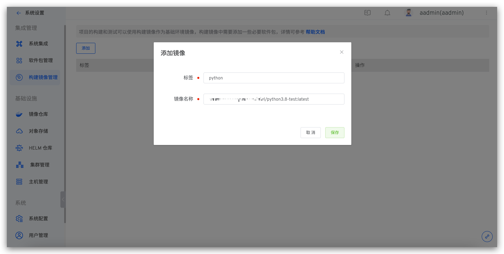
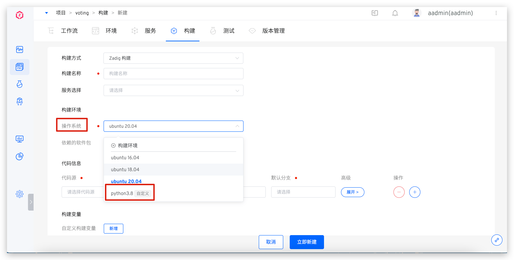

本文介绍在 Zadig 系统上如何使用自定义镜像作为构建和测试的基础环境来构建或测试项目中的服务。如果构建您的服务需要安装很多工具和依赖，那么把这些工具和依赖事先打包成一个自定义镜像，在构建服务的时候使用它，这样做可以大大提升服务的构建效率。

## 步骤 1：生成构建镜像


- 编写 Dockerfile，根据实际需求，添加 docker 指令。

::: danger
使用自定义构建镜像时，需要确保在镜像中安装了 Zadig 系统需要的依赖，否则可能无法正常构建。<br>
所需依赖如下：
1. curl：获取网络资源
2. git：用于执行 git 命令，获取构建代码（请确保安装 2.11.0 以上版本）
3. tzdata：保持容器时间同步
4. docker cli：用于执行 docker 命令，必须安装在 `/usr/local/bin` 目录下。
:::

可参考以下两个 ubuntu:focal 和 centos:7.8.2003 样例，编写您自己的 Dockerfile :

```dockerfile
FROM ubuntu:focal

# 在此可添加自定义指令

# 以下是 Zadig 所需要的依赖

# 安装工具 curl git tzdata
RUN sed -i -E "s/[a-zA-Z0-9]+.ubuntu.com/mirrors.aliyun.com/g" /etc/apt/sources.list
RUN apt-get clean && apt-get update && DEBIAN_FRONTEND=noninteractive apt-get install -y curl git tzdata

# 修改时区
RUN ln -sf /usr/share/zoneinfo/Asia/Shanghai /etc/localtime

# 安装 docker client
RUN curl -fsSL "http://resources.koderover.com/docker-cli-v19.03.2.tar.gz" -o docker.tgz &&\
    tar -xvzf docker.tgz &&\
    mv docker/* /usr/local/bin
```

```dockerfile
FROM centos:7.8.2003

# 在此可添加自定义指令

# 以下是 Zadig 所需要的依赖

# 安装工具 curl git tzdata
RUN yum -y install curl git tzdata

# 修改时区
RUN ln -sf /usr/share/zoneinfo/Asia/Shanghai /etc/localtime

# 安装 docker client
RUN curl -fsSL "http://resources.koderover.com/docker-cli-v19.03.2.tar.gz" -o docker.tgz &&\
    tar -xvzf docker.tgz &&\
    mv docker/* /usr/local/bin
```

- 构建镜像，可参考以下命令

```bash
docker build -t name:tag -f Dockerfile .
```

- 将上一步生成的镜像推送到公开镜像仓库或者已经集成到 Zadig 系统中的私有镜像仓库

```bash
docker push name:tag
```

## 步骤 2：创建构建镜像

点击 `系统设置` -> `构建镜像管理` -> `添加`，如下图所示：



参数说明：
- `标签`：请填写一个可用于辨认镜像的名称
- `镜像名称`：请填写之前上传到镜像仓库的镜像名称，需要填写完整的镜像名称，如 ccr.ccs.tencentyun.com/namespace/imageName:tag

## 步骤 3：使用构建镜像

自定义镜像可以在构建和测试模块中使用，下面以构建模块为例。

进入项目下的构建 -> 点击添加，即可在 `操作系统` 选项中使用构建镜像，在执行构建任务时，即可使用您的自定义镜像作为操作系统


