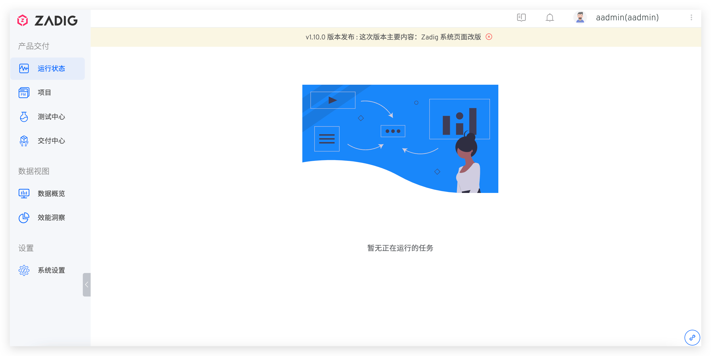

本文介绍 Zadig 的公告配置。Zadig 支持管理员发布全局公告，设置后所有登录用户均可接收到公告。管理员也可以通过配置灵活的发布策略对公告时间进行控制。

## 发布公告

管理员可以通过点击 `系统设置` -> `公告管理` -> `新建` 来新建一条公告

参数说明：
- `标题`：公告的标题
- `优先级`：分为：高、中、低
- `时间范围`：公告展示的时间范围，可精确到秒
- `内容`：公告展示的具体内容

点击保存，公告效果如下：

