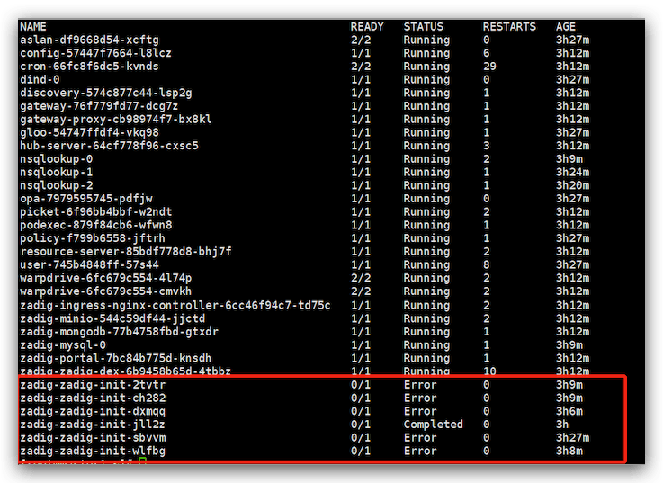

## Mongodb 和 Minio 处于 Pending 状态，安装失败？

Zadig 系统安装的时候，不会介入到集群的存储细节中来，因此，在没有默认 storage class 或是没有指定 storage
class 的时候， 需要事先创建 PV 来让 MinIO 和 Mongodb 正确运行。 以下是一个可以运行的 PV YAML 示例

::: details
```
apiVersion: v1
kind: PersistentVolume
metadata:
  name: zadig-reserved-pv
spec:
  capacity:
    storage: 20Gi
  accessModes:
    - ReadWriteOnce
  hostPath:
    path: "/mnt/zadig/data"
    type: Directory
---
apiVersion: v1
kind: PersistentVolume
metadata:
  name: task-pv-volume
spec:
  capacity:
    storage: 20Gi
  accessModes:
    - ReadWriteOnce
  hostPath:
    path: "/mnt/zadig/data2"
    type: Directory
```
:::

## 使用 hostpath 类型的 PersistentVolume 安装 Zadig，MongoDB 容器一直提示权限有问题无法创建目录，Pod 启动失败

这是因为容器对于 PersistentVolume 中指定的 path 没有写入权限导致。可以手动执行创建文件目录并给予 `777` 权限模式即可，举例如下：

```bash
mkdir /mnt/zadig/data
chmod 777 /mnt/zadig/data
```

## 安装时 MySQL Pod startupProbe 报 warning 信息


在安装 Zadig 时，MySQL Pod 创建 15s 后会开始对其进行启动探测检查。这样做的目的是保证有充分的时间来保护慢启动的应用，每次检测异常时会反馈 warning。系统最多会在 100s 内进行 10 次探测检查，遇到此种情况请耐心等待片刻。

::: tip 扩展知识
关于 Kubernetes Startup Probe 的知识点可阅读 [Configure Startup Probes](https://kubernetes.io/docs/tasks/configure-pod-container/configure-liveness-readiness-startup-probes)
:::

## 安装时 zadig-init Pod 状态为 Error



zadig-init Job 会做一些系统初始化的工作，完成内置用户以及角色和绑定数据的设置。该 Job 的完成依赖于慢启动的 MySQL / MongoDB 等基础组件，遇到此种情况请耐心等待片刻。该 Job 最多会被重试 10 次，最终有一个状态为 `Completed` 的 Job，Zadig 系统即可正常使用。如果 10 次重试后 Job 仍未完成，请联系我们。

## 安装时报错 Error: failed to install CRD crds/enterprise.gloo.solo.io_v1_AuthConfig.yaml: ...
> 完整报错信息：Error: failed to install CRD crds/enterprise.gloo.solo.io_v1_AuthConfig.yaml: unable to recognize "": no matches for kind "CustomResourceDefinition" in version "apiextensions.k8s.io/v1"

Zadig 系统对 Kubernetes 集群版本有要求。遇到此种错误请检查您的 Kubernetes 集群版本，需要集群版本在 1.16 及以上，才能正常安装使用。

## 使用 IP+PORT 的方式从 1.7.0/1.7.1 版本升级时报错 provided port is already allocated

在升级的过程中原端口尚未释放，升级时会报出端口占用的错误。解决办法：端口的释放时间大约为 1~2 分钟，可等待 1~2 分钟后重新执行升级脚本；或者更换 PORT 参数后重新执行升级脚本。

## 安装时依赖的 ENCRYPTION_KEY 信息遗忘，如何获取到

1. 通过 [All in one](/v1.11.0/install/all-in-one/) 或者 [Kubernetes 脚本](/v1.11.0/install/install-on-k8s/)安装时，可以显式配置 ENCRYPTION_KEY 环境变量，或记录脚本自动生成的 ENCRYPTION_KEY，如下图所示：


2. 安装 Zadig 成功后，可通过如下命令获取 ENCRYPTION_KEY 信息：

```bash
kubectl -n <Zadig 安装的 Namespace> get secret zadig-aes-key -o=jsonpath='{.data.aesKey}' | base64 -d
```
