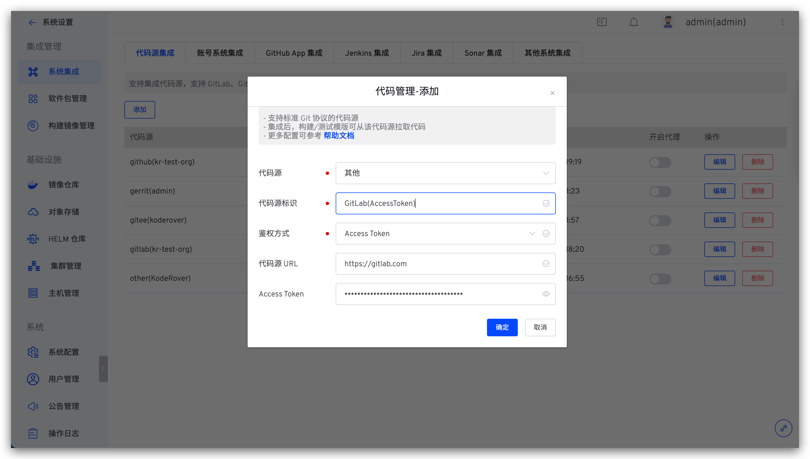

本文主要介绍如何集成支持标准 Git 协议的代码源：包括使用 SSH Key 鉴权和使用 Access Token 鉴权。

## SSH Key 鉴权方式

### 步骤 1：配置 SSH Key

在对应的代码源中配置 SSH Key，SSH Key 配置因不同代码源而异，请参阅对应代码源的官方文档操作。下面以配置 GitHub 代码源的 SSH Key 为例进行演示。

1. 生成 SSH Key，可参考 [How to use ssh-keygen to generate a new SSH key](https://www.ssh.com/academy/ssh/keygen)

2. 登录 GitHub 后点击右上角头像 -> `Settings` -> `SSH And GPG Keys` -> `New SSH Key` -> 填写 `Title` 及上一步中生成的 SSH Key 信息

### 步骤 2：将配置填入 Zadig 系统

管理员登录 Zadig 系统，依次访问`系统设置` -> `集成管理` -> `代码源集成` -> 点击添加按钮。

依次填入如下信息：

- `代码源`：选择`其他`
- `代码源标识`：自定义，方便在 Zadig 系统中快速识别出该代码源，该信息在整个系统内唯一
- `鉴权方式`：选择 `SSH Key`
- `代码源 URL`：填写对应代码源地址，比如 `git@github.com`
- `SSH Key`：**步骤 1** 中的 SSH Key，并在结尾处添加一行空行

## Access Token 鉴权方式

### 步骤 1：获取 Access Token

在对应的代码源中配置 Access Token，Access Token 配置因不同代码源而异，请参阅对应代码源的官方文档操作。下面以获取 GitLab 代码源的 Access Token 为例进行演示。

1. 登录 GitLab 后点击右上角头像 -> `Preferences` -> `Access Tokens`，填写 Token 名称后勾选 `api`、`read_user`、`read_repository` ，生成 Access Token。

2. 复制生成的 Access Token 信息即可。

### 步骤 2：将配置填入 Zadig 系统

管理员登录 Zadig 系统，依次访问`系统设置` -> `集成管理` -> `代码源集成` -> 点击添加按钮。

依次填入如下信息：

- `代码源`：选择`其他`
- `代码源标识`：自定义，方便在 Zadig 系统中快速识别出该代码源，该信息在整个系统内唯一
- `鉴权方式`：选择 `Access Token`
- `代码源 URL`：填写对应代码源地址，比如 `https://gitlab.com`
- `Access Token`：在 **步骤 1** 中获得的 Access Token
